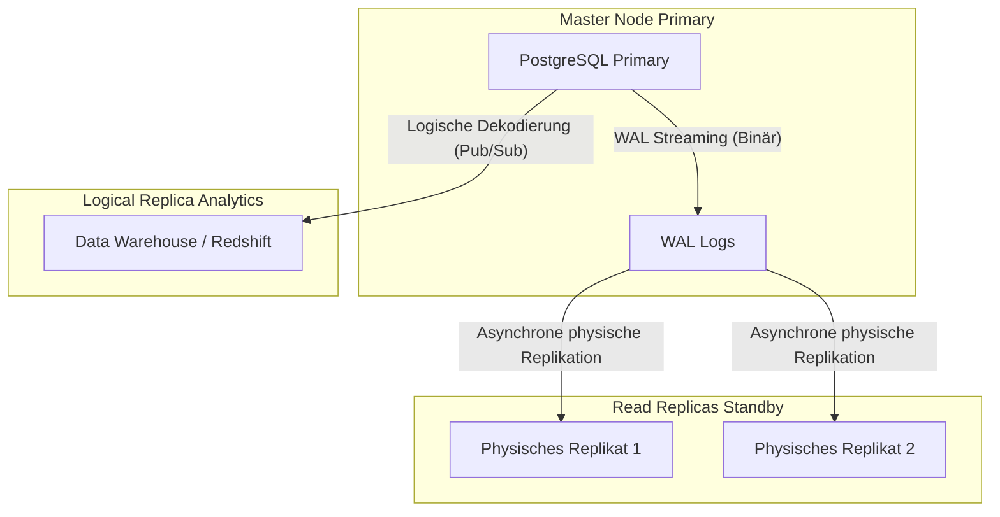

# Replikation und Massive Partitionierung

Wenn eine einzelne PostgreSQL-Instanz die Leselast oder das Speichervolumen (wir sprechen von Terabytes an Daten) nicht mehr bewältigen kann, betreten wir den Expertenbereich. Es ist an der Zeit, die Last zu verteilen.

## 1. Deklarative Partitionierung (Lokales Sharding)

Wenn du eine `logs`-Tabelle mit 500 Millionen Datensätzen hast, wird der Versuch, alte Daten mit einem `DELETE` zu löschen, die Tabelle sperren und einen Leistungseinbruch verursachen. Die Lösung besteht darin, die Tabelle physisch zu unterteilen und dabei eine einzige logische Tabelle beizubehalten.

### Beispiel: Partitionierung nach Zeit (Bereich)

```sql
-- 1. Erstelle die "Eltern"-Tabelle
CREATE TABLE telemetry.sensor_logs (
    id UUID,
    sensor_id INT,
    reading NUMERIC,
    created_at TIMESTAMP NOT NULL
) PARTITION BY RANGE (created_at);

-- 2. Erstelle die "Kinder"-Tabellen (Physisch)
CREATE TABLE sensor_logs_y2023m10 PARTITION OF telemetry.sensor_logs
    FOR VALUES FROM ('2023-10-01') TO ('2023-11-01');

CREATE TABLE sensor_logs_y2023m11 PARTITION OF telemetry.sensor_logs
    FOR VALUES FROM ('2023-11-01') TO ('2023-12-01');
```

**Entscheidender Vorteil:** Wenn der Monat Oktober nicht mehr nützlich ist, machst du kein `DELETE`. Du machst einfach ein `DROP TABLE sensor_logs_y2023m10;`. Dieser Vorgang gibt sofort Gigabytes an Speicherplatz frei, ohne die Serverleistung zu beeinträchtigen.

## 2. Replikationstopologie: Streaming vs. Logisch

Um Lesevorgänge zu skalieren oder Hochverfügbarkeit (HA) zu gewährleisten, benötigst du Replikate.



### Physische Replikation (Streaming Replication)
Kopiert die gesamte Datenbank, Block für Block, durch Lesen der Write-Ahead Logs (WAL). Physische Replikate sind **schreibgeschützt (Read-only)**. Ideal für Failover (wenn der Master ausfällt, übernimmt ein Replikat den Thron).

### Logische Replikation (Pub/Sub)
Anstatt rohe binäre Blöcke zu kopieren, dekodiert Postgres die WALs in Ereignisse der Anwendungsschicht (`INSERT`, `UPDATE`, `DELETE`) und sendet sie an Abonnenten.
- Ermöglicht die Replikation **nur bestimmter Tabellen** (ideal, um Verkaufstabellen an einen Data Lake zu senden).
- Ermöglicht dem Zielknoten das Schreiben in seine eigenen unabhängigen Tabellen.

```sql
-- Auf dem Master-Server:
CREATE PUBLICATION sales_pub FOR TABLE sales.orders, sales.invoices;

-- Auf dem Analytics-Server:
CREATE SUBSCRIPTION sales_sub CONNECTION 'host=master_ip port=5432 user=rep_user password=secret' PUBLICATION sales_pub;
```

Die Beherrschung von Partitionierung und Replikation ermöglicht es dir, Postgres virtuell ins Unendliche zu skalieren. In der **Meisterstufe (Optimizaciones)** werden wir das Kernel-Tuning und das Connection-Pooling erkunden, um die Hardware an ihr absolutes Limit zu bringen.

