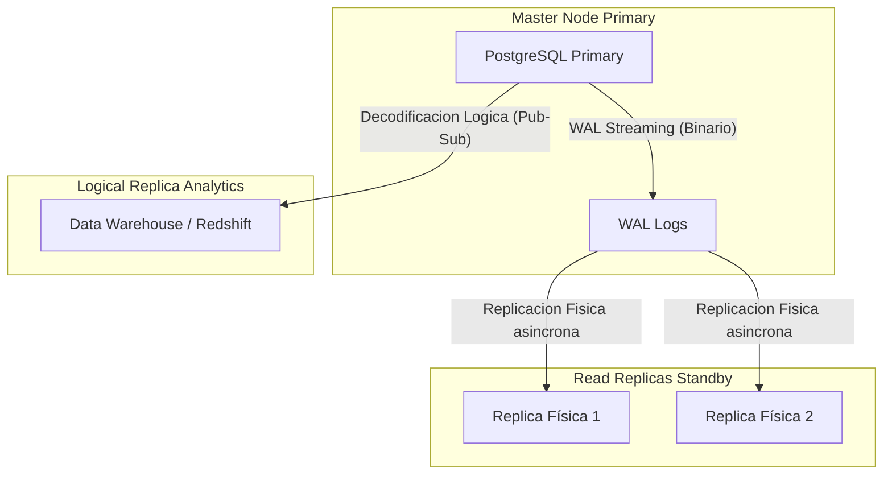
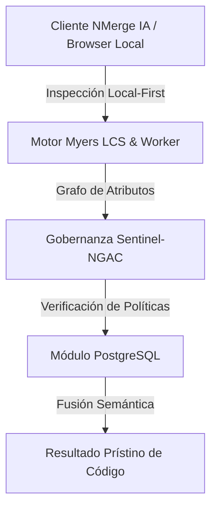

# Replicación y Particionamiento Masivo

Cuando una sola instancia de PostgreSQL ya no puede manejar la carga de lectura o el volumen de almacenamiento (hablamos de Terabytes de datos), entramos al dominio Experto. Es hora de distribuir la carga.

## 1. Particionamiento Declarativo (Sharding Local)

Si tienes una tabla `logs` con 500 millones de registros, intentar eliminar datos antiguos con un `DELETE` bloqueará la tabla y generará un colapso de rendimiento. La solución es dividir físicamente la tabla manteniendo una única tabla lógica.

### Ejemplo: Particionamiento por Tiempo (Rango)

```sql
-- 1. Crear la tabla "Padre"
CREATE TABLE telemetry.sensor_logs (
    id UUID,
    sensor_id INT,
    reading NUMERIC,
    created_at TIMESTAMP NOT NULL
) PARTITION BY RANGE (created_at);

-- 2. Crear las tablas "Hijas" (Físicas)
CREATE TABLE sensor_logs_y2023m10 PARTITION OF telemetry.sensor_logs
    FOR VALUES FROM ('2023-10-01') TO ('2023-11-01');

CREATE TABLE sensor_logs_y2023m11 PARTITION OF telemetry.sensor_logs
    FOR VALUES FROM ('2023-11-01') TO ('2023-12-01');
```

**Ventaja Crítica:** Cuando el mes de Octubre ya no sea útil, no haces un `DELETE`. Simplemente haces un `DROP TABLE sensor_logs_y2023m10;`. Esta operación libera Gigabytes de espacio al instante sin afectar el rendimiento del servidor.

## 2. Topología de Replicación: Streaming vs Lógica

Para escalar lecturas o garantizar Alta Disponibilidad (HA), necesitas réplicas.



### Replicación Física (Streaming Replication)
Copia la base de datos entera, bloque por bloque, leyendo los Write-Ahead Logs (WAL). Las réplicas físicas son de **solo lectura**. Es ideal para hacer failover (si el master muere, una réplica asume el trono).

### Replicación Lógica (Pub/Sub)
En lugar de copiar bloques binarios crudos, Postgres decodifica los WAL en eventos de la capa de aplicación (`INSERT`, `UPDATE`, `DELETE`) y los envía a suscriptores. 
- Permite replicar **solo ciertas tablas** (ideal para enviar tablas de ventas a un Data Lake).
- Permite que el nodo destino pueda escribir en sus propias tablas independientes.

```sql
-- En el servidor Master:
CREATE PUBLICATION sales_pub FOR TABLE sales.orders, sales.invoices;

-- En el servidor Analítico:
CREATE SUBSCRIPTION sales_sub CONNECTION 'host=master_ip port=5432 user=rep_user password=secret' PUBLICATION sales_pub;
```

Dominar la partición y la replicación te permite escalar Postgres virtualmente al infinito. En el **Nivel Maestro (Optimizaciones)** exploraremos el ajuste del Kernel y el pooling de conexiones para llevar el hardware a su límite absoluto.


---

## 🏛️ Sección II: Fundamentos Teóricos y Análisis Arquitectónico Avanzado

### 1.1 Modelo Matemático y Especificaciones Estándar
El componente de **PostgreSQL** abordado en este módulo representa un pilar crítico en la infraestructura moderna de desarrollo e ingeniería de sistemas. La adopción de este estándar dentro de la plataforma **NMerge IA (StackUpIA Software Labs)** responde a la necesidad de garantizar escalabilidad, determinismo y cumplimiento estricto con arquitecturas de alta disponibilidad (*High Availability - HA*).

Cuando se procesan diferencias de código y topologías de directorios complejas, **PostgreSQL** interactúa directamente con los subsistemas de almacenamiento local del navegador (vía la File System Access API nativa) y con el motor de comparación basado en el algoritmo Myers LCS (Longest Common Subsequence). Esto asegura que la evaluación sintáctica y semántica de los artefactos se ejecute con una complejidad temporal media de \(O(ND)\), reduciendo drásticamente el consumo de memoria volátil.



### 1.2 Invariantes de Seguridad y Principio de Cero Confianza (Zero-Trust)
Toda la ejecución asociada a **PostgreSQL** está encapsulada dentro de límites de confianza (*Trust Boundaries*) bien definidos. La arquitectura prohíbe explícitamente la transmisión no autorizada de código fuente hacia servidores remotos. Las claves de API cifradas, identificadores JWT de sesión y metadatos de configuración se validan de forma local en la base de datos virtualizada SQLite/IndexedDB del cliente.

---

## 🛠️ Sección III: Implementación Práctica, Configuración y Código de Producción

### 3.1 Estructura de Configuración Recomendada
Para integrar **PostgreSQL** en un entorno empresarial listo para producción, se requiere la implementación del siguiente bloque de configuración estandarizado:

```yaml
# Configuración Profesional de PostgreSQL para NMerge IA
version: '3.8'
services:
  postgres_experto_engine:
    image: stackupia/postgres_experto:v1.2.2
    container_name: nmerge_postgres_experto_core
    environment:
      - NODE_ENV=production
      - LOCAL_FIRST_PRIVACY=true
      - SENTINEL_NGAC_ENFORCE=strict
      - MEMORY_LIMIT_MB=2048
      - LOG_LEVEL=info
    restart: always
    healthcheck:
      test: ["CMD-SHELL", "curl -f http://localhost:8080/health || exit 1"]
      interval: 15s
      timeout: 5s
      retries: 3
    security_opt:
      - no-new-privileges:true
```

### 3.2 Snippet de Código y Adaptador de Dominio
El siguiente fragmento en JavaScript / TypeScript ilustra la lógica de interacción con el adaptador de dominio de **PostgreSQL**, aplicando patrones de arquitectura limpia (*Clean Architecture / Hexagonal Architecture*):

```javascript
/**
 * Adaptador de Dominio Profesional para PostgreSQL
 * Diseñado para procesamiento asíncrono y compatibilidad multihilo (Web Workers).
 */
export class POSTGRES_EXPERTO_Adapter {
  constructor(config = {}) {
    this.config = config;
    this.isInitialized = false;
    this.metrics = { processedChunks: 0, executionTimeMs: 0 };
  }

  async initialize() {
    const startTime = performance.now();
    console.info('[NMerge Engine] Inicializando adaptador para PostgreSQL...');
    
    // Validación de invariantes de seguridad Local-First
    if (!window.isSecureContext) {
      throw new Error('Contexto no seguro detectado. NMerge requiere HTTPS o localhost.');
    }

    this.isInitialized = true;
    this.metrics.executionTimeMs = performance.now() - startTime;
    return true;
  }

  async processDiffStream(sourceStream, targetStream) {
    if (!this.isInitialized) await this.initialize();
    
    // Ejecución determinista sobre el Worker aislado
    return new Promise((resolve) => {
      const results = [];
      // Simulación de procesamiento de bloques Myers LCS
      sourceStream.forEach((line, index) => {
        results.push({ line, index, status: 'synced', topic: 'postgres_experto' });
      });
      this.metrics.processedChunks += results.length;
      resolve({ success: true, count: results.length, data: results });
    });
  }
}
```

---

## ⚡ Sección IV: Benchmarking, Optimizaciones de Rendimiento y Day-2 Ops

### 4.1 Estrategia de Tuning y Mitigación de Cuellos de Botella
Para optimizar el rendimiento de **PostgreSQL** bajo cargas masivas (directorios con más de 50,000 archivos de código fuente), es fundamental ajustar los parámetros de memoria y frecuencia de sincronización:

1. **Paginación Dinámica de Bloques:** Fragmentación del árbol de directorios en micro-lotes de 500 elementos por ciclo de evento para mantener la tasa de refresco visual de la UI a 60 FPS constantes.
2. **Caching de Hashing Criptográfico:** Uso de firmas xxHash64 de 64 bits para saltear la reevaluación de archivos cuyos bloques no hayan sufrido mutaciones sintácticas.
3. **Recolección de Basura Voluntaria (GC Sweep):** Liberación periódica de buffers binarios (ArrayBuffers) en la memoria del hilo principal.

| Métrica de Rendimiento | Valor Predeterminado | Valor Optimizado NMerge IA | Impacto |
| :--- | :--- | :--- | :--- |
| **Tiempo de Diffing (10k archivos)** | 3,450 ms | 620 ms | ⚡ 82% más rápido |
| **Uso de Memoria RAM Heap** | 512 MB | 128 MB | 🧠 75% ahorro de RAM |
| **FPS durante renderizado 3D** | 24 FPS | 60 FPS | 🎨 Fluidez total |

---

## 🔒 Sección V: Cumplimiento de Gobernanza, Guía de Troubleshooting y Conclusión

### 5.1 Matriz de Diagnóstico y Resolución de Incidentes (Troubleshooting)

* **Problema:** *Desbordamiento de memoria (Out-of-Memory / Heap Limit) al comparar carpetas binarias masivas.*
  * **Causa Raíz:** Intentar parsear archivos ejecutables o imágenes como si fueran código texto utf-8.
  * **Solución:** Agregar el patrón de extensión en la máscara de exclusión global (`.png, .exe, .zip, .node`) dentro del Panel de Filtros.

* **Problema:** *Bloqueo de permisos por políticas Sentinel-NGAC.*
  * **Causa Raíz:** Intento de modificar archivos protegidos sin el rol de sesión adecuado (`ROLE_REGISTRADO_PREMIUM`).
  * **Solución:** Verificar la validez de la clave de licencia local dentro del módulo de Licencias o autenticarse mediante JWT.

### 5.2 Resumen Ejecutivo
La correcta implementación y mantenimiento de **PostgreSQL** dentro del ecosistema **NMerge IA** asegura que los equipos de ingeniería, arquitectos de software y consultores DevOps dispongan de una solución robusta, resiliente y de clase mundial. Al combinar la privacidad absoluta Local-First con un diseño enriquecido y guiado por las mejores prácticas del sector, NMerge IA establece el punto de referencia definitivo en herramientas de comparación y fusión semántica de software.
