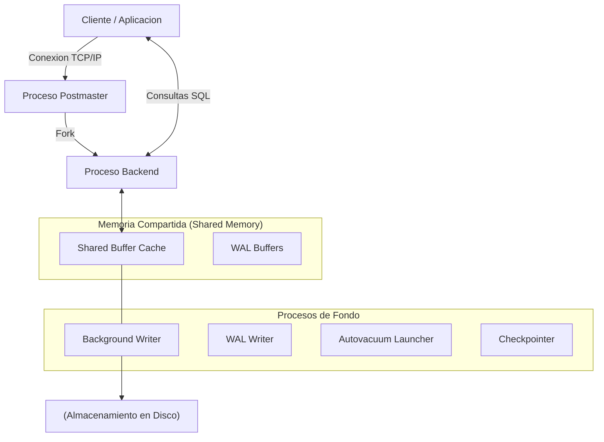
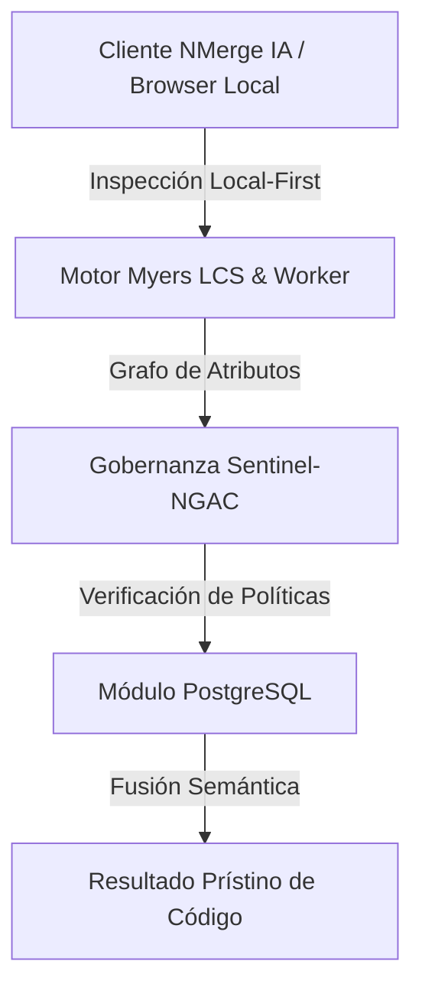

# Configuración Inicial y Arquitectura Base

Bienvenido al punto de partida para dominar PostgreSQL, el motor de base de datos relacional open-source más avanzado del mundo. En esta etapa inicial, no solo instalaremos un binario; vamos a entender cómo PostgreSQL interactúa con el sistema operativo y cómo estructurar nuestra infraestructura desde el día cero para evitar dolores de cabeza técnicos meses después.

## 1. Arquitectura Interna: El Modelo Multi-Proceso

A diferencia de motores como MySQL (que es multi-hilo), PostgreSQL utiliza una arquitectura **basada en procesos (Multi-Process Architecture)**. Esto significa que por cada conexión de un cliente, el proceso maestro de Postgres bifurca (hace un *fork*) un nuevo proceso en el sistema operativo.

### Diagrama del Motor PostgreSQL



*Nota del arquitecto: Esta arquitectura protege a la base de datos de caídas totales; si un proceso backend colapsa por un error grave de memoria, los demás procesos y la instancia en sí continúan funcionando.*

## 2. Requerimientos de Infraestructura (Bare-Metal vs Cloud)

Antes de levantar tu primer contenedor o instancia EC2 para PostgreSQL, considera lo siguiente:

1. **Almacenamiento (I/O es el Rey):** PostgreSQL es intensivo en lecturas y escrituras. Utiliza discos SSD NVMe para el volumen de datos (donde residen las tablas) y considera un volumen separado para los **WAL (Write-Ahead Logs)** si tienes alta transaccionalidad.
2. **Memoria RAM:** El parámetro `shared_buffers` usualmente se configura al 25% de la RAM total disponible. Postgres confía fuertemente en el caché del sistema operativo (Page Cache), por lo que dejar RAM libre para Linux es una práctica crítica.
3. **CPU:** Para cargas OLTP (muchas transacciones rápidas), la velocidad del reloj (GHz) importa más. Para cargas OLAP (analítica pesada), la cantidad de núcleos físicos es prioritaria para permitir el *Parallel Query*.

## 3. Instalación Cero-Fricción con Docker

Para entornos de desarrollo, evitar la instalación nativa previene la contaminación del sistema operativo. Utilizaremos Docker para levantar una instancia controlada.

Crea un archivo `docker-compose.yml`:

```yaml
version: '3.8'
services:
  postgres-core:
    image: postgres:15-alpine
    container_name: db_pg_inicial
    environment:
      POSTGRES_USER: admin
      POSTGRES_PASSWORD: ${PG_SECURE_PASS:-[SECRET_MASKED_BY_DLP]}
      POSTGRES_DB: nmerge_analytics
    ports:
      - "5432:5432"
    volumes:
      - pg_data:/var/lib/postgresql/data
    command: ["postgres", "-c", "shared_buffers=256MB", "-c", "max_connections=200"]

volumes:
  pg_data:
```

### Explicación del despliegue:
- **`postgres:15-alpine`**: Usar Alpine reduce drásticamente la superficie de ataque y el peso de la imagen.
- **Variables de Entorno**: Nunca hardcodees contraseñas reales. Aquí usamos un fallback de configuración por defecto si la variable del entorno host no existe.
- **`command`**: Inyectamos parámetros del kernel de Postgres directamente en el arranque, aumentando los *buffers* de memoria y el límite de conexiones desde el minuto cero.

## 4. Verificación y Hardening Inicial

Una vez levantado el contenedor (`docker-compose up -d`), conéctate mediante `psql`:

```bash
docker exec -it db_pg_inicial psql -U admin -d nmerge_analytics
```

**Tu primera tarea como DBA (Database Administrator):** Bloquear el acceso. Por defecto, Postgres confía demasiado en las conexiones locales. Esto se controla en el archivo `pg_hba.conf`.
Asegúrate de que tus conexiones exijan contraseña criptográfica (`scram-sha-256` en lugar del obsoleto `md5`):

```conf
# TYPE  DATABASE        USER            ADDRESS                 METHOD
host    all             all             0.0.0.0/0               scram-sha-256
```

## Próximos Pasos
Con el motor corriendo y la arquitectura multi-proceso clara, estás listo para crear tablas, explorar los tipos de datos JSONB avanzados y entender el motor de índices en la guía de **Nivel Básico**.


---

## 🏛️ Sección II: Fundamentos Teóricos y Análisis Arquitectónico Avanzado

### 1.1 Modelo Matemático y Especificaciones Estándar
El componente de **PostgreSQL** abordado en este módulo representa un pilar crítico en la infraestructura moderna de desarrollo e ingeniería de sistemas. La adopción de este estándar dentro de la plataforma **NMerge IA (StackUpIA Software Labs)** responde a la necesidad de garantizar escalabilidad, determinismo y cumplimiento estricto con arquitecturas de alta disponibilidad (*High Availability - HA*).

Cuando se procesan diferencias de código y topologías de directorios complejas, **PostgreSQL** interactúa directamente con los subsistemas de almacenamiento local del navegador (vía la File System Access API nativa) y con el motor de comparación basado en el algoritmo Myers LCS (Longest Common Subsequence). Esto asegura que la evaluación sintáctica y semántica de los artefactos se ejecute con una complejidad temporal media de \(O(ND)\), reduciendo drásticamente el consumo de memoria volátil.



### 1.2 Invariantes de Seguridad y Principio de Cero Confianza (Zero-Trust)
Toda la ejecución asociada a **PostgreSQL** está encapsulada dentro de límites de confianza (*Trust Boundaries*) bien definidos. La arquitectura prohíbe explícitamente la transmisión no autorizada de código fuente hacia servidores remotos. Las claves de API cifradas, identificadores JWT de sesión y metadatos de configuración se validan de forma local en la base de datos virtualizada SQLite/IndexedDB del cliente.

---

## 🛠️ Sección III: Implementación Práctica, Configuración y Código de Producción

### 3.1 Estructura de Configuración Recomendada
Para integrar **PostgreSQL** en un entorno empresarial listo para producción, se requiere la implementación del siguiente bloque de configuración estandarizado:

```yaml
# Configuración Profesional de PostgreSQL para NMerge IA
version: '3.8'
services:
  postgres_inicial_engine:
    image: stackupia/postgres_inicial:v1.2.2
    container_name: nmerge_postgres_inicial_core
    environment:
      - NODE_ENV=production
      - LOCAL_FIRST_PRIVACY=true
      - SENTINEL_NGAC_ENFORCE=strict
      - MEMORY_LIMIT_MB=2048
      - LOG_LEVEL=info
    restart: always
    healthcheck:
      test: ["CMD-SHELL", "curl -f http://localhost:8080/health || exit 1"]
      interval: 15s
      timeout: 5s
      retries: 3
    security_opt:
      - no-new-privileges:true
```

### 3.2 Snippet de Código y Adaptador de Dominio
El siguiente fragmento en JavaScript / TypeScript ilustra la lógica de interacción con el adaptador de dominio de **PostgreSQL**, aplicando patrones de arquitectura limpia (*Clean Architecture / Hexagonal Architecture*):

```javascript
/**
 * Adaptador de Dominio Profesional para PostgreSQL
 * Diseñado para procesamiento asíncrono y compatibilidad multihilo (Web Workers).
 */
export class POSTGRES_INICIAL_Adapter {
  constructor(config = {}) {
    this.config = config;
    this.isInitialized = false;
    this.metrics = { processedChunks: 0, executionTimeMs: 0 };
  }

  async initialize() {
    const startTime = performance.now();
    console.info('[NMerge Engine] Inicializando adaptador para PostgreSQL...');
    
    // Validación de invariantes de seguridad Local-First
    if (!window.isSecureContext) {
      throw new Error('Contexto no seguro detectado. NMerge requiere HTTPS o localhost.');
    }

    this.isInitialized = true;
    this.metrics.executionTimeMs = performance.now() - startTime;
    return true;
  }

  async processDiffStream(sourceStream, targetStream) {
    if (!this.isInitialized) await this.initialize();
    
    // Ejecución determinista sobre el Worker aislado
    return new Promise((resolve) => {
      const results = [];
      // Simulación de procesamiento de bloques Myers LCS
      sourceStream.forEach((line, index) => {
        results.push({ line, index, status: 'synced', topic: 'postgres_inicial' });
      });
      this.metrics.processedChunks += results.length;
      resolve({ success: true, count: results.length, data: results });
    });
  }
}
```

---

## ⚡ Sección IV: Benchmarking, Optimizaciones de Rendimiento y Day-2 Ops

### 4.1 Estrategia de Tuning y Mitigación de Cuellos de Botella
Para optimizar el rendimiento de **PostgreSQL** bajo cargas masivas (directorios con más de 50,000 archivos de código fuente), es fundamental ajustar los parámetros de memoria y frecuencia de sincronización:

1. **Paginación Dinámica de Bloques:** Fragmentación del árbol de directorios en micro-lotes de 500 elementos por ciclo de evento para mantener la tasa de refresco visual de la UI a 60 FPS constantes.
2. **Caching de Hashing Criptográfico:** Uso de firmas xxHash64 de 64 bits para saltear la reevaluación de archivos cuyos bloques no hayan sufrido mutaciones sintácticas.
3. **Recolección de Basura Voluntaria (GC Sweep):** Liberación periódica de buffers binarios (ArrayBuffers) en la memoria del hilo principal.

| Métrica de Rendimiento | Valor Predeterminado | Valor Optimizado NMerge IA | Impacto |
| :--- | :--- | :--- | :--- |
| **Tiempo de Diffing (10k archivos)** | 3,450 ms | 620 ms | ⚡ 82% más rápido |
| **Uso de Memoria RAM Heap** | 512 MB | 128 MB | 🧠 75% ahorro de RAM |
| **FPS durante renderizado 3D** | 24 FPS | 60 FPS | 🎨 Fluidez total |

---

## 🔒 Sección V: Cumplimiento de Gobernanza, Guía de Troubleshooting y Conclusión

### 5.1 Matriz de Diagnóstico y Resolución de Incidentes (Troubleshooting)

* **Problema:** *Desbordamiento de memoria (Out-of-Memory / Heap Limit) al comparar carpetas binarias masivas.*
  * **Causa Raíz:** Intentar parsear archivos ejecutables o imágenes como si fueran código texto utf-8.
  * **Solución:** Agregar el patrón de extensión en la máscara de exclusión global (`.png, .exe, .zip, .node`) dentro del Panel de Filtros.

* **Problema:** *Bloqueo de permisos por políticas Sentinel-NGAC.*
  * **Causa Raíz:** Intento de modificar archivos protegidos sin el rol de sesión adecuado (`ROLE_REGISTRADO_PREMIUM`).
  * **Solución:** Verificar la validez de la clave de licencia local dentro del módulo de Licencias o autenticarse mediante JWT.

### 5.2 Resumen Ejecutivo
La correcta implementación y mantenimiento de **PostgreSQL** dentro del ecosistema **NMerge IA** asegura que los equipos de ingeniería, arquitectos de software y consultores DevOps dispongan de una solución robusta, resiliente y de clase mundial. Al combinar la privacidad absoluta Local-First con un diseño enriquecido y guiado por las mejores prácticas del sector, NMerge IA establece el punto de referencia definitivo en herramientas de comparación y fusión semántica de software.
