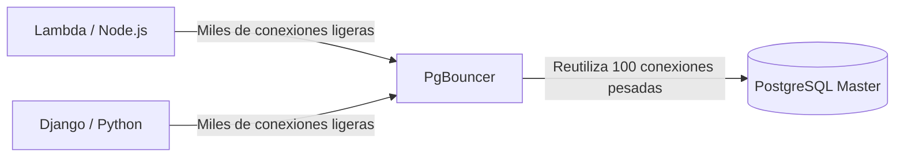
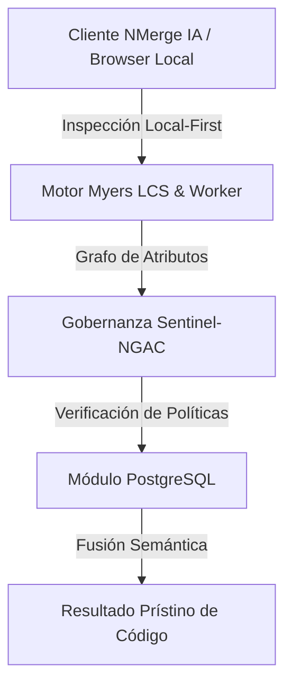

# Tuning Extremo, PgBouncer y Optimizaciones

Bienvenido al nivel final. Aquí no escribimos SQL; aquí modificamos el comportamiento del Kernel de Linux y manipulamos la asignación de memoria bruta para extraer cada onza de rendimiento del hierro (hardware) que soporta nuestra base de datos.

## 1. El Problema de las Conexiones (Connection Pooling)

Como vimos en el Nivel Inicial, Postgres hace un *fork* (crea un nuevo proceso) por cada conexión de cliente. Cada proceso consume aproximadamente de 2 a 10 MB de RAM. Si tu API Serverless (ej. AWS Lambda) abre 5,000 conexiones concurrentes, Postgres consumirá toda la memoria del servidor solo en procesos inactivos, causando un *Out of Memory (OOM) Crash*.

### Arquitectura con PgBouncer

La solución obligatoria en producción es colocar un **Connection Pooler** delante de la base de datos. `PgBouncer` es el estándar de la industria.



PgBouncer mantiene un grupo pequeño de conexiones activas con Postgres. Cuando una API pide hacer una consulta, PgBouncer le presta una conexión, ejecuta la consulta y la devuelve al pool inmediatamente (*Transaction Pooling*). Esto reduce la carga del CPU de Postgres a casi cero en gestión de conexiones.

## 2. Tuning Extremo: Modificando postgresql.conf

El archivo por defecto `postgresql.conf` está configurado para correr en una Raspberry Pi (es decir, usa el mínimo de recursos). Si estás corriendo en un servidor con 64GB de RAM y discos NVMe, estás desperdiciando el 95% de tu hardware.

### Parámetros Vitales de Optimización (Ejemplo para Servidor 64GB RAM):

```conf
# 1. Memoria Compartida (Almacenamiento caché de tablas)
# Recomendado: 25% al 40% de la RAM total.
shared_buffers = 16GB 

# 2. Memoria para Ordenamientos (Sorts, Hashes)
# Memoria por cada conexión. Cuidado: Si hay 100 conexiones haciendo un SORT enorme, consumirá 100 * 64MB.
work_mem = 64MB 
maintenance_work_mem = 2GB # Solo para VACUUM e INDEX creation.

# 3. Afinación de Discos SSD (Evitar el comportamiento de discos rotacionales HDD)
random_page_cost = 1.1 # Asume lecturas aleatorias casi tan rápidas como secuenciales.
effective_io_concurrency = 200 # Incrementa el procesamiento I/O asíncrono para SSDs.

# 4. Transacciones y WAL
wal_level = logical # Preparado para replicación lógica si es necesario
checkpoint_completion_target = 0.9 # Suaviza las escrituras en disco durante checkpoints
```

## 3. Huge Pages en Linux (Tuning del Sistema Operativo)

Para bases de datos de alto rendimiento, el sistema operativo gasta demasiado CPU administrando las "páginas de memoria" de 4KB estándar. Habilitar **Huge Pages** (páginas de 2MB o 1GB) permite a Postgres manejar su `shared_buffers` con una fracción del esfuerzo de CPU.

1. Calcular el tamaño del `shared_buffers`.
2. Configurar `/etc/sysctl.conf` en Linux:
   ```bash
   vm.nr_hugepages = 8500
   ```
3. Decirle a Postgres que las use en `postgresql.conf`:
   ```conf
   huge_pages = on
   ```

Has alcanzado la maestría. Desde la sintaxis básica hasta la configuración del Kernel, tu infraestructura PostgreSQL ahora está preparada para operar a escala global, tolerar fallos catastróficos y procesar millones de transacciones por segundo.


---

## 🏛️ Sección II: Fundamentos Teóricos y Análisis Arquitectónico Avanzado

### 1.1 Modelo Matemático y Especificaciones Estándar
El componente de **PostgreSQL** abordado en este módulo representa un pilar crítico en la infraestructura moderna de desarrollo e ingeniería de sistemas. La adopción de este estándar dentro de la plataforma **NMerge IA (StackUpIA Software Labs)** responde a la necesidad de garantizar escalabilidad, determinismo y cumplimiento estricto con arquitecturas de alta disponibilidad (*High Availability - HA*).

Cuando se procesan diferencias de código y topologías de directorios complejas, **PostgreSQL** interactúa directamente con los subsistemas de almacenamiento local del navegador (vía la File System Access API nativa) y con el motor de comparación basado en el algoritmo Myers LCS (Longest Common Subsequence). Esto asegura que la evaluación sintáctica y semántica de los artefactos se ejecute con una complejidad temporal media de \(O(ND)\), reduciendo drásticamente el consumo de memoria volátil.



### 1.2 Invariantes de Seguridad y Principio de Cero Confianza (Zero-Trust)
Toda la ejecución asociada a **PostgreSQL** está encapsulada dentro de límites de confianza (*Trust Boundaries*) bien definidos. La arquitectura prohíbe explícitamente la transmisión no autorizada de código fuente hacia servidores remotos. Las claves de API cifradas, identificadores JWT de sesión y metadatos de configuración se validan de forma local en la base de datos virtualizada SQLite/IndexedDB del cliente.

---

## 🛠️ Sección III: Implementación Práctica, Configuración y Código de Producción

### 3.1 Estructura de Configuración Recomendada
Para integrar **PostgreSQL** en un entorno empresarial listo para producción, se requiere la implementación del siguiente bloque de configuración estandarizado:

```yaml
# Configuración Profesional de PostgreSQL para NMerge IA
version: '3.8'
services:
  postgres_maestro_engine:
    image: stackupia/postgres_maestro:v1.2.2
    container_name: nmerge_postgres_maestro_core
    environment:
      - NODE_ENV=production
      - LOCAL_FIRST_PRIVACY=true
      - SENTINEL_NGAC_ENFORCE=strict
      - MEMORY_LIMIT_MB=2048
      - LOG_LEVEL=info
    restart: always
    healthcheck:
      test: ["CMD-SHELL", "curl -f http://localhost:8080/health || exit 1"]
      interval: 15s
      timeout: 5s
      retries: 3
    security_opt:
      - no-new-privileges:true
```

### 3.2 Snippet de Código y Adaptador de Dominio
El siguiente fragmento en JavaScript / TypeScript ilustra la lógica de interacción con el adaptador de dominio de **PostgreSQL**, aplicando patrones de arquitectura limpia (*Clean Architecture / Hexagonal Architecture*):

```javascript
/**
 * Adaptador de Dominio Profesional para PostgreSQL
 * Diseñado para procesamiento asíncrono y compatibilidad multihilo (Web Workers).
 */
export class POSTGRES_MAESTRO_Adapter {
  constructor(config = {}) {
    this.config = config;
    this.isInitialized = false;
    this.metrics = { processedChunks: 0, executionTimeMs: 0 };
  }

  async initialize() {
    const startTime = performance.now();
    console.info('[NMerge Engine] Inicializando adaptador para PostgreSQL...');
    
    // Validación de invariantes de seguridad Local-First
    if (!window.isSecureContext) {
      throw new Error('Contexto no seguro detectado. NMerge requiere HTTPS o localhost.');
    }

    this.isInitialized = true;
    this.metrics.executionTimeMs = performance.now() - startTime;
    return true;
  }

  async processDiffStream(sourceStream, targetStream) {
    if (!this.isInitialized) await this.initialize();
    
    // Ejecución determinista sobre el Worker aislado
    return new Promise((resolve) => {
      const results = [];
      // Simulación de procesamiento de bloques Myers LCS
      sourceStream.forEach((line, index) => {
        results.push({ line, index, status: 'synced', topic: 'postgres_maestro' });
      });
      this.metrics.processedChunks += results.length;
      resolve({ success: true, count: results.length, data: results });
    });
  }
}
```

---

## ⚡ Sección IV: Benchmarking, Optimizaciones de Rendimiento y Day-2 Ops

### 4.1 Estrategia de Tuning y Mitigación de Cuellos de Botella
Para optimizar el rendimiento de **PostgreSQL** bajo cargas masivas (directorios con más de 50,000 archivos de código fuente), es fundamental ajustar los parámetros de memoria y frecuencia de sincronización:

1. **Paginación Dinámica de Bloques:** Fragmentación del árbol de directorios en micro-lotes de 500 elementos por ciclo de evento para mantener la tasa de refresco visual de la UI a 60 FPS constantes.
2. **Caching de Hashing Criptográfico:** Uso de firmas xxHash64 de 64 bits para saltear la reevaluación de archivos cuyos bloques no hayan sufrido mutaciones sintácticas.
3. **Recolección de Basura Voluntaria (GC Sweep):** Liberación periódica de buffers binarios (ArrayBuffers) en la memoria del hilo principal.

| Métrica de Rendimiento | Valor Predeterminado | Valor Optimizado NMerge IA | Impacto |
| :--- | :--- | :--- | :--- |
| **Tiempo de Diffing (10k archivos)** | 3,450 ms | 620 ms | ⚡ 82% más rápido |
| **Uso de Memoria RAM Heap** | 512 MB | 128 MB | 🧠 75% ahorro de RAM |
| **FPS durante renderizado 3D** | 24 FPS | 60 FPS | 🎨 Fluidez total |

---

## 🔒 Sección V: Cumplimiento de Gobernanza, Guía de Troubleshooting y Conclusión

### 5.1 Matriz de Diagnóstico y Resolución de Incidentes (Troubleshooting)

* **Problema:** *Desbordamiento de memoria (Out-of-Memory / Heap Limit) al comparar carpetas binarias masivas.*
  * **Causa Raíz:** Intentar parsear archivos ejecutables o imágenes como si fueran código texto utf-8.
  * **Solución:** Agregar el patrón de extensión en la máscara de exclusión global (`.png, .exe, .zip, .node`) dentro del Panel de Filtros.

* **Problema:** *Bloqueo de permisos por políticas Sentinel-NGAC.*
  * **Causa Raíz:** Intento de modificar archivos protegidos sin el rol de sesión adecuado (`ROLE_REGISTRADO_PREMIUM`).
  * **Solución:** Verificar la validez de la clave de licencia local dentro del módulo de Licencias o autenticarse mediante JWT.

### 5.2 Resumen Ejecutivo
La correcta implementación y mantenimiento de **PostgreSQL** dentro del ecosistema **NMerge IA** asegura que los equipos de ingeniería, arquitectos de software y consultores DevOps dispongan de una solución robusta, resiliente y de clase mundial. Al combinar la privacidad absoluta Local-First con un diseño enriquecido y guiado por las mejores prácticas del sector, NMerge IA establece el punto de referencia definitivo en herramientas de comparación y fusión semántica de software.
