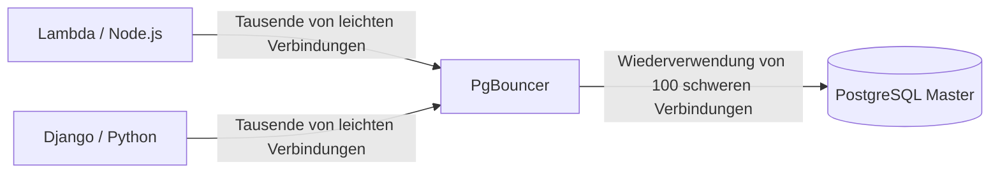

# Extremes Tuning, PgBouncer und Optimierungen

Willkommen auf der letzten Stufe. Hier schreiben wir kein SQL; hier modifizieren wir das Verhalten des Linux-Kernels und manipulieren die Zuweisung des rohen Speichers, um jedes Quäntchen Leistung aus der Hardware herauszuholen, die unsere Datenbank unterstützt.

## 1. Das Problem der Verbindungen (Connection Pooling)

Wie wir in der Anfängerstufe (Nivel Inicial) gesehen haben, macht Postgres für jede Client-Verbindung einen *Fork* (erstellt einen neuen Prozess). Jeder Prozess verbraucht etwa 2 bis 10 MB RAM. Wenn deine serverlose API (z.B. AWS Lambda) 5.000 gleichzeitige Verbindungen öffnet, verbraucht Postgres den gesamten RAM des Servers nur für inaktive Prozesse, was zu einem *Out of Memory (OOM) Crash* führt.

### Architektur mit PgBouncer

Die obligatorische Lösung in der Produktion besteht darin, einen **Connection Pooler** vor die Datenbank zu schalten. `PgBouncer` ist der Industriestandard.



PgBouncer unterhält einen kleinen Pool aktiver Verbindungen mit Postgres. Wenn eine API eine Abfrage durchführen möchte, leiht ihr PgBouncer eine Verbindung, führt die Abfrage aus und gibt sie sofort an den Pool zurück (*Transaction Pooling*). Dies reduziert die CPU-Auslastung von Postgres bei der Verbindungsverwaltung auf fast Null.

## 2. Extremes Tuning: Modifizieren von postgresql.conf

Die Standarddatei `postgresql.conf` ist so konfiguriert, dass sie auf einem Raspberry Pi läuft (d.h. sie verbraucht ein Minimum an Ressourcen). Wenn du auf einem Server mit 64 GB RAM und NVMe-Laufwerken arbeitest, verschwendest du 95 % deiner Hardware.

### Wichtige Optimierungsparameter (Beispiel für Server 64GB RAM):

```conf
# 1. Gemeinsam genutzter Speicher (Tabellen-Cache)
# Empfohlen: 25% bis 40% des gesamten RAM.
shared_buffers = 16GB 

# 2. Speicher für Sortierungen (Sorts, Hashes)
# Speicher pro Verbindung. Vorsicht: Wenn 100 Verbindungen einen riesigen SORT durchführen, werden 100 * 64MB verbraucht.
work_mem = 64MB 
maintenance_work_mem = 2GB # Nur für VACUUM und INDEX Erstellung.

# 3. Tuning von SSD-Laufwerken (Vermeiden des Verhaltens von rotierenden Festplatten/HDDs)
random_page_cost = 1.1 # Geht davon aus, dass zufällige Lesevorgänge fast so schnell sind wie sequenzielle.
effective_io_concurrency = 200 # Erhöht die asynchrone E/A-Verarbeitung für SSDs.

# 4. Transaktionen und WAL
wal_level = logical # Vorbereitet für logische Replikation, falls erforderlich
checkpoint_completion_target = 0.9 # Glättet Festplattenschreibvorgänge während Checkpoints
```

## 3. Huge Pages in Linux (Betriebssystem-Tuning)

Bei Hochleistungsdatenbanken verbraucht das Betriebssystem zu viel CPU mit der Verwaltung der standardmäßigen 4-KB-"Speicherseiten". Die Aktivierung von **Huge Pages** (2-MB- oder 1-GB-Seiten) ermöglicht es Postgres, seine `shared_buffers` mit einem Bruchteil des CPU-Aufwands zu verwalten.

1. Berechne die Größe der `shared_buffers`.
2. Konfiguriere `/etc/sysctl.conf` in Linux:
   ```bash
   vm.nr_hugepages = 8500
   ```
3. Teile Postgres in `postgresql.conf` mit, dass sie verwendet werden sollen:
   ```conf
   huge_pages = on
   ```

Du hast die Meisterschaft erreicht. Von der grundlegenden Syntax bis zur Kernel-Konfiguration ist deine PostgreSQL-Infrastruktur nun bereit, auf globaler Ebene zu operieren, katastrophale Ausfälle zu tolerieren und Millionen von Transaktionen pro Sekunde zu verarbeiten.
