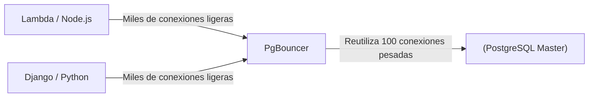

# Tuning Extremo, PgBouncer y Optimizaciones

Bienvenido al nivel final. Aquí no escribimos SQL; aquí modificamos el comportamiento del Kernel de Linux y manipulamos la asignación de memoria bruta para extraer cada onza de rendimiento del hierro (hardware) que soporta nuestra base de datos.

## 1. El Problema de las Conexiones (Connection Pooling)

Como vimos en el Nivel Inicial, Postgres hace un *fork* (crea un nuevo proceso) por cada conexión de cliente. Cada proceso consume aproximadamente de 2 a 10 MB de RAM. Si tu API Serverless (ej. AWS Lambda) abre 5,000 conexiones concurrentes, Postgres consumirá toda la memoria del servidor solo en procesos inactivos, causando un *Out of Memory (OOM) Crash*.

### Arquitectura con PgBouncer

La solución obligatoria en producción es colocar un **Connection Pooler** delante de la base de datos. `PgBouncer` es el estándar de la industria.



PgBouncer mantiene un grupo pequeño de conexiones activas con Postgres. Cuando una API pide hacer una consulta, PgBouncer le presta una conexión, ejecuta la consulta y la devuelve al pool inmediatamente (*Transaction Pooling*). Esto reduce la carga del CPU de Postgres a casi cero en gestión de conexiones.

## 2. Tuning Extremo: Modificando postgresql.conf

El archivo por defecto `postgresql.conf` está configurado para correr en una Raspberry Pi (es decir, usa el mínimo de recursos). Si estás corriendo en un servidor con 64GB de RAM y discos NVMe, estás desperdiciando el 95% de tu hardware.

### Parámetros Vitales de Optimización (Ejemplo para Servidor 64GB RAM):

```conf
# 1. Memoria Compartida (Almacenamiento caché de tablas)
# Recomendado: 25% al 40% de la RAM total.
shared_buffers = 16GB 

# 2. Memoria para Ordenamientos (Sorts, Hashes)
# Memoria por cada conexión. Cuidado: Si hay 100 conexiones haciendo un SORT enorme, consumirá 100 * 64MB.
work_mem = 64MB 
maintenance_work_mem = 2GB # Solo para VACUUM e INDEX creation.

# 3. Afinación de Discos SSD (Evitar el comportamiento de discos rotacionales HDD)
random_page_cost = 1.1 # Asume lecturas aleatorias casi tan rápidas como secuenciales.
effective_io_concurrency = 200 # Incrementa el procesamiento I/O asíncrono para SSDs.

# 4. Transacciones y WAL
wal_level = logical # Preparado para replicación lógica si es necesario
checkpoint_completion_target = 0.9 # Suaviza las escrituras en disco durante checkpoints
```

## 3. Huge Pages en Linux (Tuning del Sistema Operativo)

Para bases de datos de alto rendimiento, el sistema operativo gasta demasiado CPU administrando las "páginas de memoria" de 4KB estándar. Habilitar **Huge Pages** (páginas de 2MB o 1GB) permite a Postgres manejar su `shared_buffers` con una fracción del esfuerzo de CPU.

1. Calcular el tamaño del `shared_buffers`.
2. Configurar `/etc/sysctl.conf` en Linux:
   ```bash
   vm.nr_hugepages = 8500
   ```
3. Decirle a Postgres que las use en `postgresql.conf`:
   ```conf
   huge_pages = on
   ```

Has alcanzado la maestría. Desde la sintaxis básica hasta la configuración del Kernel, tu infraestructura PostgreSQL ahora está preparada para operar a escala global, tolerar fallos catastróficos y procesar millones de transacciones por segundo.
