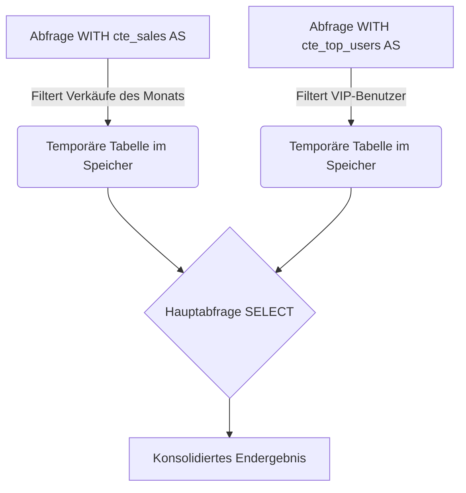
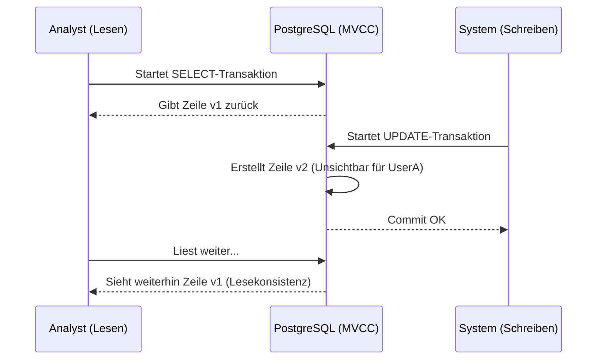

# Erweiterte Abfragen, CTEs und ACID-Transaktionen

Wenn ein einfaches `SELECT` und `JOIN` nicht mehr ausreichen, um die Geschäftslogik zu verarbeiten, betreten wir die mittlere Stufe. Hier verwandeln wir PostgreSQL von einem einfachen Datenspeicher in eine **analytische Rechenmaschine**. Die Berechnung in die Datenbank zu verlagern (wo die Daten leben), ist fast immer effizienter, als Gigabytes an Daten über das Netzwerk an deinen Node.js- oder Python-Server zu senden.

## 1. Common Table Expressions (CTEs): Aufräumen des SQL-Spaghettis

Verschachtelte Unterabfragen können schnell zu einer Wartungshölle werden. CTEs (die `WITH`-Klausel) ermöglichen es dir, temporäre und lesbare Ergebnisblöcke zu definieren.

### CTE-Flussdiagramm



### Praktisches Beispiel
Stell dir vor, wir möchten den durchschnittlichen Rechnungsbetrag unserer "Top Customers" berechnen, ohne ein SQL-Spaghetti zu machen:

```sql
WITH top_customers AS (
    SELECT customer_id, SUM(total_amount) as lifetime_value
    FROM billing.invoices
    GROUP BY customer_id
    HAVING SUM(total_amount) > 10000
),
recent_invoices AS (
    SELECT customer_id, total_amount
    FROM billing.invoices
    WHERE created_at >= NOW() - INTERVAL '30 days'
)
-- Hauptabfrage, die die CTEs verbindet
SELECT t.customer_id, t.lifetime_value, AVG(r.total_amount) as avg_recent_ticket
FROM top_customers t
JOIN recent_invoices r ON t.customer_id = r.customer_id
GROUP BY t.customer_id, t.lifetime_value;
```

## 2. Window Functions: Die Magie der Analytik

*Window Functions* (Fensterfunktionen) ermöglichen es, Berechnungen über einen Satz von Zeilen durchzuführen, die mit der aktuellen Zeile in Beziehung stehen, **ohne sie zu gruppieren (ohne die Ergebnisse wie bei `GROUP BY` zusammenzufassen)**.

Möchtest du wissen, welche Position (Ranking) das Gehalt eines Mitarbeiters innerhalb seiner eigenen Abteilung hat, während die Details des Mitarbeiters erhalten bleiben?

```sql
SELECT 
    employee_name, 
    department, 
    salary,
    RANK() OVER (PARTITION BY department ORDER BY salary DESC) as salary_rank,
    salary - AVG(salary) OVER (PARTITION BY department) as diff_from_dept_avg
FROM hr.employees;
```
In diesem magischen Code:
- `PARTITION BY` erstellt Untergruppen (Fenster) nach Abteilung.
- Die Abfrage gibt ALLE Zeilen der Mitarbeiter zurück, fügt aber analytisch berechnete Spalten hinzu, die das gesamte Fenster betrachten.

## 3. Transaktionen und Nebenläufigkeitskontrolle (MVCC)

PostgreSQL erfüllt **ACID** (Atomarität, Konsistenz, Isolation, Dauerhaftigkeit) dank seiner MVCC-Architektur (*Multi-Version Concurrency Control*).

### Was ist MVCC?
Wenn du eine Zeile in Postgres aktualisierst, **überschreibt** die Engine die Daten nicht auf der Festplatte. Stattdessen markiert sie die alte Zeile als "veraltet" (dead tuple) und fügt eine neue Version der Zeile ein. Das bedeutet, dass **Leser niemals Schreiber blockieren und Schreiber niemals Leser blockieren.**



### Explizite Transaktionen
Das Gruppieren kritischer Operationen stellt sicher, dass der Zustand der Datenbank konsistent ist.

```sql
BEGIN; -- Startet die Transaktion

UPDATE accounts SET balance = balance - 100 WHERE id = 1;
UPDATE accounts SET balance = balance + 100 WHERE id = 2;

-- Wenn hier in deinem Code etwas fehlschlägt, machst du ein ROLLBACK;
-- Wenn alles in Ordnung ist, bestätigst du:
COMMIT; 
```

## 4. Upsert (INSERT ... ON CONFLICT)

Das *Upsert*-Muster löst Nebenläufigkeitsprobleme beim Versuch, einen Datensatz einzufügen, der möglicherweise bereits existiert. Anstatt ein `SELECT` (zur Überprüfung) und dann ein `INSERT` oder `UPDATE` vom Backend auszuführen (was langsam und anfällig für Race Conditions ist), machst du es atomar:

```sql
INSERT INTO analytics.daily_stats (date, user_id, visits)
VALUES ('2023-10-01', 105, 1)
ON CONFLICT (date, user_id) 
DO UPDATE SET visits = analytics.daily_stats.visits + 1;
```

Mit diesen Werkzeugen hast du das Schreiben von monolithischem SQL hinter dir gelassen. Du schreibst sauberen, deklarativen und mathematisch robusten Code. Auf der **Fortgeschrittenen Stufe (Nivel Avanzado)** werden wir in den Untergrund der Engine eindringen: Ausführungspläne (EXPLAIN) und interne Bereinigung (Vacuum).
