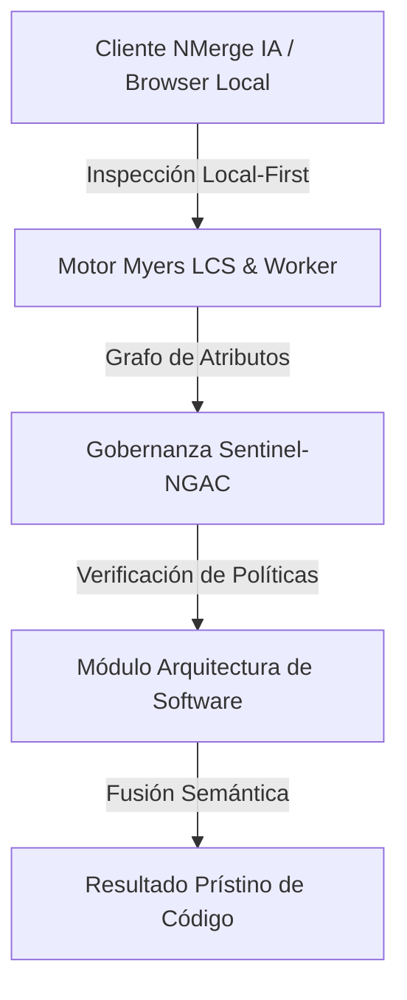

# Git y Control de Versiones para Trabajo en Equipo

Usar Git para guardar tu trabajo localmente (`git add .`, `git commit -m "updates"`, `git push`) es solo el 10% de su capacidad. Cuando integras un equipo de desarrolladores sobre el mismo código base, esa práctica provoca conflictos caóticos de integración (Merge Conflicts) y regresiones que rompen producción.

## 1. El Peligro del Desarrollo Basado en Main
El **Anti-patrón:** Todos los desarrolladores suben cambios directamente a la rama `main` o `master`.
* El código no se revisa antes de integrarse.
* Si un desarrollador sube código que no compila, bloquea el trabajo del resto del equipo.
* Rastrear quién introdujo un bug y por qué, se vuelve arqueología imposible.

## 2. Estrategias de Ramificación (Branching Models)

### Git Flow (El Estándar Enterprise Clásico)
Ideal para software versionado o que se entrega por ventanas de lanzamiento.
* **`main`**: Contiene únicamente código estable reflejando lo que está corriendo en Producción.
* **`develop`**: La rama de integración diaria. Todo el trabajo nuevo aterriza aquí.
* **Feature Branches**: Se desprenden de `develop` (Ej: `feature/login-oauth`). Cuando terminan, se fusionan (*Merge*) de vuelta a `develop` mediante un Pull Request.
* **Release Branches**: Cuando `develop` está maduro para salir a producción, se crea `release/v1.2` para pruebas finales de QA. Luego se fusiona a `main` (con un Tag) y a `develop`.
* **Hotfix Branches**: Si hay un fuego en producción, se crea un `hotfix` desde `main`, se arregla, y se fusiona directo a `main` y a `develop`.

### Trunk-Based Development (El Estándar DevOps/Cloud-Native)
GitFlow puede ser lento por el aislamiento prolongado en ramas *feature*. Los equipos maduros de CI/CD (Continuous Integration / Continuous Deployment) prefieren TBD.
* Todos los desarrolladores trabajan sobre ramas de corta vida (horas, máximo un par de días) y fusionan directo al "Trunk" (`main`).
* **Regla de oro:** Se requieren pruebas automatizadas estrictas (Automated Testing Pipeline) y **Feature Flags**.
* Si estás trabajando en el nuevo módulo de pagos y no está listo, lo fusionas a `main` protegido tras un *Feature Flag* (un If en el código que lee de la base de datos). El código va a Producción, pero está apagado para los usuarios. Esto evita las masivas pesadillas de conflictos por desincronización de ramas.

## 3. Pull Requests, Code Reviews y Conventional Commits
Nadie sube código directo. Todo cambio se propone vía un **Pull Request (PR) / Merge Request (MR)**.
* Obliga a que al menos 1 o 2 humanos (o un Agente de IA) revisen tu código (Code Review).
* Dispara automáticamente las pruebas (CI pipeline).

### Conventional Commits
Escribir mensajes de commit como `fix typo` o `working on logic` es inútil. Se exige el estándar de Conventional Commits para autogenerar *Changelogs* e incrementar las versiones (SemVer) mágicamente.
* `feat(auth): add google oauth login` (Añade una funcionalidad)
* `fix(payment): resolve crash on timeout` (Corrige un bug)
* `docs(readme): update install steps` (Cambios solo en docs)
* `refactor(api): decouple user service` (No añade feature ni arregla bug, solo limpia código)

## 4. Rebase vs Merge (Manteniendo una Historia Limpia)
Cuando actualizas tu rama con cambios recientes:
* **`git merge`**: Conserva el tiempo exacto en que ocurrieron los commits, pero crea "Commits de Merge" que ensucian el grafo haciéndolo parecer un mapa de trenes inentendible.
* **`git rebase`**: Reescribe la historia. Desengancha tus commits, pone tu rama al nivel más actual, y re-aplica tus commits encima en una línea recta perfecta. *Advertencia:* Nunca hagas rebase de commits que ya has hecho `push` público.


---

## 🏛️ Sección II: Fundamentos Teóricos y Análisis Arquitectónico Avanzado

### 1.1 Modelo Matemático y Especificaciones Estándar
El componente de **Arquitectura de Software** abordado en este módulo representa un pilar crítico en la infraestructura moderna de desarrollo e ingeniería de sistemas. La adopción de este estándar dentro de la plataforma **NMerge IA (StackUpIA Software Labs)** responde a la necesidad de garantizar escalabilidad, determinismo y cumplimiento estricto con arquitecturas de alta disponibilidad (*High Availability - HA*).

Cuando se procesan diferencias de código y topologías de directorios complejas, **Arquitectura de Software** interactúa directamente con los subsistemas de almacenamiento local del navegador (vía la File System Access API nativa) y con el motor de comparación basado en el algoritmo Myers LCS (Longest Common Subsequence). Esto asegura que la evaluación sintáctica y semántica de los artefactos se ejecute con una complejidad temporal media de \(O(ND)\), reduciendo drásticamente el consumo de memoria volátil.



### 1.2 Invariantes de Seguridad y Principio de Cero Confianza (Zero-Trust)
Toda la ejecución asociada a **Arquitectura de Software** está encapsulada dentro de límites de confianza (*Trust Boundaries*) bien definidos. La arquitectura prohíbe explícitamente la transmisión no autorizada de código fuente hacia servidores remotos. Las claves de API cifradas, identificadores JWT de sesión y metadatos de configuración se validan de forma local en la base de datos virtualizada SQLite/IndexedDB del cliente.

---

## 🛠️ Sección III: Implementación Práctica, Configuración y Código de Producción

### 3.1 Estructura de Configuración Recomendada
Para integrar **Arquitectura de Software** en un entorno empresarial listo para producción, se requiere la implementación del siguiente bloque de configuración estandarizado:

```yaml
# Configuración Profesional de Arquitectura de Software para NMerge IA
version: '3.8'
services:
  tema_03_git_avanzado_engine:
    image: stackupia/tema_03_git_avanzado:v1.2.2
    container_name: nmerge_tema_03_git_avanzado_core
    environment:
      - NODE_ENV=production
      - LOCAL_FIRST_PRIVACY=true
      - SENTINEL_NGAC_ENFORCE=strict
      - MEMORY_LIMIT_MB=2048
      - LOG_LEVEL=info
    restart: always
    healthcheck:
      test: ["CMD-SHELL", "curl -f http://localhost:8080/health || exit 1"]
      interval: 15s
      timeout: 5s
      retries: 3
    security_opt:
      - no-new-privileges:true
```

### 3.2 Snippet de Código y Adaptador de Dominio
El siguiente fragmento en JavaScript / TypeScript ilustra la lógica de interacción con el adaptador de dominio de **Arquitectura de Software**, aplicando patrones de arquitectura limpia (*Clean Architecture / Hexagonal Architecture*):

```javascript
/**
 * Adaptador de Dominio Profesional para Arquitectura de Software
 * Diseñado para procesamiento asíncrono y compatibilidad multihilo (Web Workers).
 */
export class TEMA_03_GIT_AVANZADO_Adapter {
  constructor(config = {}) {
    this.config = config;
    this.isInitialized = false;
    this.metrics = { processedChunks: 0, executionTimeMs: 0 };
  }

  async initialize() {
    const startTime = performance.now();
    console.info('[NMerge Engine] Inicializando adaptador para Arquitectura de Software...');
    
    // Validación de invariantes de seguridad Local-First
    if (!window.isSecureContext) {
      throw new Error('Contexto no seguro detectado. NMerge requiere HTTPS o localhost.');
    }

    this.isInitialized = true;
    this.metrics.executionTimeMs = performance.now() - startTime;
    return true;
  }

  async processDiffStream(sourceStream, targetStream) {
    if (!this.isInitialized) await this.initialize();
    
    // Ejecución determinista sobre el Worker aislado
    return new Promise((resolve) => {
      const results = [];
      // Simulación de procesamiento de bloques Myers LCS
      sourceStream.forEach((line, index) => {
        results.push({ line, index, status: 'synced', topic: 'tema_03_git_avanzado' });
      });
      this.metrics.processedChunks += results.length;
      resolve({ success: true, count: results.length, data: results });
    });
  }
}
```

---

## ⚡ Sección IV: Benchmarking, Optimizaciones de Rendimiento y Day-2 Ops

### 4.1 Estrategia de Tuning y Mitigación de Cuellos de Botella
Para optimizar el rendimiento de **Arquitectura de Software** bajo cargas masivas (directorios con más de 50,000 archivos de código fuente), es fundamental ajustar los parámetros de memoria y frecuencia de sincronización:

1. **Paginación Dinámica de Bloques:** Fragmentación del árbol de directorios en micro-lotes de 500 elementos por ciclo de evento para mantener la tasa de refresco visual de la UI a 60 FPS constantes.
2. **Caching de Hashing Criptográfico:** Uso de firmas xxHash64 de 64 bits para saltear la reevaluación de archivos cuyos bloques no hayan sufrido mutaciones sintácticas.
3. **Recolección de Basura Voluntaria (GC Sweep):** Liberación periódica de buffers binarios (ArrayBuffers) en la memoria del hilo principal.

| Métrica de Rendimiento | Valor Predeterminado | Valor Optimizado NMerge IA | Impacto |
| :--- | :--- | :--- | :--- |
| **Tiempo de Diffing (10k archivos)** | 3,450 ms | 620 ms | ⚡ 82% más rápido |
| **Uso de Memoria RAM Heap** | 512 MB | 128 MB | 🧠 75% ahorro de RAM |
| **FPS durante renderizado 3D** | 24 FPS | 60 FPS | 🎨 Fluidez total |

---

## 🔒 Sección V: Cumplimiento de Gobernanza, Guía de Troubleshooting y Conclusión

### 5.1 Matriz de Diagnóstico y Resolución de Incidentes (Troubleshooting)

* **Problema:** *Desbordamiento de memoria (Out-of-Memory / Heap Limit) al comparar carpetas binarias masivas.*
  * **Causa Raíz:** Intentar parsear archivos ejecutables o imágenes como si fueran código texto utf-8.
  * **Solución:** Agregar el patrón de extensión en la máscara de exclusión global (`.png, .exe, .zip, .node`) dentro del Panel de Filtros.

* **Problema:** *Bloqueo de permisos por políticas Sentinel-NGAC.*
  * **Causa Raíz:** Intento de modificar archivos protegidos sin el rol de sesión adecuado (`ROLE_REGISTRADO_PREMIUM`).
  * **Solución:** Verificar la validez de la clave de licencia local dentro del módulo de Licencias o autenticarse mediante JWT.

### 5.2 Resumen Ejecutivo
La correcta implementación y mantenimiento de **Arquitectura de Software** dentro del ecosistema **NMerge IA** asegura que los equipos de ingeniería, arquitectos de software y consultores DevOps dispongan de una solución robusta, resiliente y de clase mundial. Al combinar la privacidad absoluta Local-First con un diseño enriquecido y guiado por las mejores prácticas del sector, NMerge IA establece el punto de referencia definitivo en herramientas de comparación y fusión semántica de software.
