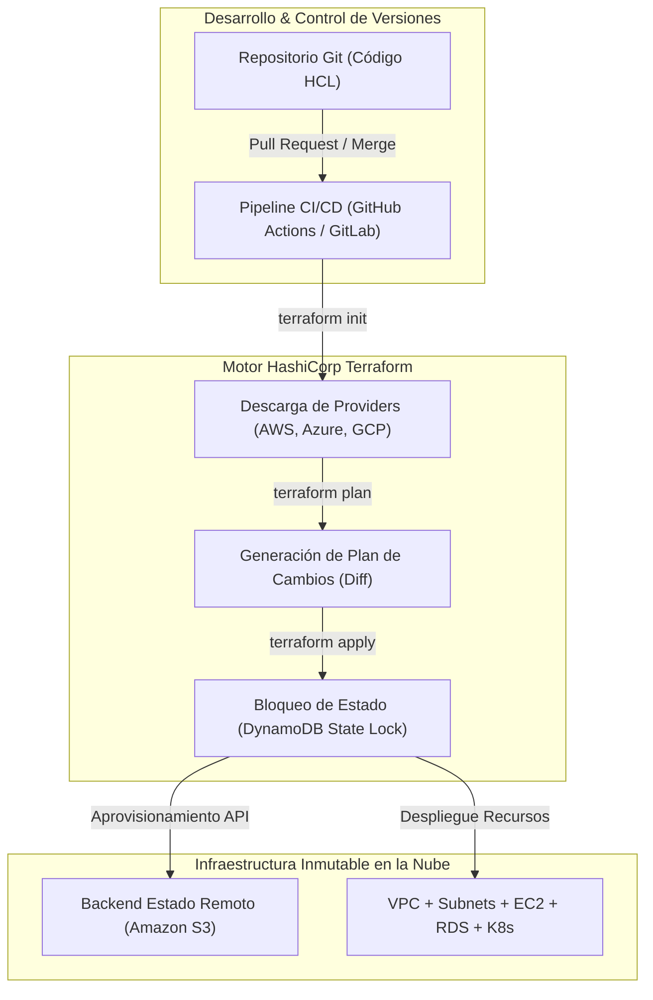

# Infraestructura como Código e Inmutabilidad (IaC & Terraform)

La **Infraestructura como Código (IaC)** es la práctica fundamental de DevOps y Cloud Engineering que permite aprovisionar, configurar y gestionar la infraestructura tecnológica (servidores, redes, bases de datos y balanceadores) mediante código fuente auditable, reproducible e inmutable, sustituyendo la configuración manual basada en clics en la consola web (*ClickOps*).

## 1. El Paradigma Declarativo e Inmutabilidad

A diferencia de la gestión tradicional basada en scripts imperativos (como Bash o PowerShell) que indican *CÓMO* ejecutar pasos secuenciales, la arquitectura de **Terraform** utiliza un enfoque **Declarativo**: defines el *ESTADO DESEADO* de tu infraestructura y el motor calcula automáticamente la diferencia contra el estado real en la nube.

### Diagrama de Flujo de Aprovisionamiento Declarativo



## 2. Ciclo de Vida de Terraform

El flujo de trabajo estándar en ingeniería de infraestructura consta de 4 comandos esenciales:

```bash
# 1. Inicializar directorio y descargar proveedores
terraform init

# 2. Vista previa y cálculo del diff contra la infraestructura real
terraform plan

# 3. Aplicación de cambios y creación de recursos
terraform apply -auto-approve

# 4. Destrucción segura de entornos temporales de pruebas
terraform destroy
```

## 3. Estado Remoto y Bloqueo Concurrente (Remote State Locking)

El archivo de estado `terraform.tfstate` es el mapa de verdad que asocia los recursos declarados en el código con los IDs reales creados en el proveedor de nube. 

* **Anti-patrón:** Guardar el estado localmente o enviarlo a Git (expone secretos y genera colisiones entre desarrolladores).
* **Mejor Práctica Enterprise:** Almacenar el archivo de estado cifrado en **Amazon S3** con un mecanismo de bloqueo atómico mediante **Amazon DynamoDB**.

### Ejemplo de Configuración `backend.tf`:

```hcl
terraform {
  required_version = ">= 1.5.0"
  
  required_providers {
    aws = {
      source  = "hashicorp/aws"
      version = "~> 5.0"
    }
  }

  backend "s3" {
    bucket         = "nmerge-terraform-state-prod"
    key            = "global/s3/terraform.tfstate"
    region         = "us-east-1"
    dynamodb_table = "nmerge-terraform-locks"
    encrypt        = true
  }
}
```

## 4. Módulos Reutilizables de Producción

Los módulos encapsulan conjuntos de recursos para promover la reutilización y estandarizar la seguridad empresarial.

```hcl
# Ejemplo de invocación de Módulo Web App Reutilizable
module "servidor_web_produccion" {
  source          = "./modules/infraestructura_web"
  environment     = "production"
  instance_type   = "t3.medium"
  min_size        = 2
  max_size        = 10
  enable_autoscaling = true

  tags = {
    Proyecto  = "NMerge IA"
    ManagedBy = "Terraform"
  }
}
```
