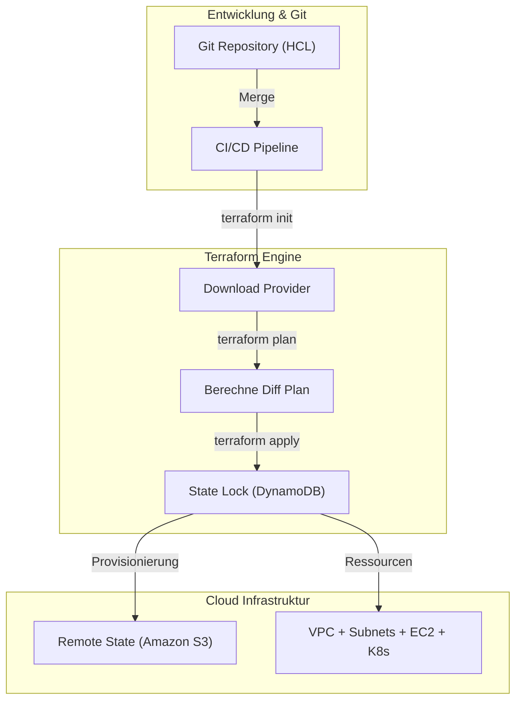

# Infrastruktur als Code & Unveränderlichkeit (IaC & Terraform)

**Infrastructure as Code (IaC)** ist die grundlegende DevOps-Praxis zur Bereitstellung und Verwaltung von IT-Infrastrukturen über deklarativen Code.

## 1. Deklaratives Paradigma

Im Gegensatz zu imperativen Skripten definiert **Terraform** den *SOLL-ZUSTAND* Ihrer Architektur.



## 2. Terraform Lebenszyklus

```bash
terraform init
terraform plan
terraform apply -auto-approve
terraform destroy
```

## 3. Remote State & Locking (S3 + DynamoDB)

```hcl
terraform {
  backend "s3" {
    bucket         = "nmerge-terraform-state-prod"
    key            = "global/s3/terraform.tfstate"
    region         = "us-east-1"
    dynamodb_table = "nmerge-terraform-locks"
    encrypt        = true
  }
}
```
