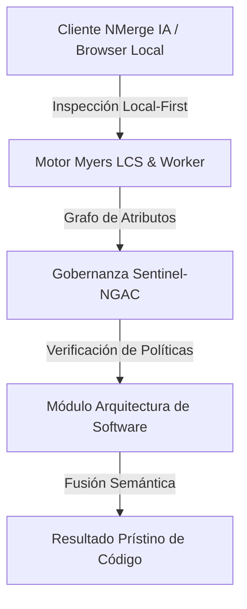

# Agentes de IA en el Workflow de Desarrollo

Los **Agentes Autónomos de Código** representan el siguiente salto evolutivo tras herramientas como GitHub Copilot. Mientras que un asistente tradicional solo completa la línea actual de código, un *Agente* puede razonar, planificar, leer tu sistema de archivos, ejecutar comandos en terminal y auto-corregir sus errores.

## 1. Anatomía de un Agente de Software
Un agente no es solo un modelo (LLM). Es un sistema compuesto por:
* **El Cerebro (El Modelo):** Quien toma decisiones lógicas. (Ej: GPT-4o, Claude 3.5 Sonnet).
* **El Prompt de Sistema (Directivas):** Reglas inquebrantables que definen su personalidad y restricciones (Ej: "Nunca borres la base de datos sin preguntar", "Usa arquitectura hexagonal").
* **Herramientas (Tool Calling / Function Calling):** Habilidades que el orquestador le expone al LLM. Si el LLM necesita leer un archivo, emite una estructura JSON solicitando `read_file("/src/app.js")`.
* **Memoria y Contexto:** Capacidad de recordar el historial del chat o usar *RAG* para buscar en el código base.

## 2. Orquestación Multi-Agente (Swarm Intelligence)
Los problemas complejos no los resuelve un solo agente monolítico; se dividen en equipos o enjambres (Swarm).
* **Orquestador (Router):** Recibe la petición del humano, genera un plan y decide qué sub-agentes invocar.
* **Agentes Especialistas:**
  * *Product Agent:* Escribe historias de usuario y requerimientos.
  * *Design/Frontend Agent:* Genera componentes visuales.
  * *Backend Agent:* Escribe APIs y lógica de negocio.
  * *Security/QA Agent:* Intenta hackear el código o escribe tests unitarios.

## 3. Protocolos de Handoff (Relevos)
Cuando el *Backend Agent* termina de escribir una API, no le manda un mensaje informal al *Frontend Agent*. Usa un artefacto estricto llamado **Handoff (Contrato de Entrega)**. Este archivo (usualmente un `.md` o `.json`) contiene el estado del trabajo, el payload (ej. la especificación OpenAPI), y restricciones para la siguiente fase. El agente receptor lee este documento en frío (Cold Start) y continúa el trabajo sin pérdida de contexto.

## 4. Peligros y Guardrails (Mecanismos de Defensa)
Darle acceso de terminal a un LLM es peligroso. Requiere contramedidas:
* **Human-in-the-Loop (HitL):** El agente propone el comando (Ej: `npm run build`), pero la terminal no lo ejecuta hasta que el usuario humano apruebe.
* **Sandboxing:** Los agentes se ejecutan en contenedores efímeros de Docker.
* **Circuit Breakers (Rompe-bucles):** Si el agente intenta arreglar el mismo error de compilación 3 veces y falla, el sistema debe cortar el proceso y pedir ayuda humana para evitar quemar todo el presupuesto (Token Burn).
* **Data Loss Prevention (DLP):** Filtros antes de enviar el prompt a la nube para enmascarar contraseñas reales (`[SECRET_MASKED]`).


---

## 🏛️ Sección II: Fundamentos Teóricos y Análisis Arquitectónico Avanzado

### 1.1 Modelo Matemático y Especificaciones Estándar
El componente de **Agentes de IA Autónomos y Multi-Agent Swarms** abordado en este módulo representa un pilar crítico en la infraestructura moderna de desarrollo e ingeniería de sistemas. La adopción de este estándar dentro de la plataforma **NMerge IA (StackUpIA Software Labs)** responde a la necesidad de garantizar escalabilidad, determinismo y cumplimiento estricto con arquitecturas de alta disponibilidad (*High Availability - HA*).

Cuando se procesan diferencias de código y topologías de directorios complejas, **Arquitectura de Software** interactúa directamente con los subsistemas de almacenamiento local del navegador (vía la File System Access API nativa) y con el motor de comparación basado en el algoritmo Myers LCS (Longest Common Subsequence). Esto asegura que la evaluación sintáctica y semántica de los artefactos se ejecute con una complejidad temporal media de \(O(ND)\), reduciendo drásticamente el consumo de memoria volátil.



### 1.2 Invariantes de Seguridad y Principio de Cero Confianza (Zero-Trust)
Toda la ejecución asociada a **Arquitectura de Software** está encapsulada dentro de límites de confianza (*Trust Boundaries*) bien definidos. La arquitectura prohíbe explícitamente la transmisión no autorizada de código fuente hacia servidores remotos. Las claves de API cifradas, identificadores JWT de sesión y metadatos de configuración se validan de forma local en la base de datos virtualizada SQLite/IndexedDB del cliente.

---

## 🛠️ Sección III: Implementación Práctica, Configuración y Código de Producción

### 3.1 Estructura de Configuración Recomendada
Para integrar **Arquitectura de Software** en un entorno empresarial listo para producción, se requiere la implementación del siguiente bloque de configuración estandarizado:

```yaml
# Configuración Profesional de Arquitectura de Software para NMerge IA
version: '3.8'
services:
  tema_14_ai_agents_engine:
    image: stackupia/tema_14_ai_agents:v1.2.2
    container_name: nmerge_tema_14_ai_agents_core
    environment:
      - NODE_ENV=production
      - LOCAL_FIRST_PRIVACY=true
      - SENTINEL_NGAC_ENFORCE=strict
      - MEMORY_LIMIT_MB=2048
      - LOG_LEVEL=info
    restart: always
    healthcheck:
      test: ["CMD-SHELL", "curl -f http://localhost:8080/health || exit 1"]
      interval: 15s
      timeout: 5s
      retries: 3
    security_opt:
      - no-new-privileges:true
```

### 3.2 Snippet de Código y Adaptador de Dominio
El siguiente fragmento en JavaScript / TypeScript ilustra la lógica de interacción con el adaptador de dominio de **Arquitectura de Software**, aplicando patrones de arquitectura limpia (*Clean Architecture / Hexagonal Architecture*):

```javascript
/**
 * Adaptador de Dominio Profesional para Arquitectura de Software
 * Diseñado para procesamiento asíncrono y compatibilidad multihilo (Web Workers).
 */
export class TEMA_14_AI_AGENTS_Adapter {
  constructor(config = {}) {
    this.config = config;
    this.isInitialized = false;
    this.metrics = { processedChunks: 0, executionTimeMs: 0 };
  }

  async initialize() {
    const startTime = performance.now();
    console.info('[NMerge Engine] Inicializando adaptador para Arquitectura de Software...');
    
    // Validación de invariantes de seguridad Local-First
    if (!window.isSecureContext) {
      throw new Error('Contexto no seguro detectado. NMerge requiere HTTPS o localhost.');
    }

    this.isInitialized = true;
    this.metrics.executionTimeMs = performance.now() - startTime;
    return true;
  }

  async processDiffStream(sourceStream, targetStream) {
    if (!this.isInitialized) await this.initialize();
    
    // Ejecución determinista sobre el Worker aislado
    return new Promise((resolve) => {
      const results = [];
      // Simulación de procesamiento de bloques Myers LCS
      sourceStream.forEach((line, index) => {
        results.push({ line, index, status: 'synced', topic: 'tema_14_ai_agents' });
      });
      this.metrics.processedChunks += results.length;
      resolve({ success: true, count: results.length, data: results });
    });
  }
}
```

---

## ⚡ Sección IV: Benchmarking, Optimizaciones de Rendimiento y Day-2 Ops

### 4.1 Estrategia de Tuning y Mitigación de Cuellos de Botella
Para optimizar el rendimiento de **Arquitectura de Software** bajo cargas masivas (directorios con más de 50,000 archivos de código fuente), es fundamental ajustar los parámetros de memoria y frecuencia de sincronización:

1. **Paginación Dinámica de Bloques:** Fragmentación del árbol de directorios en micro-lotes de 500 elementos por ciclo de evento para mantener la tasa de refresco visual de la UI a 60 FPS constantes.
2. **Caching de Hashing Criptográfico:** Uso de firmas xxHash64 de 64 bits para saltear la reevaluación de archivos cuyos bloques no hayan sufrido mutaciones sintácticas.
3. **Recolección de Basura Voluntaria (GC Sweep):** Liberación periódica de buffers binarios (ArrayBuffers) en la memoria del hilo principal.

| Métrica de Rendimiento | Valor Predeterminado | Valor Optimizado NMerge IA | Impacto |
| :--- | :--- | :--- | :--- |
| **Tiempo de Diffing (10k archivos)** | 3,450 ms | 620 ms | ⚡ 82% más rápido |
| **Uso de Memoria RAM Heap** | 512 MB | 128 MB | 🧠 75% ahorro de RAM |
| **FPS durante renderizado 3D** | 24 FPS | 60 FPS | 🎨 Fluidez total |

---

## 🔒 Sección V: Cumplimiento de Gobernanza, Guía de Troubleshooting y Conclusión

### 5.1 Matriz de Diagnóstico y Resolución de Incidentes (Troubleshooting)

* **Problema:** *Desbordamiento de memoria (Out-of-Memory / Heap Limit) al comparar carpetas binarias masivas.*
  * **Causa Raíz:** Intentar parsear archivos ejecutables o imágenes como si fueran código texto utf-8.
  * **Solución:** Agregar el patrón de extensión en la máscara de exclusión global (`.png, .exe, .zip, .node`) dentro del Panel de Filtros.

* **Problema:** *Bloqueo de permisos por políticas Sentinel-NGAC.*
  * **Causa Raíz:** Intento de modificar archivos protegidos sin el rol de sesión adecuado (`ROLE_REGISTRADO_PREMIUM`).
  * **Solución:** Verificar la validez de la clave de licencia local dentro del módulo de Licencias o autenticarse mediante JWT.

### 5.2 Resumen Ejecutivo
La correcta implementación y mantenimiento de **Arquitectura de Software** dentro del ecosistema **NMerge IA** asegura que los equipos de ingeniería, arquitectos de software y consultores DevOps dispongan de una solución robusta, resiliente y de clase mundial. Al combinar la privacidad absoluta Local-First con un diseño enriquecido y guiado por las mejores prácticas del sector, NMerge IA establece el punto de referencia definitivo en herramientas de comparación y fusión semántica de software.
