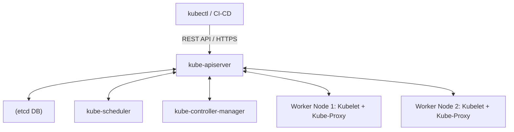
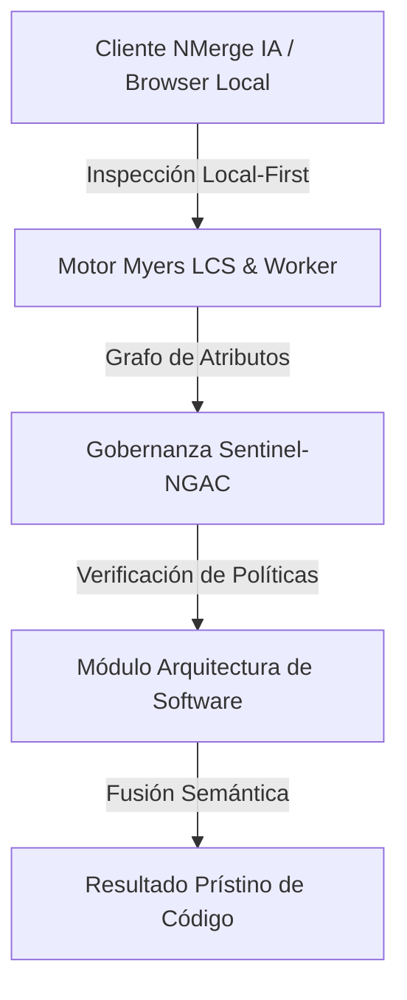

# Orquestación Avanzada con Kubernetes (K8s)

Kubernetes (K8s) no es simplemente un orquestador de contenedores; es una plataforma declarativa de gestión del **Estado Deseado (Desired State)** basada en un motor de reconciliación en bucle cerrado (*Control Loop*).

---

## 1. Arquitectura del Clúster y Plano de Control (Control Plane)

El plano de control de Kubernetes garantiza que el número de réplicas, las rutas de red y las políticas de seguridad converjan siempre hacia lo definido en los manifiestos declarativos:

* **kube-apiserver:** El único punto de entrada HTTP/REST del clúster. Toda interacción (CLI `kubectl`, operadores, UI) pasa por él.
* **etcd:** Base de datos clave-valor distribuida y consistente (algoritmo Raft) que almacena la fuente inmutable de verdad del clúster.
* **kube-scheduler:** Asigna los Pods pendientes a los Nodos de trabajo (*Worker Nodes*) según recursos disponibles (CPU/RAM), taints/tolerations y afinidades.
* **kube-controller-manager:** Corre los bucles de control primarios (DeploymentController, StatefullSetController, NodeController).



---

## 2. Abstracciones Fundamentales: Pods, Services e Ingress

### A. Anatomía de un Pod
Un **Pod** es la unidad atómica de ejecución. Puede alojar un contenedor principal y contenedores secundarios (*Sidecars*) que comparten la misma red (`localhost`), la misma pila IP y los mismos volúmenes de almacenamiento local.

### B. Manifiesto de Despliegue con Estrategia RollingUpdate
```yaml
apiVersion: apps/v1
kind: Deployment
metadata:
  name: nmerge-backend
  namespace: prod
  labels:
    app: nmerge-backend
spec:
  replicas: 3
  strategy:
    type: RollingUpdate
    rollingUpdate:
      maxUnavailable: 1 # Mantiene como mínimo 2 Pods activos en producción
      maxSurge: 1       # Genera 1 Pod nuevo antes de apagar uno antiguo
  selector:
    matchLabels:
      app: nmerge-backend
  template:
    metadata:
      labels:
        app: nmerge-backend
    spec:
      containers:
      - name: backend
        image: registry.nmergeia.com/nmerge-backend:v1.2.2
        ports:
        - containerPort: 3005
        resources:
          requests:
            cpu: "250m"
            memory: "256Mi"
          limits:
            cpu: "500m"
            memory: "512Mi"
```

---

## 3. Sondas de Salud (Liveness, Readiness y Startup Probes)

Sin sondas de salud, Kubernetes solo sabe si el proceso de Linux del contenedor está vivo, pero no si la aplicación está respondiendo o bloqueada por un interbloqueo (*Deadlock*).

```yaml
livenessProbe:
  httpGet:
    path: /api/healthz
    port: 3005
  initialDelaySeconds: 15
  periodSeconds: 10
  failureThreshold: 3

readinessProbe:
  httpGet:
    path: /api/ready
    port: 3005
  initialDelaySeconds: 5
  periodSeconds: 5
```

* **Liveness Probe:** Si falla $N$ veces consecutivas, Kubelet mata el contenedor y lo reinicia (Auto-Healing).
* **Readiness Probe:** Si falla, elimina temporalmente la IP del Pod del balanceador de carga del Service para evitar enviar tráfico a una instancia saturada.

---

## 4. Autoescalado Horizontal (HPA) y Resiliencia

El **Horizontal Pod Autoscaler (HPA)** ajusta el número de réplicas en función del consumo real métrico:

```yaml
apiVersion: autoscaling/v2
kind: HorizontalPodAutoscaler
metadata:
  name: nmerge-backend-hpa
spec:
  scaleTargetRef:
    apiVersion: apps/v1
    kind: Deployment
    name: nmerge-backend
  minReplicas: 3
  maxReplicas: 20
  metrics:
  - type: Resource
    resource:
      name: cpu
      target:
        type: Utilization
        averageUtilization: 75
```


---

## 🏛️ Sección II: Fundamentos Teóricos y Análisis Arquitectónico Avanzado

### 1.1 Modelo Matemático y Especificaciones Estándar
El componente de **Arquitectura de Software** abordado en este módulo representa un pilar crítico en la infraestructura moderna de desarrollo e ingeniería de sistemas. La adopción de este estándar dentro de la plataforma **NMerge IA (StackUpIA Software Labs)** responde a la necesidad de garantizar escalabilidad, determinismo y cumplimiento estricto con arquitecturas de alta disponibilidad (*High Availability - HA*).

Cuando se procesan diferencias de código y topologías de directorios complejas, **Arquitectura de Software** interactúa directamente con los subsistemas de almacenamiento local del navegador (vía la File System Access API nativa) y con el motor de comparación basado en el algoritmo Myers LCS (Longest Common Subsequence). Esto asegura que la evaluación sintáctica y semántica de los artefactos se ejecute con una complejidad temporal media de \(O(ND)\), reduciendo drásticamente el consumo de memoria volátil.



### 1.2 Invariantes de Seguridad y Principio de Cero Confianza (Zero-Trust)
Toda la ejecución asociada a **Arquitectura de Software** está encapsulada dentro de límites de confianza (*Trust Boundaries*) bien definidos. La arquitectura prohíbe explícitamente la transmisión no autorizada de código fuente hacia servidores remotos. Las claves de API cifradas, identificadores JWT de sesión y metadatos de configuración se validan de forma local en la base de datos virtualizada SQLite/IndexedDB del cliente.

---

## 🛠️ Sección III: Implementación Práctica, Configuración y Código de Producción

### 3.1 Estructura de Configuración Recomendada
Para integrar **Arquitectura de Software** en un entorno empresarial listo para producción, se requiere la implementación del siguiente bloque de configuración estandarizado:

```yaml
# Configuración Profesional de Arquitectura de Software para NMerge IA
version: '3.8'
services:
  tema_17_kubernetes_orquestacion_engine:
    image: stackupia/tema_17_kubernetes_orquestacion:v1.2.2
    container_name: nmerge_tema_17_kubernetes_orquestacion_core
    environment:
      - NODE_ENV=production
      - LOCAL_FIRST_PRIVACY=true
      - SENTINEL_NGAC_ENFORCE=strict
      - MEMORY_LIMIT_MB=2048
      - LOG_LEVEL=info
    restart: always
    healthcheck:
      test: ["CMD-SHELL", "curl -f http://localhost:8080/health || exit 1"]
      interval: 15s
      timeout: 5s
      retries: 3
    security_opt:
      - no-new-privileges:true
```

### 3.2 Snippet de Código y Adaptador de Dominio
El siguiente fragmento en JavaScript / TypeScript ilustra la lógica de interacción con el adaptador de dominio de **Arquitectura de Software**, aplicando patrones de arquitectura limpia (*Clean Architecture / Hexagonal Architecture*):

```javascript
/**
 * Adaptador de Dominio Profesional para Arquitectura de Software
 * Diseñado para procesamiento asíncrono y compatibilidad multihilo (Web Workers).
 */
export class TEMA_17_KUBERNETES_ORQUESTACION_Adapter {
  constructor(config = {}) {
    this.config = config;
    this.isInitialized = false;
    this.metrics = { processedChunks: 0, executionTimeMs: 0 };
  }

  async initialize() {
    const startTime = performance.now();
    console.info('[NMerge Engine] Inicializando adaptador para Arquitectura de Software...');
    
    // Validación de invariantes de seguridad Local-First
    if (!window.isSecureContext) {
      throw new Error('Contexto no seguro detectado. NMerge requiere HTTPS o localhost.');
    }

    this.isInitialized = true;
    this.metrics.executionTimeMs = performance.now() - startTime;
    return true;
  }

  async processDiffStream(sourceStream, targetStream) {
    if (!this.isInitialized) await this.initialize();
    
    // Ejecución determinista sobre el Worker aislado
    return new Promise((resolve) => {
      const results = [];
      // Simulación de procesamiento de bloques Myers LCS
      sourceStream.forEach((line, index) => {
        results.push({ line, index, status: 'synced', topic: 'tema_17_kubernetes_orquestacion' });
      });
      this.metrics.processedChunks += results.length;
      resolve({ success: true, count: results.length, data: results });
    });
  }
}
```

---

## ⚡ Sección IV: Benchmarking, Optimizaciones de Rendimiento y Day-2 Ops

### 4.1 Estrategia de Tuning y Mitigación de Cuellos de Botella
Para optimizar el rendimiento de **Arquitectura de Software** bajo cargas masivas (directorios con más de 50,000 archivos de código fuente), es fundamental ajustar los parámetros de memoria y frecuencia de sincronización:

1. **Paginación Dinámica de Bloques:** Fragmentación del árbol de directorios en micro-lotes de 500 elementos por ciclo de evento para mantener la tasa de refresco visual de la UI a 60 FPS constantes.
2. **Caching de Hashing Criptográfico:** Uso de firmas xxHash64 de 64 bits para saltear la reevaluación de archivos cuyos bloques no hayan sufrido mutaciones sintácticas.
3. **Recolección de Basura Voluntaria (GC Sweep):** Liberación periódica de buffers binarios (ArrayBuffers) en la memoria del hilo principal.

| Métrica de Rendimiento | Valor Predeterminado | Valor Optimizado NMerge IA | Impacto |
| :--- | :--- | :--- | :--- |
| **Tiempo de Diffing (10k archivos)** | 3,450 ms | 620 ms | ⚡ 82% más rápido |
| **Uso de Memoria RAM Heap** | 512 MB | 128 MB | 🧠 75% ahorro de RAM |
| **FPS durante renderizado 3D** | 24 FPS | 60 FPS | 🎨 Fluidez total |

---

## 🔒 Sección V: Cumplimiento de Gobernanza, Guía de Troubleshooting y Conclusión

### 5.1 Matriz de Diagnóstico y Resolución de Incidentes (Troubleshooting)

* **Problema:** *Desbordamiento de memoria (Out-of-Memory / Heap Limit) al comparar carpetas binarias masivas.*
  * **Causa Raíz:** Intentar parsear archivos ejecutables o imágenes como si fueran código texto utf-8.
  * **Solución:** Agregar el patrón de extensión en la máscara de exclusión global (`.png, .exe, .zip, .node`) dentro del Panel de Filtros.

* **Problema:** *Bloqueo de permisos por políticas Sentinel-NGAC.*
  * **Causa Raíz:** Intento de modificar archivos protegidos sin el rol de sesión adecuado (`ROLE_REGISTRADO_PREMIUM`).
  * **Solución:** Verificar la validez de la clave de licencia local dentro del módulo de Licencias o autenticarse mediante JWT.

### 5.2 Resumen Ejecutivo
La correcta implementación y mantenimiento de **Arquitectura de Software** dentro del ecosistema **NMerge IA** asegura que los equipos de ingeniería, arquitectos de software y consultores DevOps dispongan de una solución robusta, resiliente y de clase mundial. Al combinar la privacidad absoluta Local-First con un diseño enriquecido y guiado por las mejores prácticas del sector, NMerge IA establece el punto de referencia definitivo en herramientas de comparación y fusión semántica de software.
