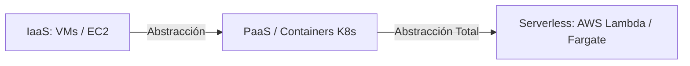
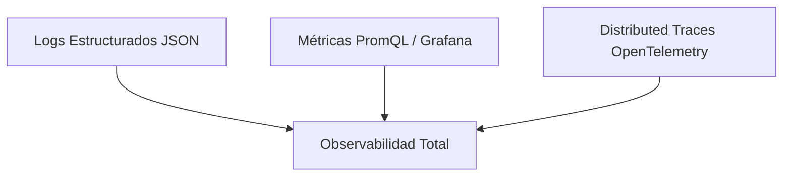
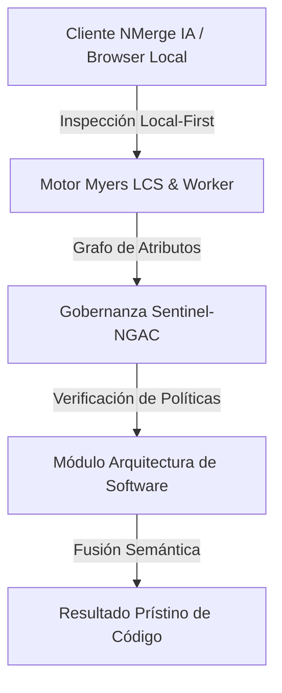

# Cloud Native, Serverless y Site Reliability Engineering (SRE)

El desarrollo **Cloud Native** y las prácticas de **Site Reliability Engineering (SRE)** representan la metodología moderna para diseñar, desplegar y operar aplicaciones distribuidas de alta escala y tolerancia a fallos.

---

## 1. Principios Cloud Native (El Estándar 12-Factor App)

Las aplicaciones Cloud Native siguen la metodología de los 12 Factores para garantizar portabilidad, inmutabilidad y escalabilidad en entornos de nube:

1. **Codebase:** Un único repositorio por microservicio, múltiples despliegues (Dev, Staging, Prod).
2. **Dependencias:** Declaradas e aisladas explícitamente (`package.json`, `Dockerfile`).
3. **Configuración:** Estrictamente almacenada en **Variables de Entorno** (`process.env`), jamás en el código fuente.
4. **Backing Services:** Tratar recursos de respaldo (Bases de datos, Redis, RabbitMQ) como recursos adjuntos accesibles vía URL/credenciales.
5. **Construcción, Lanzamiento, Ejecución:** Separación estricta entre la fase de Build (compilación de imagen), Release (unión con config) y Run (ejecución de contenedor).
6. **Procesos Stateless:** La aplicación debe ejecutar procesos sin estado. Cualquier estado persistente debe delegarse a servicios externos (PostgreSQL, Redis).
7. **Port Binding:** Exportar servicios mediante asignación transparente de puertos HTTP/TCP.
8. **Concurrencia:** Escalar horizontalmente mediante el modelo de procesos (clonar pods/instancias).
9. **Descartabilidad:** Inicio rápido y apagado gradual (*Graceful Shutdown* reaccionando a señales `SIGTERM`).
10. **Paridad entre Dev y Prod:** Mantener entornos de desarrollo y producción lo más idénticos posible.
11. **Logs como Streams:** Tratar logs como flujos continuos de eventos hacia `stdout` / `stderr`.
12. **Procesos de Administración:** Ejecutar tareas administrativas/migraciones como procesos únicos de una sola vez.

---

## 2. Serverless vs Containers (CaaS)



* **Serverless (FaaS):** Modelo basado en eventos de ejecución efímera. Auto-escala de $0$ a miles de instancias bajo demanda y cobra únicamente por los milisegundos reales de cómputo consumidos.
* **Graceful Shutdown Pattern en Node.js (Cloud Native):**
```javascript
const server = app.listen(3005, () => console.log('Server running on 3005'));

process.on('SIGTERM', () => {
  console.log('SIGTERM recibido. Cerrando conexiones HTTP de forma gradual...');
  server.close(() => {
    console.log('Servidor HTTP cerrado. Desconectando Base de Datos...');
    db.destroy().then(() => process.exit(0));
  });
});
```

---

## 3. Arquitectura SRE: SLI, SLO y Presupuesto de Error (Error Budget)

SRE es la disciplina que aplica principios de ingeniería de software a las operaciones de infraestructura.

### A. Definición de Métricas Core SRE:
* **SLI (Service Level Indicator):** La medida cuantitativa real del rendimiento del servicio.
  $$\text{SLI} = \frac{\text{Número de Peticiones Exitosas } (< 200\text{ms})}{\text{Número Total de Peticiones}} \times 100\%$$
* **SLO (Service Level Objective):** El objetivo meta acordado internamente (ej. $99.9\%$ de peticiones exitosas al mes).
* **Error Budget:** La cuota de error permitida ($100\% - \text{SLO}$). Para un SLO del $99.9\%$, el presupuesto de error es $0.1\%$.

```gherkin
FEATURE: Gobierno de Despliegues por Error Budget
  GIVEN un SLO mensual de disponibilidad del 99.9%
  AND un Error Budget consumido del 100% debido a incidentes Sev-1
  WHEN un equipo de desarrollo intenta desplegar una nueva feature a Producción
  THEN el pipeline de CI/CD debe congelar el despliegue de características
  AND permitir únicamente hotfixes de estabilidad y mejoras SRE
```

---

## 4. Observabilidad: Los Tres Pilares (Logs, Metrics, Traces)



1. **Logs (Registros):** Eventos discretos codificados en JSON estructurado para indexación en ELK o Loki.
2. **Metrics (Métricas):** Datos agregados en series temporales (CPU, Latencia p99, Error Rate) visualizados en Grafana.
3. **Traces (Trazas Distribuidas):** Seguimiento del ciclo de vida de una petición HTTP a través de múltiples microservicios utilizando cabeceras `W3C Trace Context` (`traceparent`).


---

## 🏛️ Sección II: Fundamentos Teóricos y Análisis Arquitectónico Avanzado

### 1.1 Modelo Matemático y Especificaciones Estándar
El componente de **SRE y Arquitecturas Cloud Native** abordado en este módulo representa un pilar crítico en la infraestructura moderna de desarrollo e ingeniería de sistemas. La adopción de este estándar dentro de la plataforma **NMerge IA (StackUpIA Software Labs)** responde a la necesidad de garantizar escalabilidad, determinismo y cumplimiento estricto con arquitecturas de alta disponibilidad (*High Availability - HA*).

Cuando se procesan diferencias de código y topologías de directorios complejas, **Arquitectura de Software** interactúa directamente con los subsistemas de almacenamiento local del navegador (vía la File System Access API nativa) y con el motor de comparación basado en el algoritmo Myers LCS (Longest Common Subsequence). Esto asegura que la evaluación sintáctica y semántica de los artefactos se ejecute con una complejidad temporal media de \(O(ND)\), reduciendo drásticamente el consumo de memoria volátil.



### 1.2 Invariantes de Seguridad y Principio de Cero Confianza (Zero-Trust)
Toda la ejecución asociada a **Arquitectura de Software** está encapsulada dentro de límites de confianza (*Trust Boundaries*) bien definidos. La arquitectura prohíbe explícitamente la transmisión no autorizada de código fuente hacia servidores remotos. Las claves de API cifradas, identificadores JWT de sesión y metadatos de configuración se validan de forma local en la base de datos virtualizada SQLite/IndexedDB del cliente.

---

## 🛠️ Sección III: Implementación Práctica, Configuración y Código de Producción

### 3.1 Estructura de Configuración Recomendada
Para integrar **Arquitectura de Software** en un entorno empresarial listo para producción, se requiere la implementación del siguiente bloque de configuración estandarizado:

```yaml
# Configuración Profesional de Arquitectura de Software para NMerge IA
version: '3.8'
services:
  tema_18_cloud_native_sre_engine:
    image: stackupia/tema_18_cloud_native_sre:v1.2.2
    container_name: nmerge_tema_18_cloud_native_sre_core
    environment:
      - NODE_ENV=production
      - LOCAL_FIRST_PRIVACY=true
      - SENTINEL_NGAC_ENFORCE=strict
      - MEMORY_LIMIT_MB=2048
      - LOG_LEVEL=info
    restart: always
    healthcheck:
      test: ["CMD-SHELL", "curl -f http://localhost:8080/health || exit 1"]
      interval: 15s
      timeout: 5s
      retries: 3
    security_opt:
      - no-new-privileges:true
```

### 3.2 Snippet de Código y Adaptador de Dominio
El siguiente fragmento en JavaScript / TypeScript ilustra la lógica de interacción con el adaptador de dominio de **Arquitectura de Software**, aplicando patrones de arquitectura limpia (*Clean Architecture / Hexagonal Architecture*):

```javascript
/**
 * Adaptador de Dominio Profesional para Arquitectura de Software
 * Diseñado para procesamiento asíncrono y compatibilidad multihilo (Web Workers).
 */
export class TEMA_18_CLOUD_NATIVE_SRE_Adapter {
  constructor(config = {}) {
    this.config = config;
    this.isInitialized = false;
    this.metrics = { processedChunks: 0, executionTimeMs: 0 };
  }

  async initialize() {
    const startTime = performance.now();
    console.info('[NMerge Engine] Inicializando adaptador para Arquitectura de Software...');
    
    // Validación de invariantes de seguridad Local-First
    if (!window.isSecureContext) {
      throw new Error('Contexto no seguro detectado. NMerge requiere HTTPS o localhost.');
    }

    this.isInitialized = true;
    this.metrics.executionTimeMs = performance.now() - startTime;
    return true;
  }

  async processDiffStream(sourceStream, targetStream) {
    if (!this.isInitialized) await this.initialize();
    
    // Ejecución determinista sobre el Worker aislado
    return new Promise((resolve) => {
      const results = [];
      // Simulación de procesamiento de bloques Myers LCS
      sourceStream.forEach((line, index) => {
        results.push({ line, index, status: 'synced', topic: 'tema_18_cloud_native_sre' });
      });
      this.metrics.processedChunks += results.length;
      resolve({ success: true, count: results.length, data: results });
    });
  }
}
```

---

## ⚡ Sección IV: Benchmarking, Optimizaciones de Rendimiento y Day-2 Ops

### 4.1 Estrategia de Tuning y Mitigación de Cuellos de Botella
Para optimizar el rendimiento de **Arquitectura de Software** bajo cargas masivas (directorios con más de 50,000 archivos de código fuente), es fundamental ajustar los parámetros de memoria y frecuencia de sincronización:

1. **Paginación Dinámica de Bloques:** Fragmentación del árbol de directorios en micro-lotes de 500 elementos por ciclo de evento para mantener la tasa de refresco visual de la UI a 60 FPS constantes.
2. **Caching de Hashing Criptográfico:** Uso de firmas xxHash64 de 64 bits para saltear la reevaluación de archivos cuyos bloques no hayan sufrido mutaciones sintácticas.
3. **Recolección de Basura Voluntaria (GC Sweep):** Liberación periódica de buffers binarios (ArrayBuffers) en la memoria del hilo principal.

| Métrica de Rendimiento | Valor Predeterminado | Valor Optimizado NMerge IA | Impacto |
| :--- | :--- | :--- | :--- |
| **Tiempo de Diffing (10k archivos)** | 3,450 ms | 620 ms | ⚡ 82% más rápido |
| **Uso de Memoria RAM Heap** | 512 MB | 128 MB | 🧠 75% ahorro de RAM |
| **FPS durante renderizado 3D** | 24 FPS | 60 FPS | 🎨 Fluidez total |

---

## 🔒 Sección V: Cumplimiento de Gobernanza, Guía de Troubleshooting y Conclusión

### 5.1 Matriz de Diagnóstico y Resolución de Incidentes (Troubleshooting)

* **Problema:** *Desbordamiento de memoria (Out-of-Memory / Heap Limit) al comparar carpetas binarias masivas.*
  * **Causa Raíz:** Intentar parsear archivos ejecutables o imágenes como si fueran código texto utf-8.
  * **Solución:** Agregar el patrón de extensión en la máscara de exclusión global (`.png, .exe, .zip, .node`) dentro del Panel de Filtros.

* **Problema:** *Bloqueo de permisos por políticas Sentinel-NGAC.*
  * **Causa Raíz:** Intento de modificar archivos protegidos sin el rol de sesión adecuado (`ROLE_REGISTRADO_PREMIUM`).
  * **Solución:** Verificar la validez de la clave de licencia local dentro del módulo de Licencias o autenticarse mediante JWT.

### 5.2 Resumen Ejecutivo
La correcta implementación y mantenimiento de **Arquitectura de Software** dentro del ecosistema **NMerge IA** asegura que los equipos de ingeniería, arquitectos de software y consultores DevOps dispongan de una solución robusta, resiliente y de clase mundial. Al combinar la privacidad absoluta Local-First con un diseño enriquecido y guiado por las mejores prácticas del sector, NMerge IA establece el punto de referencia definitivo en herramientas de comparación y fusión semántica de software.
