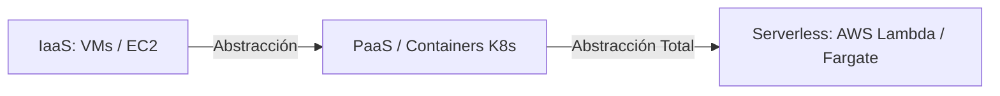
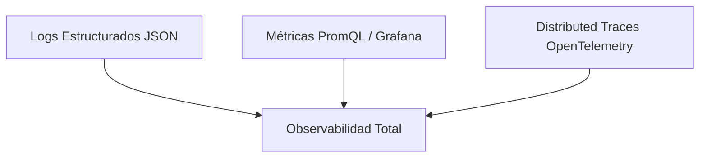

# Cloud Native, Serverless und Site Reliability Engineering (SRE)

**Cloud Native**-Entwicklung und **Site Reliability Engineering (SRE)**-Praktiken stellen die moderne Methodik für den Entwurf, die Bereitstellung und den Betrieb hochskalierter, fehlertoleranter verteilter Anwendungen dar.

---

## 1. Cloud-Native-Prinzipien (Der 12-Faktor-App-Standard)

Cloud-native Anwendungen folgen der 12-Faktoren-Methodik, um Portabilität, Unveränderlichkeit und Skalierbarkeit in Cloud-Umgebungen sicherzustellen:

1. **Codebasis:** Ein einzelnes Repository pro Microservice, mehrere Bereitstellungen (Dev, Staging, Prod).
2. **Abhängigkeiten:** Explizit deklariert und isoliert („package.json“, „Dockerfile“).
3. **Konfiguration:** Streng in **Umgebungsvariablen** („process.env“) gespeichert, niemals im Quellcode.
4. **Backing-Dienste:** Behandeln Sie Backup-Ressourcen (Datenbanken, Redis, RabbitMQ) als angehängte Ressourcen, auf die über URL/Anmeldeinformationen zugegriffen werden kann.
5. **Build, Release, Run:** Strikte Trennung zwischen den Phasen Build (Image-Kompilierung), Release (Vereinigung mit Konfiguration) und Run (Containerausführung).
6. **Zustandslose Prozesse:** Die Anwendung muss zustandslose Prozesse ausführen. Jeder dauerhafte Status sollte an externe Dienste (PostgreSQL, Redis) delegiert werden.
7. **Portbindung:** Exportieren Sie Dienste mithilfe einer transparenten HTTP/TCP-Portzuordnung.
8. **Parallelität:** Horizontale Skalierung mithilfe des Prozessmodells (Pods/Instanzen klonen).
9. **Verwerfen

> [!NOTE]
> Der Rest des Whitepapers ist in seiner Originalsprache gehalten, um die Syntax von Code und Diagrammen beizubehalten.

abilidad:** Inicio rápido y apagado gradual (*Graceful Shutdown* reaccionando a señales `SIGTERM`).
10. **Paridad entre Dev y Prod:** Mantener entornos de desarrollo y producción lo más idénticos posible.
11. **Logs como Streams:** Tratar logs como flujos continuos de eventos hacia `stdout` / `stderr`.
12. **Procesos de Administración:** Ejecutar tareas administrativas/migraciones como procesos únicos de una sola vez.

---

## 2. Serverless vs Containers (CaaS)



* **Serverless (FaaS):** Modelo basado en eventos de ejecución efímera. Auto-escala de $0$ a miles de instancias bajo demanda y cobra únicamente por los milisegundos reales de cómputo consumidos.
* **Graceful Shutdown Pattern en Node.js (Cloud Native):**
```javascript
const server = app.listen(3005, () => console.log('Server running on 3005'));

process.on('SIGTERM', () => {
  console.log('SIGTERM recibido. Cerrando conexiones HTTP de forma gradual...');
  server.close(() => {
    console.log('Servidor HTTP cerrado. Desconectando Base de Datos...');
    db.destroy().then(() => process.exit(0));
  });
});
```

---

## 3. Arquitectura SRE: SLI, SLO y Presupuesto de Error (Error Budget)

SRE es la disciplina que aplica principios de ingeniería de software a las operaciones de infraestructura.

### A. Definición de Métricas Core SRE:
* **SLI (Service Level Indicator):** La medida cuantitativa real del rendimiento del servicio.
  $$\text{SLI} = \frac{\text{Número de Peticiones Exitosas } (< 200\text{ms})}{\text{Número Total de Peticiones}} \times 100\%$$
* **SLO (Service Level Objective):** El objetivo meta acordado internamente (ej. $99.9\%$ de peticiones exitosas al mes).
* **Error Budget:** La cuota de error permitida ($100\% - \text{SLO}$). Para un SLO del $99.9\%$, el presupuesto de error es $0.1\%$.

```gherkin
FEATURE: Gobierno de Despliegues por Error Budget
  GIVEN un SLO mensual de disponibilidad del 99.9%
  AND un Error Budget consumido del 100% debido a incidentes Sev-1
  WHEN un equipo de desarrollo intenta desplegar una nueva feature a Producción
  THEN el pipeline de CI/CD debe congelar el despliegue de características
  AND permitir únicamente hotfixes de estabilidad y mejoras SRE
```

---

## 4. Observabilidad: Los Tres Pilares (Logs, Metrics, Traces)



1. **Logs (Registros):** Eventos discretos codificados en JSON estructurado para indexación en ELK o Loki.
2. **Metrics (Métricas):** Datos agregados en series temporales (CPU, Latencia p99, Error Rate) visualizados en Grafana.
3. **Traces (Trazas Distribuidas):** Seguimiento del ciclo de vida de una petición HTTP a través de múltiples microservicios utilizando cabeceras `W3C Trace Context` (`traceparent`).
