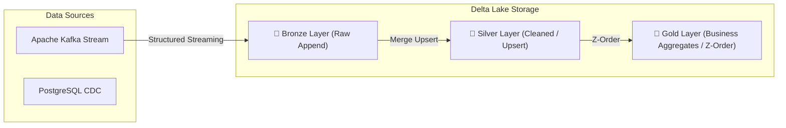

## 🎯 1. Delta Lake Architecture

**Delta Lake** is the open-source storage layer that brings **ACID transactions**, Time Travel, schema enforcement, and real-time compaction to Data Lakes (S3, ADLS, GCS), building an enterprise **Lakehouse architecture**.

### 💡 Core Architecture & Invariants:
- **ACID Transactions via Delta Log (`_delta_log/`):** Audit trail log with Optimistic Concurrency Control.
- **Time Travel & Auditing:** Query exact historical snapshots via `versionAsOf` or `timestampAsOf`.
- **Medallion Architecture (Bronze -> Silver -> Gold):** Raw ingestion (Bronze), cleaned/deduplicated (Silver), and aggregated metrics (Gold).
- **Z-Ordering & Data Skipping:** Multi-dimensional indexing for high-speed BI queries.

---

## 🏗️ 2. Medallion Lakehouse Architecture (Delta Lake Engine)

---

© 2026 NMerge IA. All rights reserved.