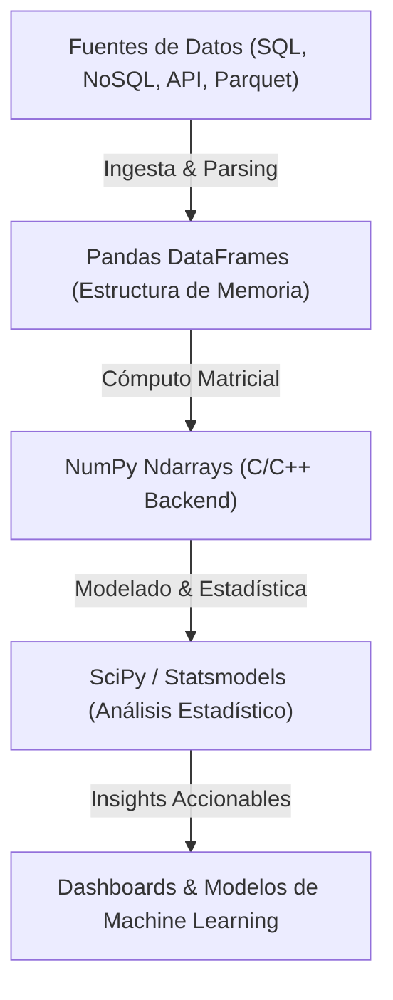

# Data Science, Python Ecosystem, NumPy and Pandas Core

La **Ciencia de Datos (Data Science)** es la disciplina interdisciplinaria que combina métodos científicos, algoritmos matemáticos, procesos estadísticos y sistemas de computación para extraer conocimiento útil, patrones ocultos e insights accionables a partir de grandes volúmenes de datos estructurados y no estructurados. En la era actual de la Inteligencia Artificial y el Big Data, Python se ha consolidado como el lenguaje estándar absoluto gracias a su ecosistema rico en librerías científicas optimizadas en C/C++ y Rust.



## 1. Fundamentos del Ecosistema Data Science en Python

El éxito de Python en la ciencia de datos reside en la separación clara entre la interfaz sintáctica de alto nivel (Python) y los motores de cálculo numérico vectorizados de bajo nivel en C, C++ y Fortran.

- **NumPy (Numerical Python):** Proporciona la estructura fundamental de almacenamiento denso de datos `ndarray` (N-Dimensional Array), permitiendo operaciones matemáticas vectorizadas sin bucles explícitos en Python.
- **Pandas:** Construido sobre NumPy, introduce las estructuras bidimensionales de etiquetado de datos `DataFrame` y `Series`, facilitando el filtrado, la alineación automática de índices y la agregación de datos.
- **SciPy:** Módulo avanzado de algoritmos matemáticos y estadísticos (optimización, integración numérica, transformadas de Fourier y distribuciones de probabilidad).

## 2. NumPy: Operaciones Vectorizadas y Estructuras Ndarray

En Python tradicional, una lista almacena punteros a objetos dispersos en la memoria Heap. NumPy sustituye esto por bloques continuos de memoria contigua (Contiguous Memory Blocks), reduciendo la latencia de caché L1/L2 en la CPU.

```python
import numpy as np

# Creación de arreglos vectorizados N-dimensionales
data = np.array([[1.5, 2.8, 3.4], [4.1, 5.0, 6.9]], dtype=np.float64)

# Operaciones matematicas vectorizadas (SIMD - Single Instruction Multiple Data)
squared_data = data ** 2
mean_by_column = np.mean(data, axis=0)

print(f"Dimensiones del ndarray: {data.shape}")
print(f"Tipo de datos en memoria contigua: {data.dtype}")
print(f"Promedio por columna: {mean_by_column}")
```

### Tabla Comparativa de Rendimiento de Memoria

| Estructura de Datos | Acceso a Memoria | Recolección de Basura | Velocidad Relativa de Cómputo |
| :--- | :--- | :--- | :--- |
| Lista Nativa de Python | Punteros Dispersos | Alto Overhead (PyObject) | 1x (Base Lenta) |
| NumPy Ndarray | Bloque Contiguo C-Contiguous | Cero Overhead en C | 50x - 100x más rápido |
| Pandas Series (PyArrow Backend) | Apache Arrow Columnar | Cero Overhead (Zero-Copy) | 150x más rápido |

## 3. Pandas: Manipulación de DataFrames y Carga de Archivos Parquet

Pandas es la navaja suiza de la ingesta de datos. En entornos profesionales de ingeniería de datos, el formato **Apache Parquet** sustituye al antiguo CSV debido a su compresión columnar (Snappy/Gzip) y lectura ultrarrápida.

```python
import pandas as pd

# Lectura eficiente desde almacenamiento columnar Parquet
df = pd.read_parquet('datos_empresa.parquet')

# Inspeccion estructural del DataFrame
print("Primeros registros:")
print(df.head(5))

# Filtrado booleano de alto rendimiento
df_filtrado = df[(df['ventas'] > 5000) & (df['categoria'] == 'Tecnología')]

# Agregación y agrupamiento rápido (Group-By Engine)
resumen = df_filtrado.groupby('region').agg({
    'ventas': ['sum', 'mean'],
    'cliente_id': 'nunique'
}).reset_index()

print("Resumen Estadístico por Región:")
print(resumen)
```

## 4. Mejores Prácticas de Optimización de Memoria en Pandas

1. **Evitar bucles `for` e `iter-rows()`:*** Utiliza siempre expresiones vectorizadas nativas o `.apply()` vectorizado.
2. **Downcasting de tipos de datos numéricos:** Convierte enteros de `int64` a `int32` o `int16`, y flotantes a `float32` cuando la precisión lo permita.
3. **Uso del tipo de datos Categorical:** Convierte columnas de texto repetitivo (ej. regiones, estados, categorías) al tipo `category` para reducir el consumo de RAM hasta en un 80%.

```python
# Downcasting eficiente para optimizar uso de memoria RAM
def optimizar_dataframe(df):
    for col in df.columns:
        if df[col].dtype == 'int64':
            df[col] = pd.to_numeric(df[col], downcast='integer')
        elif df[col].dtype == 'float64':
            df[col] = pd.to_numeric(df[col], downcast='float')
        elif df[col].dtype == 'object' and df[col].nunique() / len(df[col]) < 0.5:
            df[col] = df[col].astype('category')
    return df
```
