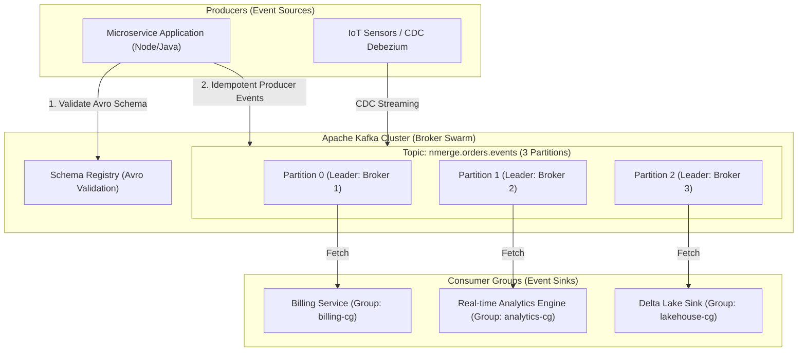

## 🎯 1. Executive Summary: Apache Kafka Event Streaming

**Apache Kafka** is the high-performance distributed event streaming platform used by over 80% of Fortune 500 companies. It provides distributed stream publish-and-subscribe, fault-tolerant storage, and real-time processing with sub-millisecond latencies.

### 💡 Core Architecture & Invariants:
- **Distributed Immutable Event Log:** Events are sequentially persisted to disk using page cache and Zero-Copy memory transfer (`sendfile`).
- **Delivery Guarantees (Exactly-Once Semantics - EOS):** Combination of idempotent producers (`enable.idempotence=true`) and atomic transactions across topics.
- **Consumer Groups & Rebalancing:** Dynamic horizontal scalability by assigning partitions to consumers sharing the same `group.id`.
- **Schema Governance:** Integration with Confluent Schema Registry (Avro / Protobuf / JSON Schema) for backward/forward compatibility.

---

## 🏗️ 2. Real-Time Data Flow Architecture (Kafka Cluster)



---

## 💻 3. Enterprise Implementation: Producer & Consumer with Schema Registry (Python/Kafka)

```python
from confluent_kafka import Producer, Consumer, KafkaError, KafkaException
import json

producer_config = {
    'bootstrap.servers': 'localhost:9092,localhost:9093',
    'client.id': 'nmerge-order-producer',
    'enable.idempotence': True,
    'acks': 'all',
    'compression.type': 'snappy',
    'linger.ms': 20
}

producer = Producer(producer_config)

def produce_order_event(order_id: str, user_id: str, amount: float):
    payload = {"event_id": f"evt_{order_id}", "order_id": order_id, "user_id": user_id, "amount": amount}
    producer.produce(topic="nmerge.orders.events", key=user_id.encode('utf-8'), value=json.dumps(payload).encode('utf-8'))
    producer.poll(0)

producer.flush()
```

---

© 2026 NMerge IA. All rights reserved.