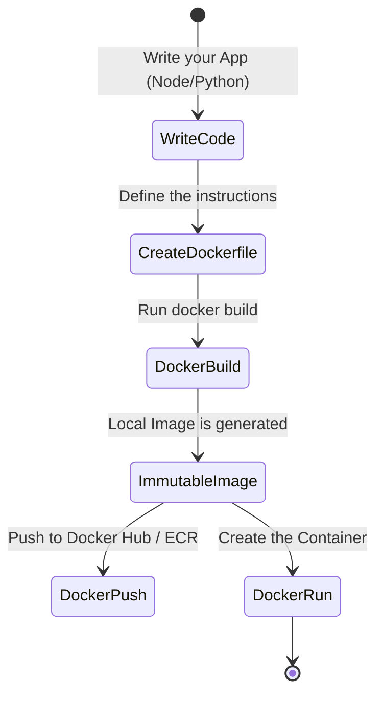

# Creating Your Own Images (Dockerfile)

Once you know how to run containers created by others (like NGINX or Postgres), it's time to package your own code. The true magic of Docker lies in **immutability**: if you package your app today, it will run exactly the same on your coworker's computer or on AWS servers 5 years from now.

## 1. The Manifest: What is a Dockerfile?

A `Dockerfile` is a plain text file (with no extension) containing a series of logical instructions that Docker reads from top to bottom to assemble an image.

### The Packaging Lifecycle



## 2. Building a Web App (Node.js)

Let's assume we have a very simple Node.js API. Our project has the following structure:

```text
/my-project
├── package.json
├── package-lock.json
├── server.js
└── Dockerfile
```

### The Standard Dockerfile

Create the `Dockerfile` file and add the following layers:

```dockerfile
# 1. Base Layer: Never use the 'latest' tag in production. Use fixed versions.
FROM node:18-alpine

# 2. Working Directory: Everything following will run inside this folder in the container
WORKDIR /usr/src/app

# 3. Dependency Cache: We copy ONLY the dependency files first.
# This is critical to leverage Docker's layer caching.
COPY package*.json ./

# 4. Installation: We run the package manager. It will only repeat if the JSON files change.
RUN npm install --production

# 5. Source Code: Now we copy the rest of the application.
COPY . .

# 6. Variables and Ports: We declare the port the app listens on (documentary only).
EXPOSE 3000
ENV NODE_ENV=production

# 7. Execution: The default command when the container starts.
CMD ["node", "server.js"]
```

## 3. The Power of Layer Caching

Why do we separate `COPY package*.json` from `COPY . .`? 
Docker caches the result of each line. If you change a button's color in your code (`server.js`), Docker will reuse the dependencies cache (`npm install`) because the `package.json` file didn't change. Had you copied everything together (`COPY . .` followed by `RUN npm install`), a simple text change would force Docker to re-install all dependencies, making your deployment extremely slow.

## 4. Build and Run

With our `Dockerfile` ready, we tell Docker to build the image (the dot `.` indicates to look for the Dockerfile in the current directory):

```bash
docker build -t my-node-api:v1 .
```

Once the build finishes, we start the container:

```bash
docker run -d --name backend-api -p 3000:3000 my-node-api:v1
```

## 5. The Protective Shield: .dockerignore

If you run `docker build` in a Node.js project, you risk copying the massive `node_modules` folder from your local machine to the container, overwriting the container's native installation (which might use a different CPU architecture). 

To avoid this, ALWAYS create a `.dockerignore` file:

```text
node_modules
npm-debug.log
.git
.env
```

With these basics mastered, you are ready to stop running isolated containers. In the **Intermediate Level**, we will learn to connect multiple services (like your Node.js API and a PostgreSQL database) in an orchestrated network using **Docker Compose**.
