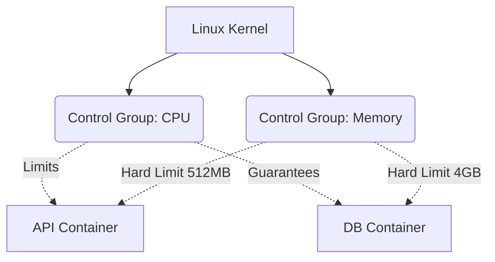

# Kernel Limits, CGroups, and Security

You have learned to build and orchestrate hyper-optimized images. But running containers in production without governing their resources is a recipe for systemic disaster. At this expert level, we will go deep into the bowels of the Linux Kernel.

How does Docker prevent a container with a Memory Leak from consuming 100% of the physical server's RAM and crashing all other applications? The answer is **Cgroups (Control Groups)** and **Namespaces**.

## 1. Physical Isolation vs Logical Isolation

- **Namespaces:** They lie to the container. They make it believe it has its own hard drive, its own network system, and its own process tree (PID 1). This is *Logical* isolation.
- **Cgroups:** They put handcuffs on the container. They physically limit the amount of CPU, RAM, and I/O that the container can request from the underlying hardware. This is *Physical* isolation.

### Resource Control Architecture



## 2. Implementing Hard Limits

If a container exceeds its allocated memory limit, the Linux kernel invokes the infamous **OOM Killer (Out Of Memory Killer)** and immediately murders the container's process to save the host operating system.

Always apply restrictive policies in your `docker-compose.yml` (especially using the *Deploy* specification from V3/Compose Spec):

```yaml
services:
  data-processor:
    image: python-worker:latest
    deploy:
      resources:
        limits:
          cpus: '0.50'     # Maximum half a physical CPU core
          memory: 512M     # The OOM Killer will trigger if it reaches 513MB
        reservations:
          cpus: '0.10'     # Minimum CPU guaranteed by the scheduler
          memory: 128M     # Minimum reserved memory
```

With this configuration, a badly programmed infinite `while(True)` loop in the Python worker will only affect 50% of one core, keeping the main server 100% stable.

## 3. Expert Security: Drop Capabilities and Non-Root

By default, the main process inside a Docker container runs as the **root** user. This is a massive risk. If there is a Container Breakout, the attacker will have superuser privileges on the host server.

### Rule 1: Unprivileged User
Modify the end of your Dockerfile to downgrade permissions before running the application.

```dockerfile
# ... (previous configurations) ...

# Create a system user without shell or privileges
RUN addgroup -S appgroup && adduser -S appuser -G appgroup

# Assign file ownership to that user
RUN chown -R appuser:appgroup /usr/src/app

# Change context to the secure user
USER appuser

# Only now do we run the server
CMD ["node", "server.js"]
```

### Rule 2: Kernel Capabilities Dropping
Even as `root`, Linux divides superuser privileges into blocks called "Capabilities". A default container retains too many (like `CAP_NET_RAW` which allows Ping and Network Spoofing).

In production, you should drop all capabilities and only give back the strictly necessary minimums.

```yaml
services:
  web:
    image: nginx:alpine
    cap_drop:
      - ALL # Destroys all kernel privileges
    cap_add:
      - NET_BIND_SERVICE # Only allows binding to low ports (<1024)
    security_opt:
      - no-new-privileges:true # Prevents internal privilege escalation
```

## Expert Summary
An expert container architect assumes the container will be breached and injected with malicious code. By applying strict Cgroup limits, running processes as an unprivileged `USER`, and dropping Kernel `Capabilities`, you guarantee that the Blast Radius of an attack is zero. At the **Master** level, we will scale this to global orchestration.
