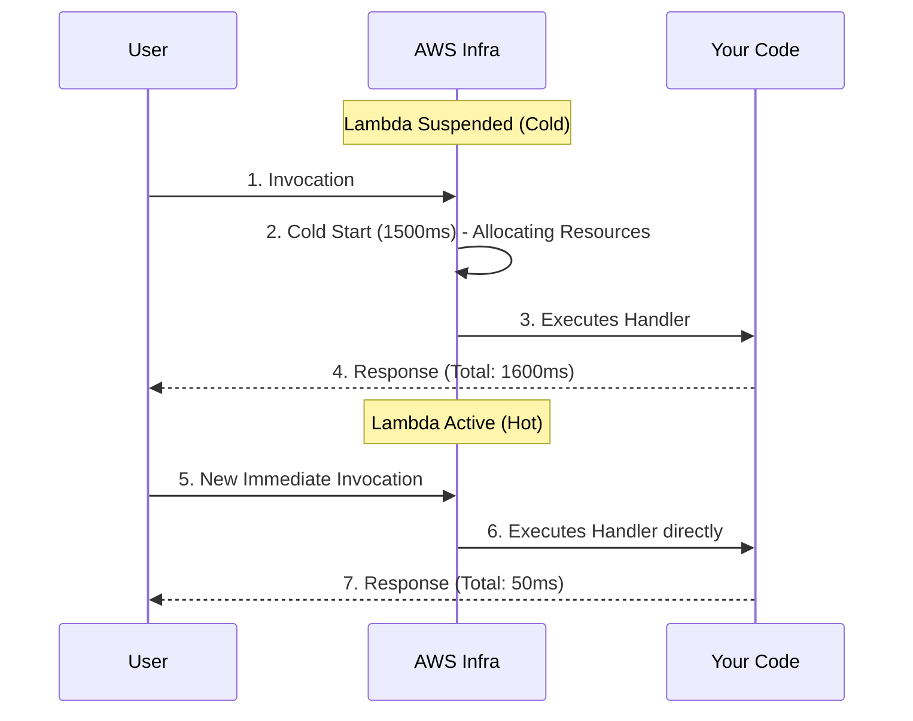

# Mastering AWS Lambda and the Cold Start

AWS Lambda is the absolute core of the Serverless architecture. It is an ephemeral computing environment. Literally, AWS loads your code into a micro-container, runs it, charges you for the milliseconds used, and destroys it.

## 1. The Anatomy of a Lambda

A Lambda function always consists of three essential elements in its signature.

```javascript
// index.mjs
export const handler = async (event, context) => {
  try {
    // 1. EVENT: Contains the trigger data (S3, API Gateway, SQS)
    const body = JSON.parse(event.body);
    
    // 2. CONTEXT: Environment metadata (Remaining time, Request ID)
    const remainingTime = context.getRemainingTimeInMillis();

    if (body.action === 'process') {
       return { statusCode: 200, body: "Processed!" };
    }

  } catch (error) {
    console.error("Critical Error:", error);
    return { statusCode: 500, body: "Internal Error" };
  }
};
```

### Iron Constraints (Hard Limits)
You must design your architecture assuming these Lambda limits:
* **Maximum Execution Time:** 15 Minutes. (If you need hours, use AWS Batch or Fargate).
* **Maximum Memory:** 10 GB.
* **Ephemeral Storage (`/tmp`):** Maximum 10 GB of temporary storage that will vanish.

## 2. Enemy #1: Cold Start

If your Lambda has not been invoked in the last few minutes, AWS suspends it to save resources. When a new request arrives, AWS must:
1. Find a physical server with space.
2. Download your code from an internal bucket.
3. Start the environment (Node.js, Python).
4. Execute the function.

This process is called **Cold Start**. It can take anywhere from 300 milliseconds to 3 seconds, which is terrible for user experience.



### Basic Mitigation Strategies
* **Minimize Package Weight:** Do not upload a 200MB `node_modules` folder. Use `esbuild` or `webpack` to package your code into a single 2MB minified file.
* **Global Initialization:** Database connections must be made OUTSIDE the `handler`.

```javascript
import { Client } from 'pg';

// ✅ GOOD: Executes during Cold Start and is reused in hot invocations.
const db = new Client({ connectionString: process.env.DB_URL });
await db.connect();

export const handler = async (event) => {
  // This will be super fast.
  const res = await db.query('SELECT * FROM users');
  return { statusCode: 200, body: JSON.stringify(res.rows) };
};
```

In the **Intermediate Level**, we will see how to connect our Lambdas to the outside world using API Gateway and how to handle Serverless Databases with DynamoDB.
