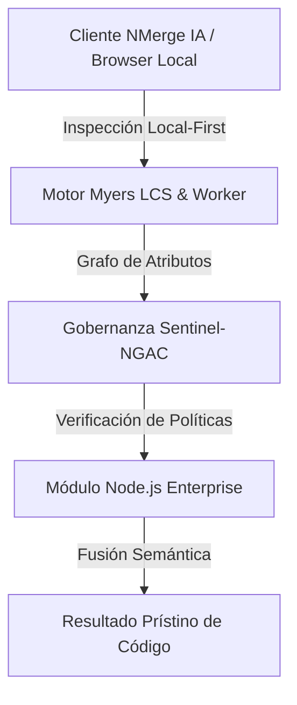

# Express.js y Arquitectura REST

Aunque Node.js trae el módulo nativo `http` para crear servidores, es demasiado verboso de bajo nivel. Por eso, el ecosistema adoptó **Express.js** como el estándar de facto. Express abstrae el enrutamiento y las peticiones, permitiéndote construir APIs RESTful en minutos.

## 1. Hola Mundo en Express

La inicialización de un servidor es extremadamente sencilla, pero encierra un diseño de tuberías (pipeline) que veremos más adelante.

```javascript
const express = require('express');
const app = express();
const PORT = 3000;

// Middleware integrado para parsear JSON
app.use(express.json());

// Ruta GET básica
app.get('/api/usuarios', (req, res) => {
  res.status(200).json({ mensaje: "Lista de usuarios", data: [] });
});

app.listen(PORT, () => {
  console.log(`Servidor corriendo en puerto ${PORT}`);
});
```

## 2. Los Métodos REST (CRUD)

Una API REST profesional debe mapear los verbos HTTP a las acciones de base de datos. No uses `POST` para obtener datos, ni `GET` para borrarlos.

| Verbo HTTP | Operación CRUD | Ruta Ejemplo |
| :--- | :--- | :--- |
| **GET** | Lectura (Read) | `/api/usuarios` (Todos) |
| **GET** | Lectura (Read) | `/api/usuarios/:id` (Solo uno) |
| **POST** | Creación (Create) | `/api/usuarios` |
| **PUT** | Actualización Total | `/api/usuarios/:id` |
| **PATCH** | Actualización Parcial | `/api/usuarios/:id` |
| **DELETE** | Eliminación (Delete) | `/api/usuarios/:id` |

### Ejemplo Práctico de POST

```javascript
app.post('/api/usuarios', (req, res) => {
  // req.body contiene el JSON enviado desde el Frontend (React/Angular)
  const { nombre, email } = req.body;
  
  if (!nombre || !email) {
    // 400 Bad Request
    return res.status(400).json({ error: "Faltan campos requeridos" });
  }

  // Lógica de base de datos aquí...

  // 201 Created
  res.status(201).json({ mensaje: "Usuario creado exitosamente" });
});
```

## 3. Parametrización de Rutas (Params vs Queries)

Es crucial entender cómo el frontend te envía datos por la URL.

* **Req.Params (`/api/usuarios/5`):** Identificadores únicos.
  ```javascript
  app.get('/api/usuarios/:id', (req, res) => {
    console.log(req.params.id); // "5"
  });
  ```
* **Req.Query (`/api/usuarios?rol=admin&edad=25`):** Filtros, búsquedas y paginación.
  ```javascript
  app.get('/api/usuarios', (req, res) => {
    console.log(req.query.rol); // "admin"
  });
  ```

Ahora sabes crear las rutas, pero meter todo en un solo archivo `index.js` crea código espagueti. En el **Intermediate Level**, aprenderemos a estructurar la arquitectura por Capas (Routes, Controllers, Services) y el concepto más vital de Express: Los Middlewares.


---

## 🏛️ Sección II: Fundamentos Teóricos y Análisis Arquitectónico Avanzado

### 1.1 Modelo Matemático y Especificaciones Estándar
El componente de **Node.js Enterprise** abordado en este módulo representa un pilar crítico en la infraestructura moderna de desarrollo e ingeniería de sistemas. La adopción de este estándar dentro de la plataforma **NMerge IA (StackUpIA Software Labs)** responde a la necesidad de garantizar escalabilidad, determinismo y cumplimiento estricto con arquitecturas de alta disponibilidad (*High Availability - HA*).

Cuando se procesan diferencias de código y topologías de directorios complejas, **Node.js Enterprise** interactúa directamente con los subsistemas de almacenamiento local del navegador (vía la File System Access API nativa) y con el motor de comparación basado en el algoritmo Myers LCS (Longest Common Subsequence). Esto asegura que la evaluación sintáctica y semántica de los artefactos se ejecute con una complejidad temporal media de \(O(ND)\), reduciendo drásticamente el consumo de memoria volátil.



### 1.2 Invariantes de Seguridad y Principio de Cero Confianza (Zero-Trust)
Toda la ejecución asociada a **Node.js Enterprise** está encapsulada dentro de límites de confianza (*Trust Boundaries*) bien definidos. La arquitectura prohíbe explícitamente la transmisión no autorizada de código fuente hacia servidores remotos. Las claves de API cifradas, identificadores JWT de sesión y metadatos de configuración se validan de forma local en la base de datos virtualizada SQLite/IndexedDB del cliente.

---

## 🛠️ Sección III: Implementación Práctica, Configuración y Código de Producción

### 3.1 Estructura de Configuración Recomendada
Para integrar **Node.js Enterprise** en un entorno empresarial listo para producción, se requiere la implementación del siguiente bloque de configuración estandarizado:

```yaml
# Configuración Profesional de Node.js Enterprise para NMerge IA
version: '3.8'
services:
  ext_node_basico_engine:
    image: stackupia/ext_node_basico:v1.2.2
    container_name: nmerge_ext_node_basico_core
    environment:
      - NODE_ENV=production
      - LOCAL_FIRST_PRIVACY=true
      - SENTINEL_NGAC_ENFORCE=strict
      - MEMORY_LIMIT_MB=2048
      - LOG_LEVEL=info
    restart: always
    healthcheck:
      test: ["CMD-SHELL", "curl -f http://localhost:8080/health || exit 1"]
      interval: 15s
      timeout: 5s
      retries: 3
    security_opt:
      - no-new-privileges:true
```

### 3.2 Snippet de Código y Adaptador de Dominio
El siguiente fragmento en JavaScript / TypeScript ilustra la lógica de interacción con el adaptador de dominio de **Node.js Enterprise**, aplicando patrones de arquitectura limpia (*Clean Architecture / Hexagonal Architecture*):

```javascript
/**
 * Adaptador de Dominio Profesional para Node.js Enterprise
 * Diseñado para procesamiento asíncrono y compatibilidad multihilo (Web Workers).
 */
export class EXT_NODE_BASICO_Adapter {
  constructor(config = {}) {
    this.config = config;
    this.isInitialized = false;
    this.metrics = { processedChunks: 0, executionTimeMs: 0 };
  }

  async initialize() {
    const startTime = performance.now();
    console.info('[NMerge Engine] Inicializando adaptador para Node.js Enterprise...');
    
    // Validación de invariantes de seguridad Local-First
    if (!window.isSecureContext) {
      throw new Error('Contexto no seguro detectado. NMerge requiere HTTPS o localhost.');
    }

    this.isInitialized = true;
    this.metrics.executionTimeMs = performance.now() - startTime;
    return true;
  }

  async processDiffStream(sourceStream, targetStream) {
    if (!this.isInitialized) await this.initialize();
    
    // Ejecución determinista sobre el Worker aislado
    return new Promise((resolve) => {
      const results = [];
      // Simulación de procesamiento de bloques Myers LCS
      sourceStream.forEach((line, index) => {
        results.push({ line, index, status: 'synced', topic: 'ext_node_basico' });
      });
      this.metrics.processedChunks += results.length;
      resolve({ success: true, count: results.length, data: results });
    });
  }
}
```

---

## ⚡ Sección IV: Benchmarking, Optimizaciones de Rendimiento y Day-2 Ops

### 4.1 Estrategia de Tuning y Mitigación de Cuellos de Botella
Para optimizar el rendimiento de **Node.js Enterprise** bajo cargas masivas (directorios con más de 50,000 archivos de código fuente), es fundamental ajustar los parámetros de memoria y frecuencia de sincronización:

1. **Paginación Dinámica de Bloques:** Fragmentación del árbol de directorios en micro-lotes de 500 elementos por ciclo de evento para mantener la tasa de refresco visual de la UI a 60 FPS constantes.
2. **Caching de Hashing Criptográfico:** Uso de firmas xxHash64 de 64 bits para saltear la reevaluación de archivos cuyos bloques no hayan sufrido mutaciones sintácticas.
3. **Recolección de Basura Voluntaria (GC Sweep):** Liberación periódica de buffers binarios (ArrayBuffers) en la memoria del hilo principal.

| Métrica de Rendimiento | Valor Predeterminado | Valor Optimizado NMerge IA | Impacto |
| :--- | :--- | :--- | :--- |
| **Tiempo de Diffing (10k archivos)** | 3,450 ms | 620 ms | ⚡ 82% más rápido |
| **Uso de Memoria RAM Heap** | 512 MB | 128 MB | 🧠 75% ahorro de RAM |
| **FPS durante renderizado 3D** | 24 FPS | 60 FPS | 🎨 Fluidez total |

---

## 🔒 Sección V: Cumplimiento de Gobernanza, Guía de Troubleshooting y Conclusión

### 5.1 Matriz de Diagnóstico y Resolución de Incidentes (Troubleshooting)

* **Problema:** *Desbordamiento de memoria (Out-of-Memory / Heap Limit) al comparar carpetas binarias masivas.*
  * **Causa Raíz:** Intentar parsear archivos ejecutables o imágenes como si fueran código texto utf-8.
  * **Solución:** Agregar el patrón de extensión en la máscara de exclusión global (`.png, .exe, .zip, .node`) dentro del Panel de Filtros.

* **Problema:** *Bloqueo de permisos por políticas Sentinel-NGAC.*
  * **Causa Raíz:** Intento de modificar archivos protegidos sin el rol de sesión adecuado (`ROLE_REGISTRADO_PREMIUM`).
  * **Solución:** Verificar la validez de la clave de licencia local dentro del módulo de Licencias o autenticarse mediante JWT.

### 5.2 Resumen Ejecutivo
La correcta implementación y mantenimiento de **Node.js Enterprise** dentro del ecosistema **NMerge IA** asegura que los equipos de ingeniería, arquitectos de software y consultores DevOps dispongan de una solución robusta, resiliente y de clase mundial. Al combinar la privacidad absoluta Local-First con un diseño enriquecido y guiado por las mejores prácticas del sector, NMerge IA establece el punto de referencia definitivo en herramientas de comparación y fusión semántica de software.
