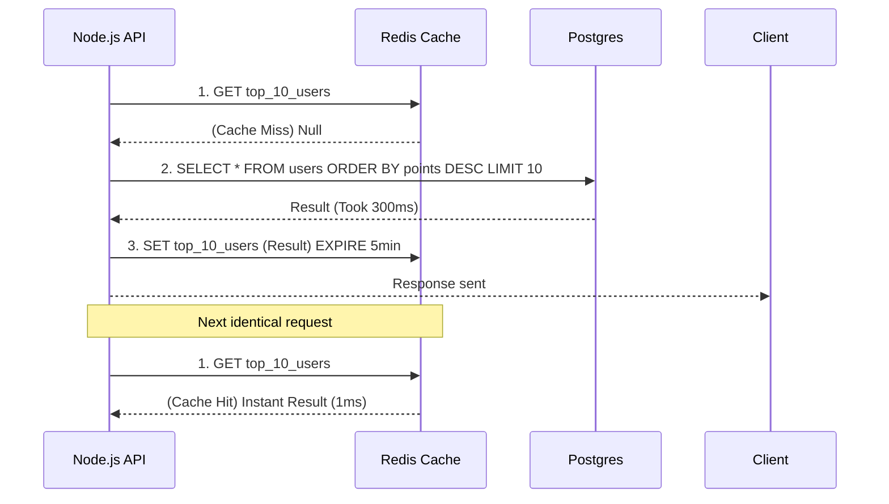

# Microservices, Redis Cache, and Messaging (Event-Driven)

When a Node.js REST API scales to support a million users, the bottleneck is no longer the Event Loop; it's the Database. Every SQL query adds 50ms to 200ms. If 10,000 users query the Home of your App at the same time, your database will die.

## 1. The Distributed Cache (Redis)

Redis is an In-Memory (lives in RAM) key-value database. Its read latency is under 1ms. 

The master pattern is the **Cache-Aside Pattern**:



## 2. Event-Driven Architecture (Microservices)

In a Monolith, if a sale occurs, you sequentially call functions: `createOrder()`, `subtractStock()`, `sendEmail()`. If sending the email takes 3 seconds, the user is left waiting.

In Microservices, we use **Message Brokers** (RabbitMQ, Kafka, AWS SQS) to decouple operations.

```javascript
// Payment Service (Node.js)
const channel = await RabbitMQ.createChannel();

app.post('/pay', async (req, res) => {
  const success = await processCard(req.body);
  
  if (success) {
    // Fire and Forget
    // We fire an event to the queue and respond to the user INSTANTLY.
    channel.publish('sales_exchange', 'payment.completed', Buffer.from(JSON.stringify(req.body)));
    
    return res.json({ msg: "Your order is being processed." });
  }
});
```

Meanwhile, in totally separate containers (perhaps written in Python or Go), other microservices are *listening* to that event:
* The **Emails Service** listens to `payment.completed` and sends the receipt.
* The **Inventory Service** listens to `payment.completed` and subtracts the stock.

## 3. JWT and Stateless Sessions

Distributed architectures demand stateless authentication. Instead of saving sessions in server memory (which would break if you have 5 Node instances behind a Load Balancer), we use **JSON Web Tokens (JWT)**.

The JWT contains encrypted authorization information *inside* the string itself. The server does not need to check the database to know if you are an Admin; it simply cryptographically decrypts the JWT with its secret signature (`HMAC SHA256`).

In the **Optimizations Level**, we will use Node Clusters, PM2, and analyze Worker Threads to squeeze the bare-metal hardware.
