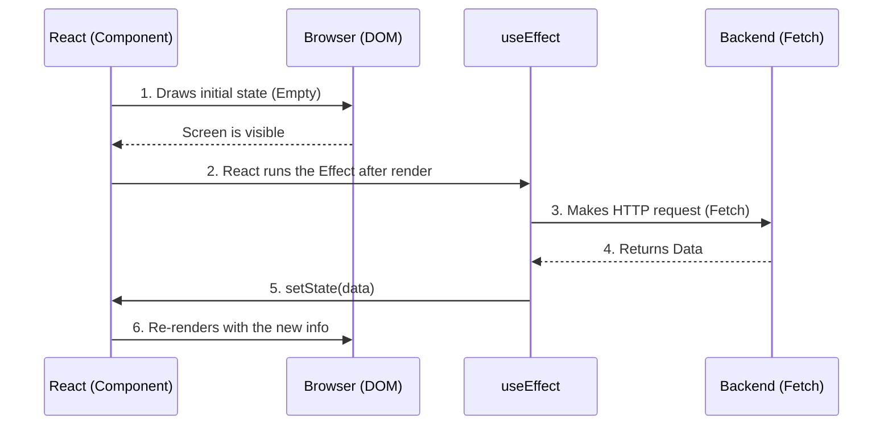

# Core Hooks and Local State Management

Functional components by themselves are pure and memoryless ("Stateless"). If you call a function twice, it starts from scratch. For a component to "remember" information between renders (like a shopping cart or whether a modal is open), React introduced **Hooks**.

## 1. Local State: useState

`useState` is the most critical hook. It gives your component a private memory vault that survives rendering cycles.

```jsx
import React, { useState } from 'react';

export const Counter = () => {
  // 1. Declaration: 'count' is the value, 'setCount' is the mutator function
  // 2. Initialization: Starts at 0
  const [count, setCount] = useState(0);

  return (
    <div>
      <p>You have clicked {count} times</p>
      {/* Never mutate directly (e.g.: count = count + 1). Always use the Setter */}
      <button onClick={() => setCount(count + 1)}>
        Increment
      </button>
    </div>
  );
};
```

### The Golden Rule of State: Immutability
React decides to re-render the screen by comparing if the new state is different from the previous one using referential equality (`===`). If you have an Array or an Object, NEVER use `.push()` on them or alter their properties directly, because their memory reference won't change and React won't update the screen.
**You must always create a new Array or Object by copying the previous one (Spread Operator `...`).**

## 2. Side Effects: useEffect

Pure functions should not touch the "outside world" (make HTTP requests, subscribe to WebSockets, touch LocalStorage). If you need to do this, you must use `useEffect`.



### The Dependency Array

The second argument of `useEffect` controls **when** the effect is executed. It is the source of 90% of React bugs if not mastered.

```jsx
// Scenario 1: No dependency array (Danger)
// Executes AFTER EVERY RENDER. Can cause infinite loops.
useEffect(() => { fetchData() }); 

// Scenario 2: Empty array [] (The modern "componentDidMount")
// Executes ONLY ONCE when the component is born.
useEffect(() => { fetchData() }, []); 

// Scenario 3: Array with variables [userId]
// Executes at birth and EVERY TIME 'userId' changes.
useEffect(() => { fetchUserData(userId) }, [userId]); 
```

Mastering `useState` and `useEffect` allows you to build 80% of any application. In the **Intermediate Level**, we will solve the infamous "Prop Drilling" problem and connect our app to a global state with the Context API.
