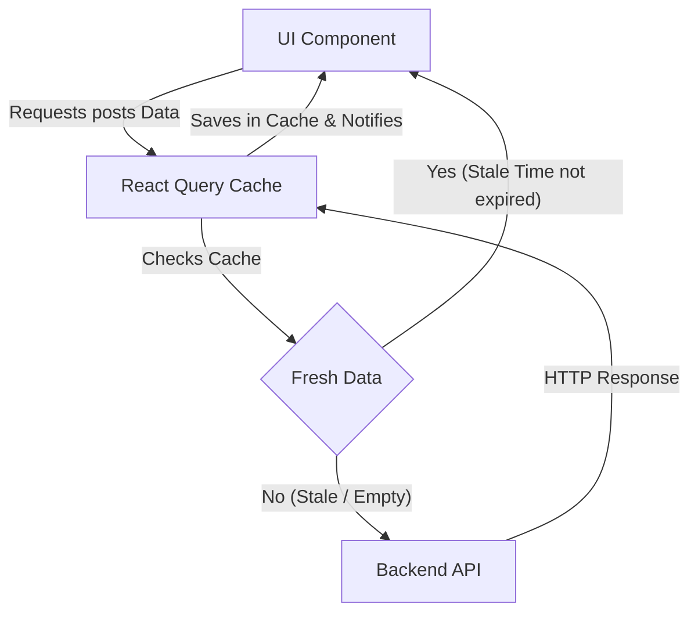

# Server State, Mutations, and React Query

If you've ever built a `useEffect` system to fetch from an API, you've had to manually create three states: `data`, `isLoading`, and `error`. You've had to deal with Race Conditions, aborting requests when the user changes pages quickly, and figuring out how to cache information so you don't bombard your backend.

At this expert level, we accept a fundamental truth: **Data coming from the backend is NOT application state (Client State); it is Server State.**

## 1. The Paradigm Shift: TanStack Query (React Query)

Zustand and Redux are perfect for UI (if a panel is open, the current theme, an in-memory cart). But for handling APIs and databases, the absolute industrial standard is **TanStack Query**.



## 2. Eliminating useEffect forever

Let's look at how an expert fetches data from an API without a single `useEffect`, `useState`, or concurrency blocks.

```jsx
import { useQuery } from '@tanstack/react-query';
import axios from 'axios';

// 1. Separate the pure fetch function (React agnostic)
const fetchUsers = async () => {
  const { data } = await axios.get('https://api.company.com/v1/users');
  return data;
};

export const UserList = () => {
  // 2. The Magic of React Query
  const { data: users, isLoading, isError, error } = useQuery({
    queryKey: ['users', 'list'], // The unique ID for this cache
    queryFn: fetchUsers,
    staleTime: 1000 * 60 * 5, // Trusts the cache for 5 minutes before refetch
  });

  if (isLoading) return <Spinner />;
  if (isError) return <Alert msg={error.message} />;

  return (
    <ul>
      {users.map(u => <li key={u.id}>{u.name}</li>)}
    </ul>
  );
};
```

### The Power of Global Cache
If another component in another view of the app makes a `useQuery` with the same key `['users', 'list']`, React Query **will not make the HTTP request**. It will instantly deliver the data from RAM (Cache Hit), reducing latency to 0 ms.

## 3. Mutations: Modifying the Server

Reading data is easy; modifying it and invalidating the cache (so the interface refreshes) is the real challenge. `useMutation` handles updates, creation, and deletion.

```jsx
import { useMutation, useQueryClient } from '@tanstack/react-query';

export const CreateForm = () => {
  const queryClient = useQueryClient();

  const mutation = useMutation({
    mutationFn: (newUser) => axios.post('/api/users', newUser),
    // Lifecycle hook: When the server responds OK (200)
    onSuccess: () => {
      // Invalidates the user list cache.
      // This forces React Query to do an automatic background refetch!
      queryClient.invalidateQueries({ queryKey: ['users', 'list'] });
    },
  });

  const onSubmit = (data) => {
    mutation.mutate(data);
  };

  return (
    <button 
      onClick={() => onSubmit({ name: 'Bob' })}
      disabled={mutation.isPending} // Automatic button control
    >
      {mutation.isPending ? 'Saving...' : 'Create User'}
    </button>
  );
};
```

With React Query, your code is reduced by 50%, your backend breathes thanks to the cache, and the user perceives an ultra-fast app. At the **Optimizations** level, we will focus on the browser's local rendering bottlenecks: Memoization, Profiling, and massive Code Splitting.
