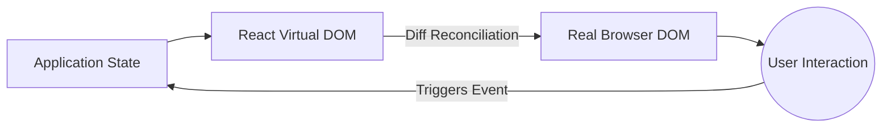

# Initial Concepts and Modern Lifecycle

Welcome to the modern React ecosystem. Gone are the days of Classes and monstrous lifecycles (`componentDidMount`, `componentWillReceiveProps`). Today, React is functional, declarative, and blazingly fast if used correctly.

## 1. The Declarative Paradigm

Unlike Vanilla JavaScript (Imperative), where you tell the browser *how* to do every step (create element, add class, attach to DOM), in React you tell it *what* you want to be drawn, and React takes care of the *how*.



## 2. Functional Components (The Standard)

A React component is simply a pure JavaScript function that receives data (Props) and returns JSX (a hybrid syntax between JS and HTML).

```jsx
// A perfect, pure component
export const UserCard = ({ name, role }) => {
  return (
    <div className="card">
      <h2>{name}</h2>
      <p>Role: {role}</p>
    </div>
  );
};
```

### Why JSX?
JSX is not real HTML. It is syntactic sugar for `React.createElement()`. Under the hood, React transforms those tags into JavaScript objects, allowing the *Virtual DOM* to perform mathematical comparisons (diffing) at a speed the real DOM could never reach.

## 3. The Engine of Change: The Virtual DOM

When you change your application's state, React does not destroy and rebuild the entire webpage (as older frameworks did). 

1. **Snapshot:** React takes a "picture" of the new Virtual DOM.
2. **Diffing:** It compares the new picture with the previous Virtual DOM using an O(n) heuristic algorithm.
3. **Reconciliation (Patching):** It only applies the mathematically exact changes to the real DOM.

If only the number of "Likes" on a button changed, React will travel directly to that DOM node and update the text, leaving the rest of the tree (images, forms) intact.

## Next Steps
We have understood how React draws the screen. In the **Basic Level**, we will explore how to give our components "memory" using Hooks (`useState` and `useEffect`), the heart of modern React.
