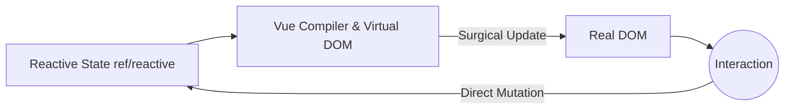

# Initial Concepts and Reactivity

Welcome to Vue.js, the progressive framework. Unlike React, Vue uses a reactivity system based on Proxies (in Vue 3) that makes state management much more intuitive and less prone to unnecessary re-renders.

## 1. The Progressive Paradigm
Vue is called 'progressive' because you can use it to render a single component on a static page (like jQuery) or build a complete SPA (Single Page Application) using Vue Router and Pinia.



## 2. Options API vs Composition API
In Vue 3, the standard is the **Composition API** with `<script setup>`. This allows grouping logic by feature instead of by lifecycle.

```html
<script setup>
import { ref } from 'vue'

const counter = ref(0)
const increment = () => counter.value++
</script>

<template>
  <div class="card">
    <h2>Counter: {{ counter }}</h2>
    <button @click="increment">Increment</button>
  </div>
</template>
```
