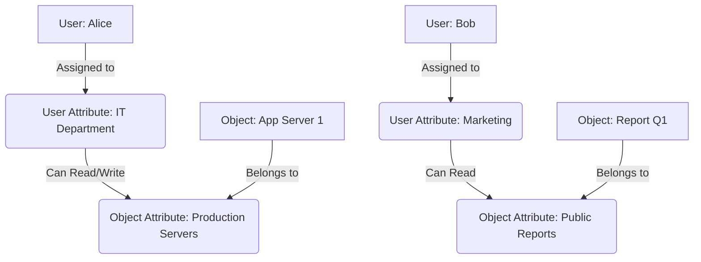

# Basic Level

> [!IMPORTANT]
> To master NGAC, you must first understand its fundamental building blocks. Each element is a node in the Authorization Graph.

## Central Elements (The Basic Core)

NGAC is based on 5 main types of elements:

1. **U (Users):** The entities that request access.
2. **O (Objects):** The resources that are being protected (files, database records, URLs).
3. **UA (User Attributes):** Groups of users (such as Roles, Departments, or Titles).
4. **OA (Object Attributes):** Groupings of objects (such as Folders, Confidentiality Labels).
5. **Op (Operations):** The allowed actions (Read, Write, Delete).

### The Relationship Graph

Access control in NGAC is determined by tracing a path from a User (U) to an Object (O).

> [!NOTE]
> In this diagram, Alice inherits permissions on "App Server 1" because there is a valid path: `Alice -> IT Department -> (Read/Write) -> Production Servers <- App Server 1`.

## Association

> [!NOTE]
> The rest of the white paper is kept in its original language to preserve the syntax of code and diagrams.

ones
Las asociaciones son aristas especiales que conectan un `UA` con un `OA` y contienen las Operaciones (Op). Las aristas regulares de pertenencia no contienen operaciones.
