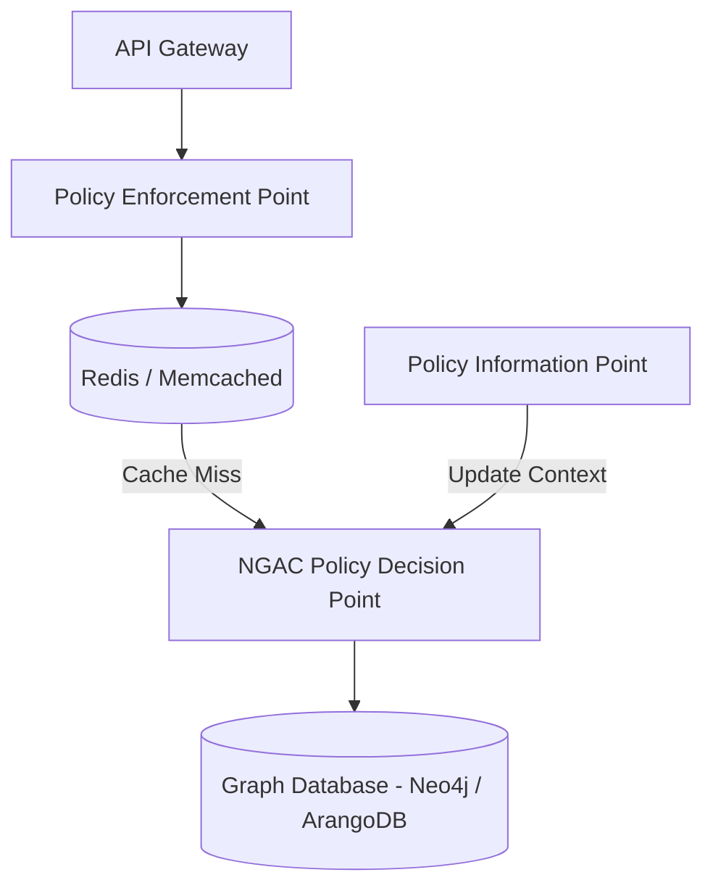

# Expert Level

> [!CAUTION]
> Enterprise-scale NGAC requires tight control over Policy Decision Point (PDP) performance (latency) and availability.

## NGAC Distributed Architecture

In Cloud Native systems, you cannot allow the PDP to become a bottleneck or single point of failure (SPOF). 

### Graph Sharding and Cache

To ensure latencies less than 10ms:
1. **PEP Level Cache:** Memorize authorization results for a few minutes if the policies are not very volatile (Memoization).
2. **Graph DB:** Use native graph databases (e.g. Neo4j, Amazon Neptune) to avoid the costly recursive `JOIN` required by SQL.

## Continuous Audit and Compliance

NGAC shines in regulatory analysis (Compliance). You can run "Review" algorithms to detect vulnerabilities in policy settings.

> [!NOTE]
> With a Cypher query in Neo4j, you can mathematically prove that **"No external user has a path that connects to an object marked with PII"**, offering formal guarantees to auditors.

> [!NOTE]
> The rest of the white paper is kept in its original language to preserve the syntax of code and diagrams.

