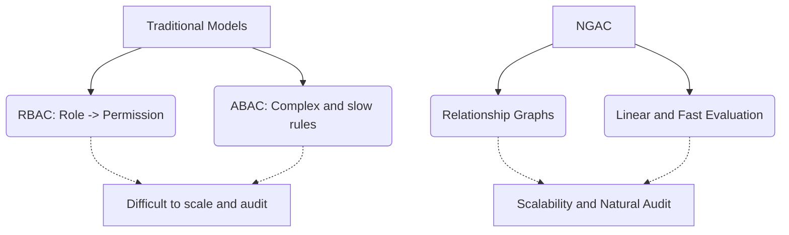

# Initial Level

> [!NOTE]
> NGAC (Next Generation Access Control) is a NIST-standardized access control model designed to overcome the limitations of RBAC (Role-Based Access Control) and ABAC (Attribute-Based Access Control).

## What is NGAC?

Unlike traditional models, NGAC centralizes policy management by expressing them through directed graphs. In NGAC, everything (users, objects, operations) is a node in a graph, and access is determined by finding a valid path from the user to the object.

### NGAC vs Traditional Models

> [!TIP]
> If your system needs rapidly changing policies (for example, giving access to a contractor only during their shift), NGAC handles this naturally by simply adding or removing edges in the graph.

## Main Benefits
1. **Flexibility:** Allows you to emulate RBAC, ABAC, MAC and DAC in a single model.
2. **Audit:** Answer the question "Who can access this file?" is a simple graph traversal query.
3. **Performance:** Modern graph databases resolve permissions in milliseconds.

> [!NOTE]
> The rest of the white paper is kept in its original language to preserve the syntax of code and diagrams.

