# Medium Level

> [!TIP]
> At this level, static policies (who's who) are mixed with Dynamic Policies, giving you real-time control.

## Dynamic Policies and Authorization

Unlike RBAC, in NGAC changes take effect immediately without requiring reloading sessions or redistributing JWT tokens. Validation is done against the centralized authorization graph in each critical request.

### Permission Evaluation (Policy Evaluation)

To evaluate whether a request is approved, the NGAC engine intercepts the request.

```mermaid
sequenceDiagram
    participant User as Web Client
    participant API as API Gateway / Proxy
    participant NGAC as Motor Sentinel-NGAC
    participant DB as Database
    
    User->>API: GET /resources/protected/1
    API->>NGAC: Can User read Object 1
    
    rect rgb(20, 50, 40)
        Note over NGAC: The Graph (PDP) is evaluated
        NGAC-->>NGAC: Search path: U -> UA -> OA <- O
    end
    
    alt Path Found
        NGAC-->>API: 200 OK (Allowed)
        API->>DB: Fetch Data
        DB-->>API: Data
        API-->>User: 200 OK + Data
    else Nonexistent Path
        NGAC-->>API: 403 Forbidden
        API-->>User: 403 Forbidden
    end
```

## Policy Decision Point (PDP) and Policy Enforcement Point (PEP)
The **PEP** (in our case, the request interceptor) is responsible for stopping the action and asking for permission. The **PDP** (Sentinel-NGAC) is the brain that navigates the graph.

> [!CAUTION]
>

> [!NOTE]
> The rest of the white paper is kept in its original language to preserve the syntax of code and diagrams.

 No hardcodees los chequeos de seguridad en la lógica de negocio. Toda autorización debe manejarse limpiamente en el nivel PEP, dejando a los controladores (controllers) libres de lógica de seguridad.
