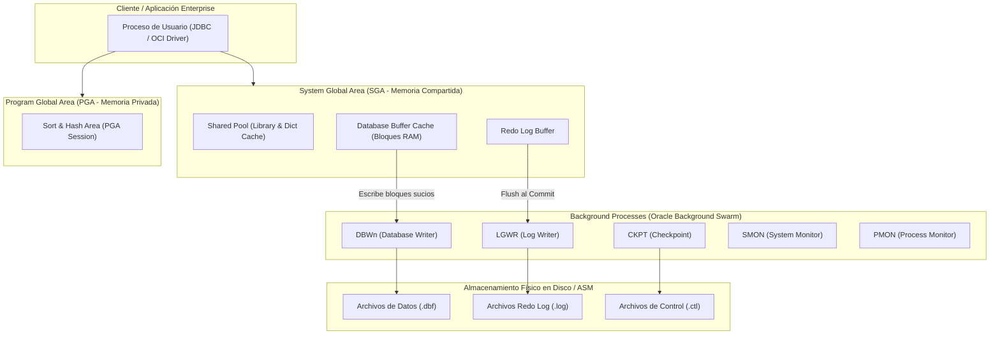

## 🎯 1. Oracle Database Enterprise Architecture & Multitenant (CDB/PDB)

**Oracle Database Enterprise Edition** es el motor relacional distribuido de mayor adopción en la banca global y telecomunicaciones. Se caracteriza por su arquitectura desacoplada entre **Instancia** (Memoria SGA/PGA + Background Processes) y **Base de Datos** (Archivos físicos en disco), además de su arquitectura contenedorizada **Multitenant (CDB/PDB)**.

### 💡 Arquitectura Core & Invariantes:
- **System Global Area (SGA):** Memoria compartida que contiene el *Shared Pool* (Library Cache, Data Dictionary Cache), *Buffer Cache* (bloques de datos en RAM), *Redo Log Buffer* y *Large Pool*.
- **Program Global Area (PGA):** Memoria privada asignada a cada sesión o proceso de usuario para ordenamiento (*Sort Area*) y uniones (*Hash Join Area*).
- **Background Processes Principales:**
  - **DBWn (Database Writer):** Escribe bloques sucios (*dirty buffers*) del Buffer Cache a los archivos de datos (`.dbf`).
  - **LGWR (Log Writer):** Escribe entradas del Redo Log Buffer a los archivos Redo Log en disco de forma síncrona al hacer `COMMIT`.
  - **CKPT (Checkpoint):** Actualiza los encabezados de los archivos de datos y archivos de control notificando a DBWn.
  - **SMON (System Monitor):** Realiza recuperación de la instancia tras fallos de energía y libera segmentos temporales.
  - **PMON (Process Monitor):** Limpia sesiones caídas y libera recursos retenidos por procesos fallidos.
- **Multitenant Architecture:** Un **CDB (Container Database)** alberga un `CDB$ROOT` maestro y múltiples **PDBs (Pluggable Databases)** aisladas lógicamente.

---

## 🏗️ 2. Memory Architecture SGA/PGA y Background Processes



---

## 💻 3. Implementación Empresarial: Gestión de CDB/PDB, Tablespaces y Usuarios

```sql
-- =====================================================================
-- NMerge IA - Oracle Enterprise: Inicialización de CDB/PDB y Tablespaces
-- =====================================================================

-- 📌 1. Conexión al Container Database Maestro (CDB$ROOT)
ALTER SESSION SET CONTAINER = CDB$ROOT;

-- Ver las PDBs disponibles y su estado
SELECT pdb_name, status, open_mode FROM cdb_pdbs;

-- 📌 2. Creación de una Pluggable Database (PDB) dedicada
CREATE PLUGGABLE DATABASE pdb_nmerge_finance
  ADMIN USER admin_finance IDENTIFIED BY "G3rC4t_01_##"
  ROLES = (DBA)
  DEFAULT TABLESPACE users
  DATAFILE_SIZE 500M AUTOEXTEND ON NEXT 100M MAXSIZE 10G;

-- Abrir la PDB y guardar el estado para reinicios automáticos
ALTER PLUGGABLE DATABASE pdb_nmerge_finance OPEN;
ALTER PLUGGABLE DATABASE pdb_nmerge_finance SAVE STATE;

-- 📌 3. Conexión al contexto de la PDB creada
ALTER SESSION SET CONTAINER = pdb_nmerge_finance;

-- 📌 4. Creación de Tablespace Empresarial con Datafiles Autoextensibles
CREATE TABLESPACE tbs_finance_data
  DATAFILE '/u01/app/oracle/oradata/CDB1/pdb_nmerge_finance/finance_data_01.dbf' 
  SIZE 1G 
  AUTOEXTEND ON NEXT 256M MAXSIZE 32G
  EXTENT MANAGEMENT LOCAL AUTOALLOCATE
  SEGMENT SPACE MANAGEMENT AUTO;

-- Creación de Tablespace Temporal dedicado
CREATE TEMPORARY TABLESPACE tbs_finance_temp
  TEMPFILE '/u01/app/oracle/oradata/CDB1/pdb_nmerge_finance/finance_temp_01.dbf'
  SIZE 500M
  AUTOEXTEND ON NEXT 64M MAXSIZE 8G;

-- 📌 5. Creación de Usuario de Aplicación y Asignación de Roles
CREATE USER usr_finance_app IDENTIFIED BY "G3rC4t_01_##"
  DEFAULT TABLESPACE tbs_finance_data
  TEMPORARY TABLESPACE tbs_finance_temp
  QUOTA UNLIMITED ON tbs_finance_data;

GRANT CONNECT, RESOURCE TO usr_finance_app;
GRANT CREATE VIEW, CREATE PROCEDURE, CREATE SEQUENCE TO usr_finance_app;
```

---

## 🔒 4. Governance & Sentinel-NGAC Security
En Oracle Enterprise Edition, el acceso a la base de datos se rige bajo la autenticación transparente **SYSDBA / SYSOPER** y políticas de seguridad integradas con el PDP de **Sentinel-NGAC**.

© 2026 NMerge IA. StackUpIA Software Labs. All rights reserved.