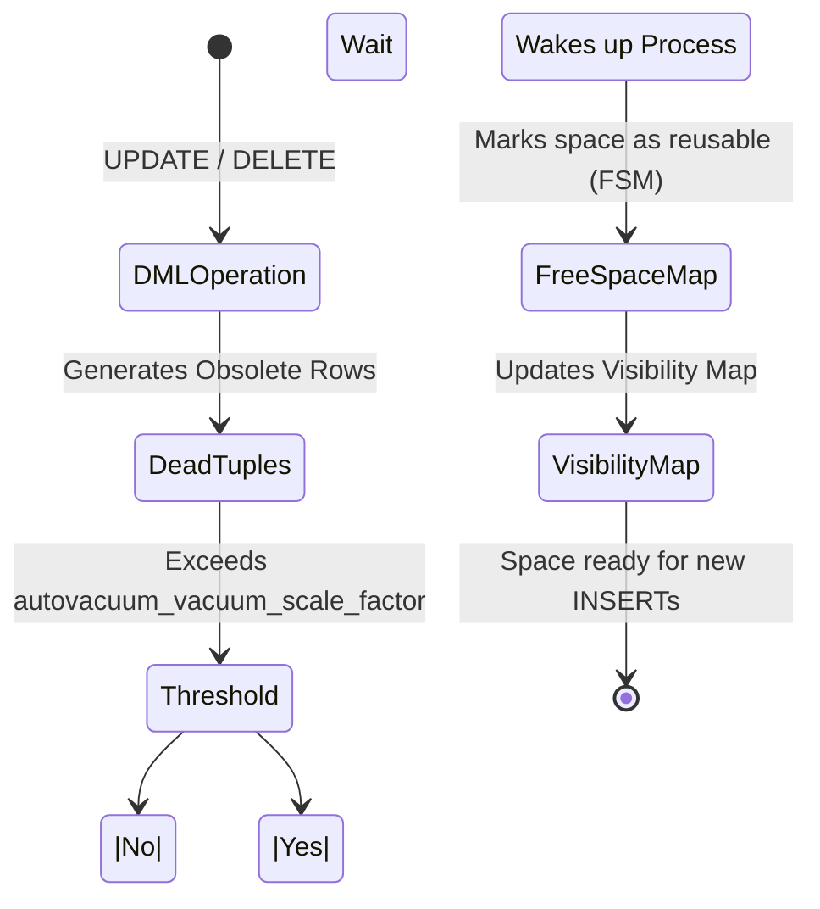

# Execution Engine, Vacuum, and Composite Indexes

At the advanced level, we stop writing code blindly and start understanding **how PostgreSQL reads our code**. The difference between a query that takes 5 minutes and one that takes 50 milliseconds lies in understanding the *Query Planner*.

## 1. The Art of EXPLAIN ANALYZE

Never assume an index is being used. PostgreSQL has a Cost-Based Optimizer. If the engine calculates that a *Sequential Scan* (reading the whole table) is cheaper than using the index because you are requesting 80% of the data, it will ignore your index.

### How to read an execution plan

```sql
EXPLAIN ANALYZE 
SELECT * FROM sales.orders 
WHERE status = 'pending' AND total > 1000;
```

**Critical Metrics to watch:**
- `Execution Time`: The actual time it took.
- `Buffers: shared hit=... read=...`: If you see many `read`s, Postgres is going to the disk. If you see many `hit`s, data is being served from RAM (Excellent!).
- `Seq Scan`: Red alarm if the table has millions of rows. Look to replace it with an `Index Scan` or `Bitmap Heap Scan`.

## 2. Composite Indexes and Column Order

When filtering by multiple columns, a simple index is not enough.

```sql
-- Composite Index
CREATE INDEX idx_orders_status_total ON sales.orders(status, total);
```
**Golden Rule:** Order matters. Always put the column with the highest **cardinality** first (the one that discards the most data quickly) or the column you use with equality operators (`=`). Columns used for ranges (`>`, `<`) should go at the end of the index.

## 3. Autovacuum: The MVCC Garbage Collector

In the Intermediate Level, we learned about MVCC and *dead tuples* (obsolete rows generated by UPDATEs and DELETEs). If these rows are not cleaned up, your database will suffer from **Bloat**, consuming disk space and destroying performance.

The `Autovacuum` process is in charge of cleaning this up.

### Autovacuum Process Diagram



**Critical Tuning for Large Tables:**
The Postgres default (`autovacuum_vacuum_scale_factor = 0.2`) means Autovacuum only triggers when 20% of the table changes. If you have a 100 million row table, 20 million rows would have to change to clean it!
Adjust this per table:

```sql
ALTER TABLE sales.orders SET (autovacuum_vacuum_scale_factor = 0.01);
```

Understanding EXPLAIN and mastering Autovacuum separates a senior developer from a true database expert. In the **Expert** level, we will scale this towards replication and massive partitioning.
