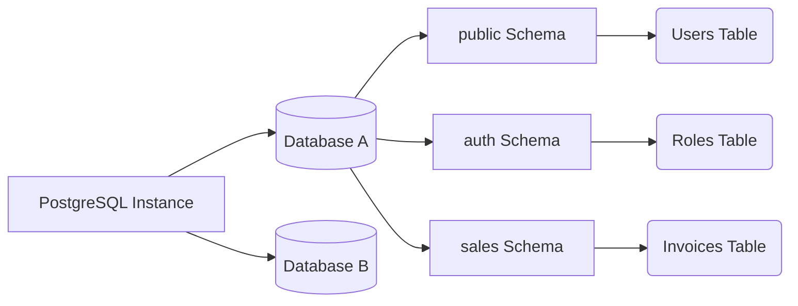

# Fundamentals, Data Types, and Core Queries

We have passed the infrastructure phase. Now we will enter the developer's "playground". PostgreSQL is not just a row and column store; it is an Object-Relational Database Management System (ORDBMS). This means it supports inheritance, complex data types, and extensions.

## 1. The Schema Paradigm

A very common mistake among developers migrating from MySQL is using the database as the only logical container for tables. In PostgreSQL, we have an intermediate layer: the **Schema**.



By default, all tables are created in the `public` schema. **Best Practice:** If you are building a monolithic architecture or a microservices setup sharing a DB, divide your business domains using schemas.

```sql
CREATE SCHEMA IF NOT EXISTS billing;
CREATE SCHEMA IF NOT EXISTS inventory;
```

## 2. Data Types: The Power of JSONB and Arrays

PostgreSQL destroys the myth that "SQL databases are rigid." Postgres natively supports NoSQL data types with exceptional performance.

### The JSONB Type (Binary JSON)
While `JSON` saves plain text, `JSONB` pre-processes the JSON into a custom binary format. This makes insertion slightly slower, but reads and **indexed searches** astoundingly fast.

```sql
CREATE TABLE billing.invoices (
    id UUID PRIMARY KEY DEFAULT gen_random_uuid(),
    customer_name VARCHAR(150) NOT NULL,
    total_amount NUMERIC(10, 2),
    metadata JSONB,
    created_at TIMESTAMP WITH TIME ZONE DEFAULT NOW()
);

-- Inserting NoSQL data inside a relational table
INSERT INTO billing.invoices (customer_name, total_amount, metadata)
VALUES ('Acme Corp', 500.50, '{"tags": ["b2b", "premium"], "payment_gateway": "stripe", "tax_exempt": false}');
```

### Querying inside JSONB
PostgreSQL provides special operators (like `->>` and `@>`) to search inside the document:

```sql
-- Find all invoices processed by Stripe
SELECT customer_name, total_amount 
FROM billing.invoices 
WHERE metadata @> '{"payment_gateway": "stripe"}';

-- Extract the first tag from the array
SELECT metadata->'tags'->>0 AS primary_tag 
FROM billing.invoices;
```

## 3. Strict Referential Integrity (Constraints)

A well-designed schema does not trust the Frontend or Backend code to filter errors; the database is the **last line of defense**.

```sql
CREATE TABLE inventory.products (
    id SERIAL PRIMARY KEY,
    sku VARCHAR(20) UNIQUE NOT NULL,
    price NUMERIC(8,2) CHECK (price > 0),
    discount_percentage INT DEFAULT 0 CHECK (discount_percentage BETWEEN 0 AND 100),
    status VARCHAR(20) DEFAULT 'draft' CHECK (status IN ('draft', 'active', 'archived'))
);
```
The indiscriminate use of `CHECK` constraints ensures that a product with a negative price will *never* enter the database, no matter how many bugs your Node.js or Python API has.

## 4. Introduction to B-Tree Indexes

The B-Tree (Balanced Tree) Index is Postgres' workhorse. It is the default index and is optimized for equality and range operators (`<`, `<=`, `=`, `>=`, `>`).

```sql
-- Creating a classic B-Tree index to speed up searches
CREATE INDEX idx_products_sku ON inventory.products(sku);

-- Partial Index: Only indexes rows that meet the condition.
-- Saves a massive amount of disk space and RAM.
CREATE INDEX idx_active_products ON inventory.products(status) WHERE status = 'active';
```

### When to use partial indexes?
If you have a "Users" table with 10 million records, but only 50,000 are marked as `is_deleted = false`, a partial index on active users will be microscopic and ultra-fast compared to indexing the entire table.

## Closing Thoughts
Mastering `JSONB` types, using logical schemas, and protecting your information with `CHECK` constraints will transform your databases from simple glorified spreadsheets into robust data vaults. In the **Intermediate Level**, we will explore the dark art of complex querying: *Common Table Expressions (CTEs)* and *Window Functions*.
