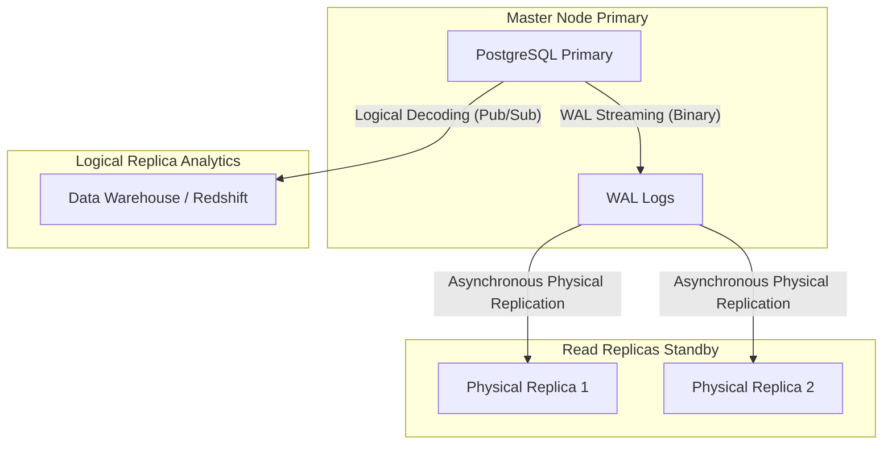

# Replication and Massive Partitioning

When a single PostgreSQL instance can no longer handle the read load or the storage volume (we are talking Terabytes of data), we enter the Expert domain. It's time to distribute the load.

## 1. Declarative Partitioning (Local Sharding)

If you have a `logs` table with 500 million records, attempting to delete old data with a `DELETE` will lock the table and cause a performance collapse. The solution is to physically split the table while maintaining a single logical table.

### Example: Time-based Partitioning (Range)

```sql
-- 1. Create the "Parent" table
CREATE TABLE telemetry.sensor_logs (
    id UUID,
    sensor_id INT,
    reading NUMERIC,
    created_at TIMESTAMP NOT NULL
) PARTITION BY RANGE (created_at);

-- 2. Create the "Child" tables (Physical)
CREATE TABLE sensor_logs_y2023m10 PARTITION OF telemetry.sensor_logs
    FOR VALUES FROM ('2023-10-01') TO ('2023-11-01');

CREATE TABLE sensor_logs_y2023m11 PARTITION OF telemetry.sensor_logs
    FOR VALUES FROM ('2023-11-01') TO ('2023-12-01');
```

**Critical Advantage:** When the month of October is no longer useful, you don't do a `DELETE`. You simply run a `DROP TABLE sensor_logs_y2023m10;`. This operation frees up Gigabytes of space instantly without hitting server performance.

## 2. Replication Topology: Streaming vs Logical

To scale reads or guarantee High Availability (HA), you need replicas.



### Physical Replication (Streaming Replication)
Copies the entire database, block by block, by reading the Write-Ahead Logs (WAL). Physical replicas are **read-only**. This is ideal for failover (if the master dies, a replica takes the throne).

### Logical Replication (Pub/Sub)
Instead of copying raw binary blocks, Postgres decodes the WALs into application-layer events (`INSERT`, `UPDATE`, `DELETE`) and sends them to subscribers.
- Allows replicating **only specific tables** (ideal for sending sales tables to a Data Lake).
- Allows the destination node to accept writes in its own independent tables.

```sql
-- On the Master server:
CREATE PUBLICATION sales_pub FOR TABLE sales.orders, sales.invoices;

-- On the Analytics server:
CREATE SUBSCRIPTION sales_sub CONNECTION 'host=master_ip port=5432 user=rep_user password=secret' PUBLICATION sales_pub;
```

Mastering partitioning and replication allows you to scale Postgres virtually to infinity. In the **Master Level (Optimizations)**, we will explore Kernel tuning and connection pooling to push the hardware to its absolute limit.

