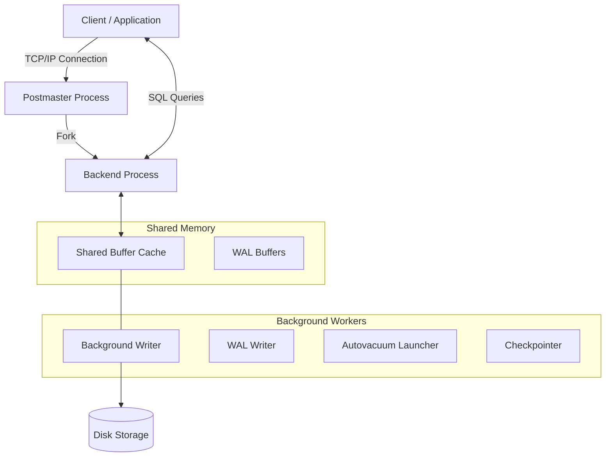

# Initial Setup and Base Architecture

Welcome to the starting point for mastering PostgreSQL, the most advanced open-source relational database engine in the world. In this initial stage, we won't just install a binary; we will understand how PostgreSQL interacts with the operating system and how to structure our infrastructure from day zero to avoid technical headaches months down the line.

## 1. Internal Architecture: The Multi-Process Model

Unlike engines like MySQL (which is multi-threaded), PostgreSQL uses a **Process-Based (Multi-Process) Architecture**. This means that for every client connection, the master Postgres process forks a new process at the operating system level.

### PostgreSQL Engine Diagram



*Architect's Note: This architecture protects the database from total crashes; if a backend process collapses due to a severe memory error, the other processes and the instance itself continue operating.*

## 2. Infrastructure Requirements (Bare-Metal vs Cloud)

Before spinning up your first container or EC2 instance for PostgreSQL, consider the following:

1. **Storage (I/O is King):** PostgreSQL is highly read/write intensive. Use NVMe SSD disks for the data volume (where tables reside) and consider a separate volume for the **WAL (Write-Ahead Logs)** if you have high transactionality.
2. **RAM Memory:** The `shared_buffers` parameter is usually configured to 25% of total available RAM. Postgres heavily relies on the OS page cache, so leaving free RAM for Linux is a critical best practice.
3. **CPU:** For OLTP workloads (many fast transactions), clock speed (GHz) matters more. For OLAP workloads (heavy analytics), the number of physical cores is a priority to enable *Parallel Query*.

## 3. Zero-Friction Installation with Docker

For development environments, avoiding native installation prevents operating system contamination. We will use Docker to spin up a controlled instance.

Create a `docker-compose.yml` file:

```yaml
version: '3.8'
services:
  postgres-core:
    image: postgres:15-alpine
    container_name: db_pg_inicial
    environment:
      POSTGRES_USER: admin
      POSTGRES_PASSWORD: ${PG_SECURE_PASS:-[SECRET_MASKED_BY_DLP]}
      POSTGRES_DB: nmerge_analytics
    ports:
      - "5432:5432"
    volumes:
      - pg_data:/var/lib/postgresql/data
    command: ["postgres", "-c", "shared_buffers=256MB", "-c", "max_connections=200"]

volumes:
  pg_data:
```

### Deployment Explanation:
- **`postgres:15-alpine`**: Using Alpine drastically reduces the attack surface and image size.
- **Environment Variables**: Never hardcode real passwords. Here we use a default configuration fallback if the host environment variable does not exist.
- **`command`**: We inject Postgres kernel parameters directly on boot, increasing memory *buffers* and the connection limit from minute zero.

## 4. Initial Verification and Hardening

Once the container is up (`docker-compose up -d`), connect via `psql`:

```bash
docker exec -it db_pg_inicial psql -U admin -d nmerge_analytics
```

**Your first task as a DBA (Database Administrator):** Lock down access. By default, Postgres trusts local connections too much. This is controlled in the `pg_hba.conf` file.
Ensure your connections demand cryptographic passwords (`scram-sha-256` instead of the obsolete `md5`):

```conf
# TYPE  DATABASE        USER            ADDRESS                 METHOD
host    all             all             0.0.0.0/0               scram-sha-256
```

## Next Steps
With the engine running and the multi-process architecture clear, you are ready to create tables, explore advanced JSONB data types, and understand the index engine in the **Basic Level** guide.
