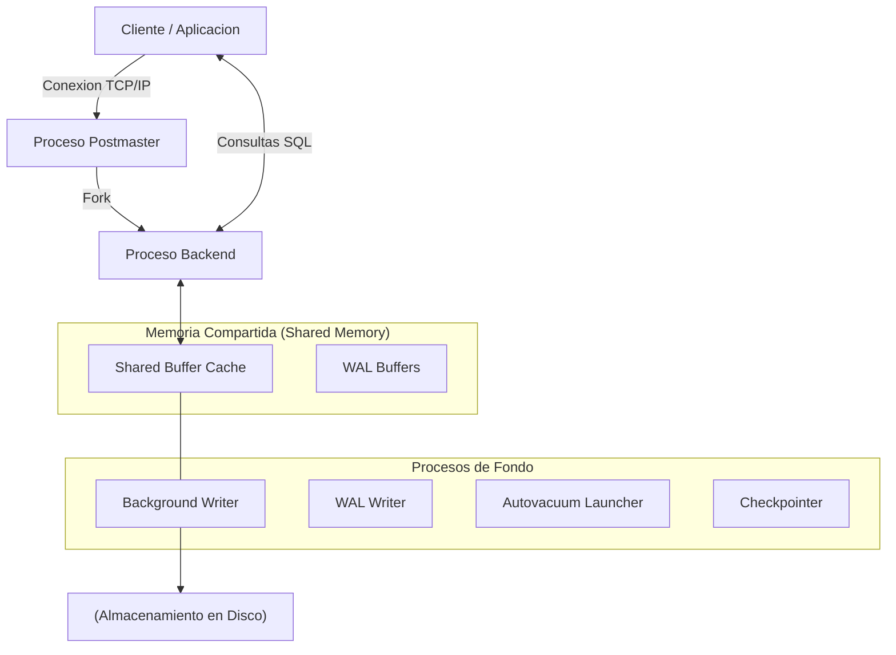

# Configuración Inicial y Arquitectura Base

Bienvenido al punto de partida para dominar PostgreSQL, el motor de base de datos relacional open-source más avanzado del mundo. En esta etapa inicial, no solo instalaremos un binario; vamos a entender cómo PostgreSQL interactúa con el sistema operativo y cómo estructurar nuestra infraestructura desde el día cero para evitar dolores de cabeza técnicos meses después.

## 1. Arquitectura Interna: El Modelo Multi-Proceso

A diferencia de motores como MySQL (que es multi-hilo), PostgreSQL utiliza una arquitectura **basada en procesos (Multi-Process Architecture)**. Esto significa que por cada conexión de un cliente, el proceso maestro de Postgres bifurca (hace un *fork*) un nuevo proceso en el sistema operativo.

### Diagrama del Motor PostgreSQL



*Nota del arquitecto: Esta arquitectura protege a la base de datos de caídas totales; si un proceso backend colapsa por un error grave de memoria, los demás procesos y la instancia en sí continúan funcionando.*

## 2. Requerimientos de Infraestructura (Bare-Metal vs Cloud)

Antes de levantar tu primer contenedor o instancia EC2 para PostgreSQL, considera lo siguiente:

1. **Almacenamiento (I/O es el Rey):** PostgreSQL es intensivo en lecturas y escrituras. Utiliza discos SSD NVMe para el volumen de datos (donde residen las tablas) y considera un volumen separado para los **WAL (Write-Ahead Logs)** si tienes alta transaccionalidad.
2. **Memoria RAM:** El parámetro `shared_buffers` usualmente se configura al 25% de la RAM total disponible. Postgres confía fuertemente en el caché del sistema operativo (Page Cache), por lo que dejar RAM libre para Linux es una práctica crítica.
3. **CPU:** Para cargas OLTP (muchas transacciones rápidas), la velocidad del reloj (GHz) importa más. Para cargas OLAP (analítica pesada), la cantidad de núcleos físicos es prioritaria para permitir el *Parallel Query*.

## 3. Instalación Cero-Fricción con Docker

Para entornos de desarrollo, evitar la instalación nativa previene la contaminación del sistema operativo. Utilizaremos Docker para levantar una instancia controlada.

Crea un archivo `docker-compose.yml`:

```yaml
version: '3.8'
services:
  postgres-core:
    image: postgres:15-alpine
    container_name: db_pg_inicial
    environment:
      POSTGRES_USER: admin
      POSTGRES_PASSWORD: ${PG_SECURE_PASS:-[SECRET_MASKED_BY_DLP]}
      POSTGRES_DB: nmerge_analytics
    ports:
      - "5432:5432"
    volumes:
      - pg_data:/var/lib/postgresql/data
    command: ["postgres", "-c", "shared_buffers=256MB", "-c", "max_connections=200"]

volumes:
  pg_data:
```

### Explicación del despliegue:
- **`postgres:15-alpine`**: Usar Alpine reduce drásticamente la superficie de ataque y el peso de la imagen.
- **Variables de Entorno**: Nunca hardcodees contraseñas reales. Aquí usamos un fallback de configuración por defecto si la variable del entorno host no existe.
- **`command`**: Inyectamos parámetros del kernel de Postgres directamente en el arranque, aumentando los *buffers* de memoria y el límite de conexiones desde el minuto cero.

## 4. Verificación y Hardening Inicial

Una vez levantado el contenedor (`docker-compose up -d`), conéctate mediante `psql`:

```bash
docker exec -it db_pg_inicial psql -U admin -d nmerge_analytics
```

**Tu primera tarea como DBA (Database Administrator):** Bloquear el acceso. Por defecto, Postgres confía demasiado en las conexiones locales. Esto se controla en el archivo `pg_hba.conf`.
Asegúrate de que tus conexiones exijan contraseña criptográfica (`scram-sha-256` en lugar del obsoleto `md5`):

```conf
# TYPE  DATABASE        USER            ADDRESS                 METHOD
host    all             all             0.0.0.0/0               scram-sha-256
```

## Próximos Pasos
Con el motor corriendo y la arquitectura multi-proceso clara, estás listo para crear tablas, explorar los tipos de datos JSONB avanzados y entender el motor de índices en la guía de **Basic Level**.
