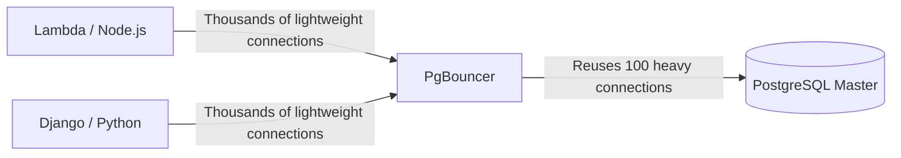

# Extreme Tuning, PgBouncer, and Optimizations

Welcome to the final level. Here we do not write SQL; here we modify Linux Kernel behavior and manipulate raw memory allocation to extract every ounce of performance from the iron (hardware) supporting our database.

## 1. The Connection Problem (Connection Pooling)

As we saw in the Initial Level, Postgres *forks* (creates a new process) for every client connection. Each process consumes approximately 2 to 10 MB of RAM. If your Serverless API (e.g., AWS Lambda) opens 5,000 concurrent connections, Postgres will consume all server memory just on idle processes, causing an *Out of Memory (OOM) Crash*.

### Architecture with PgBouncer

The mandatory solution in production is to place a **Connection Pooler** in front of the database. `PgBouncer` is the industry standard.



PgBouncer maintains a small pool of active connections with Postgres. When an API asks to run a query, PgBouncer lends it a connection, runs the query, and immediately returns it to the pool (*Transaction Pooling*). This reduces Postgres CPU load related to connection management to near zero.

## 2. Extreme Tuning: Modifying postgresql.conf

The default `postgresql.conf` file is configured to run on a Raspberry Pi (meaning, it uses minimal resources). If you are running on a server with 64GB of RAM and NVMe disks, you are wasting 95% of your hardware.

### Vital Optimization Parameters (Example for a 64GB RAM Server):

```conf
# 1. Shared Memory (Table Cache Storage)
# Recommended: 25% to 40% of total RAM.
shared_buffers = 16GB 

# 2. Memory for Sorts and Hashes
# Memory per connection. Caution: If 100 connections are doing a massive SORT, it will consume 100 * 64MB.
work_mem = 64MB 
maintenance_work_mem = 2GB # Only for VACUUM and INDEX creation.

# 3. SSD Disk Tuning (Avoid HDD rotational behavior)
random_page_cost = 1.1 # Assumes random reads are almost as fast as sequential.
effective_io_concurrency = 200 # Increases async I/O processing for SSDs.

# 4. Transactions and WAL
wal_level = logical # Ready for logical replication if needed
checkpoint_completion_target = 0.9 # Smooths out disk writes during checkpoints
```

## 3. Linux Huge Pages (OS Tuning)

For high-performance databases, the operating system spends too much CPU managing standard 4KB "memory pages". Enabling **Huge Pages** (2MB or 1GB pages) allows Postgres to manage its `shared_buffers` with a fraction of the CPU effort.

1. Calculate the `shared_buffers` size.
2. Configure `/etc/sysctl.conf` on Linux:
   ```bash
   vm.nr_hugepages = 8500
   ```
3. Tell Postgres to use them in `postgresql.conf`:
   ```conf
   huge_pages = on
   ```

You have reached mastery. From basic syntax to Kernel configuration, your PostgreSQL infrastructure is now ready to operate on a global scale, tolerate catastrophic failures, and process millions of transactions per second.
