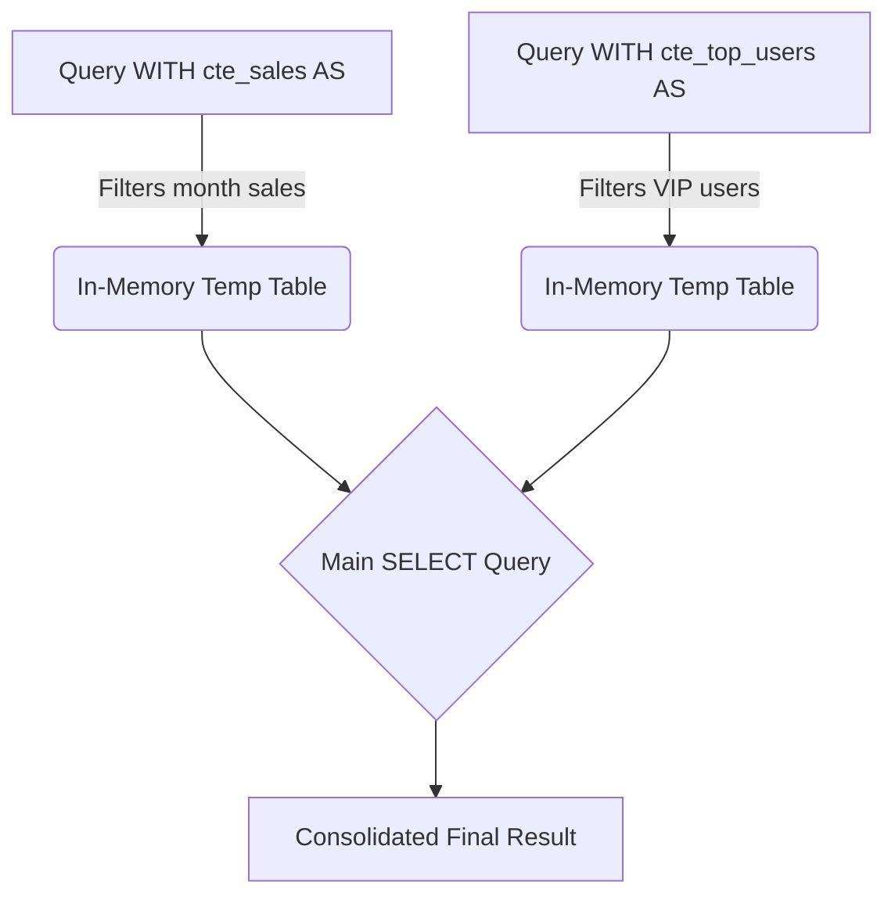
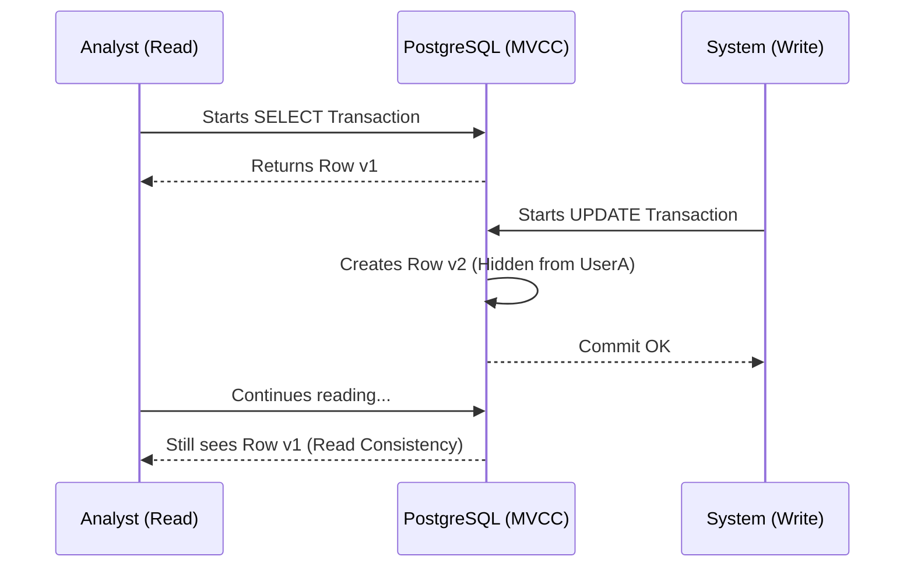

# Advanced Queries, CTEs, and ACID Transactions

When a basic `SELECT` and `JOIN` are no longer sufficient to process business logic, we enter the Intermediate Level. Here, we transform PostgreSQL from a simple data store into an **analytical compute engine**. Moving computation to the database (where the data lives) is almost always more efficient than sending gigabytes of data across the network to your Node.js or Python server.

## 1. Common Table Expressions (CTEs): Cleaning up SQL Spaghetti

Nested subqueries can quickly turn into a maintenance hell. CTEs (`WITH` clause) allow you to define temporary, readable result blocks.

### CTE Flowchart



### Practical Example
Imagine we want to calculate the average ticket of our "Top Customers" without creating SQL spaghetti:

```sql
WITH top_customers AS (
    SELECT customer_id, SUM(total_amount) as lifetime_value
    FROM billing.invoices
    GROUP BY customer_id
    HAVING SUM(total_amount) > 10000
),
recent_invoices AS (
    SELECT customer_id, total_amount
    FROM billing.invoices
    WHERE created_at >= NOW() - INTERVAL '30 days'
)
-- Main query joining the CTEs
SELECT t.customer_id, t.lifetime_value, AVG(r.total_amount) as avg_recent_ticket
FROM top_customers t
JOIN recent_invoices r ON t.customer_id = r.customer_id
GROUP BY t.customer_id, t.lifetime_value;
```

## 2. Window Functions: The Magic of Analytics

*Window Functions* allow you to perform calculations across a set of rows that are related to the current row, **without grouping them (without collapsing the results like `GROUP BY` does)**.

Want to know the salary rank of an employee within their own department, while keeping the employee details intact?

```sql
SELECT 
    employee_name, 
    department, 
    salary,
    RANK() OVER (PARTITION BY department ORDER BY salary DESC) as salary_rank,
    salary - AVG(salary) OVER (PARTITION BY department) as diff_from_dept_avg
FROM hr.employees;
```
In this magical code:
- `PARTITION BY` creates sub-groups (windows) by department.
- The query returns ALL employee rows, but adds analytically computed columns that look at their entire window.

## 3. Transactions and Concurrency Control (MVCC)

PostgreSQL complies with **ACID** (Atomicity, Consistency, Isolation, Durability) thanks to its MVCC (*Multi-Version Concurrency Control*) architecture.

### What is MVCC?
When you update a row in Postgres, the engine **does not overwrite** the data on the disk. Instead, it marks the old row as obsolete ("dead tuple") and inserts a new version of the row. This means that **readers never block writers, and writers never block readers.**



### Explicit Transactions
Grouping critical operations guarantees that the database state remains consistent.

```sql
BEGIN; -- Starts the transaction

UPDATE accounts SET balance = balance - 100 WHERE id = 1;
UPDATE accounts SET balance = balance + 100 WHERE id = 2;

-- If something fails here in your code, you ROLLBACK;
-- If everything is fine, you confirm:
COMMIT; 
```

## 4. Upsert (INSERT ... ON CONFLICT)

The *Upsert* pattern solves race conditions when attempting to insert a record that might already exist. Instead of doing a `SELECT` (to check) and then an `INSERT` or `UPDATE` from the backend (which is slow and prone to race conditions), do it atomically:

```sql
INSERT INTO analytics.daily_stats (date, user_id, visits)
VALUES ('2023-10-01', 105, 1)
ON CONFLICT (date, user_id) 
DO UPDATE SET visits = analytics.daily_stats.visits + 1;
```

With these tools, you have left monolithic SQL writing behind. You are writing clean, declarative, and mathematically robust code. In the **Advanced Level**, we will dive deep into the engine's underground: Execution Plans (EXPLAIN) and internal cleanup (Vacuum).
