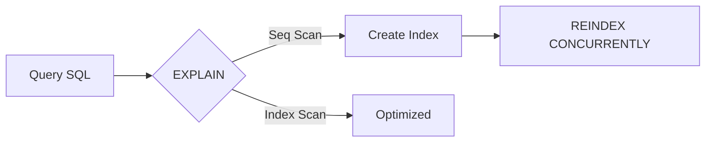

# Advanced Optimization in PostgreSQL

In high-performance transactional environments, engine tuning is critical.

## EXPLAIN ANALYZE and Costs
Using `EXPLAIN ANALYZE` not only shows the execution plan, but the actual processing time. Allows you to detect unwanted *Sequential Scans*.

## GIN, GiST and B-Tree indices
- **B-Tree:** Ideal for exact searches and ranges.
- **GIN:** Essential for Full-Text searches or JSONB arrays.

## Maintenance: REINDEX CONCURRENTLY
Prevents write locks while maintaining corrupt or degraded indexes (bloat).

> [!NOTE]
> The rest of the white paper is kept in its original language to preserve the syntax of code and diagrams.

