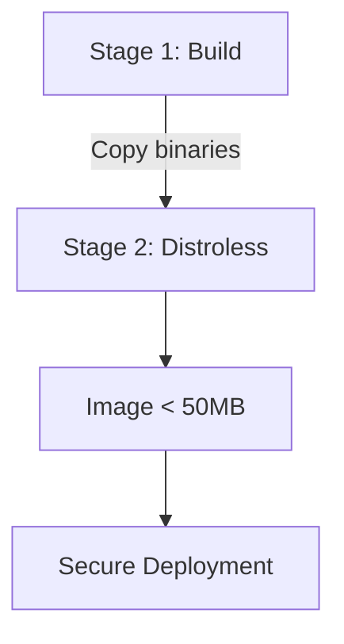

# Multi-Stage Docker and Container Strategies

Reducing the attack surface and weight of Docker images (to <50MB) is a key goal in DevSecOps.

## Multi-Stage Builds
It allows you to compile the code in a heavy image (e.g. `node:18-alpine`) and move only the resulting binaries or statics to a distroless or ultralight image (e.g. `nginx:alpine`).

## Docker Compose for Local Orchestration
The `docker-compose.yml` file makes it easy to set up isolated virtual networks.

> [!NOTE]
> The rest of the white paper is kept in its original language to preserve the syntax of code and diagrams.

