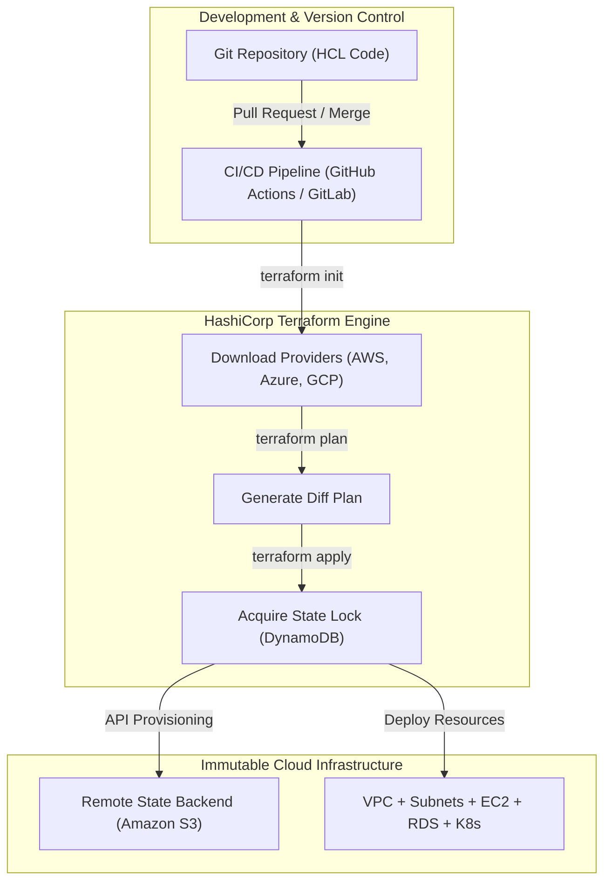

# Infrastructure as Code & Immutability (IaC & Terraform)

**Infrastructure as Code (IaC)** is the foundational DevOps and Cloud Engineering practice of provisioning, configuring, and managing IT infrastructure (servers, networks, databases, load balancers) via auditable, reproducible, and immutable code, replacing manual web console configurations (*ClickOps*).

## 1. Declarative Paradigm & Immutability

Unlike traditional step-by-step imperative scripting (Bash or PowerShell), **Terraform** uses a **Declarative** approach: you define the *DESIRED STATE* of your architecture, and the engine automatically calculates the diff against real cloud resources.

### Declarative Provisioning Flowchart



## 2. Terraform Lifecycle

The standard infrastructure engineering workflow consists of 4 essential commands:

```bash
# 1. Initialize working directory & download provider plugins
terraform init

# 2. Preview changes & calculate diff against real infrastructure
terraform plan

# 3. Apply changes and provision resources
terraform apply -auto-approve

# 4. Safely destroy temporary test environments
terraform destroy
```

## 3. Remote State & Atomic Locking (S3 + DynamoDB)

The `terraform.tfstate` file maps declared code resources to actual cloud IDs.

* **Anti-pattern:** Storing state locally or committing to Git (exposes secrets and causes state corruption).
* **Enterprise Best Practice:** Store state encrypted in **Amazon S3** with atomic concurrency locking via **Amazon DynamoDB**.

### Example `backend.tf` Configuration:

```hcl
terraform {
  required_version = ">= 1.5.0"
  
  required_providers {
    aws = {
      source  = "hashicorp/aws"
      version = "~> 5.0"
    }
  }

  backend "s3" {
    bucket         = "nmerge-terraform-state-prod"
    key            = "global/s3/terraform.tfstate"
    region         = "us-east-1"
    dynamodb_table = "nmerge-terraform-locks"
    encrypt        = true
  }
}
```

## 4. Reusable Production Modules

Modules encapsulate resource sets to promote code reuse and standardize security policies.

```hcl
# Reusable Web App Infrastructure Module
module "production_web_server" {
  source             = "./modules/web_infrastructure"
  environment        = "production"
  instance_type      = "t3.medium"
  min_size           = 2
  max_size           = 10
  enable_autoscaling = true

  tags = {
    Project   = "NMerge AI"
    ManagedBy = "Terraform"
  }
}
```
