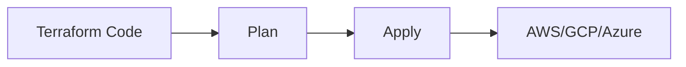

# Infrastructure as Code and Immutability

Infrastructure as Code (IaC) ensures that environments are reproducible.

## Terraform and Decentralized State
Terraform uses the `terraform.tfstate` file to map cloud resources. It must be stored remotely (e.g. S3 + DynamoDB for locks).

## Blue-Green and Canary deployments
- **Blue-Green:** Two identical environments. Zero downtime.
- **Canary:** Gradual deployment to 5% of users, progressively scaling if there are no errors.

> [!NOTE]
> The rest of the white paper is kept in its original language to preserve the syntax of code and diagrams.

