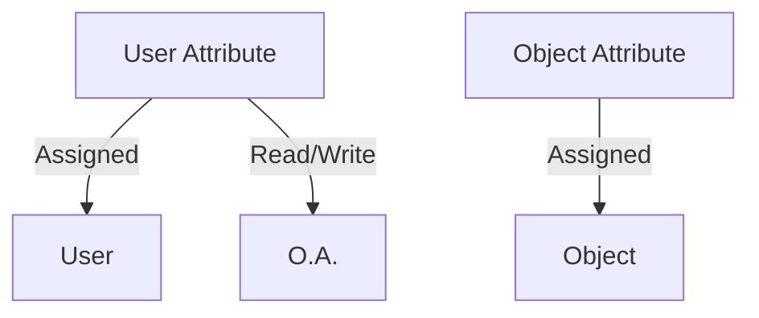

# Evolution of Access Control

From classic models to modern standards.

## RBAC vs ABAC
- **RBAC (Role-Based):** Permissions tied to static roles. Problem: Explosion of roles.
- **ABAC (Attribute-Based):** Permissions tied to boolean attributes.

## NGAC (Next Generation Access Control) Fundamentals
NIST standard. Use an algebraic graph. Users and objects are connected through attributes and associations.

> [!NOTE]
> The rest of the white paper is kept in its original language to preserve the syntax of code and diagrams.

