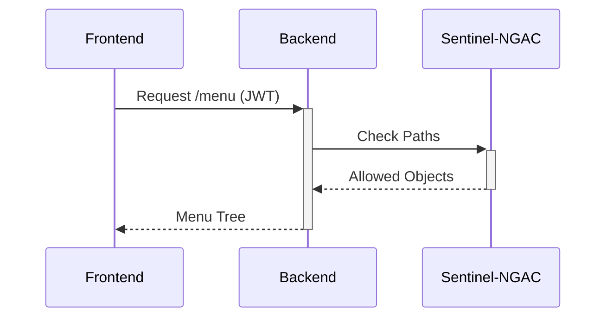

# NGAC Applied to Menus and Dynamic Views

Integrating Sentinel-NGAC into a frontend involves resolving the permissions graph at runtime.

## Graph Resolution
When a user logs in, the NGAC backend calculates all valid routes from their node (User) to the menu objects (Object).

## Success Story: safi-core
In massive ERP systems like `safi-core`, the menu response is cached in Redis. If there are permission changes, the cache is invalidated.

> [!NOTE]
> The rest of the white paper is kept in its original language to preserve the syntax of code and diagrams.

