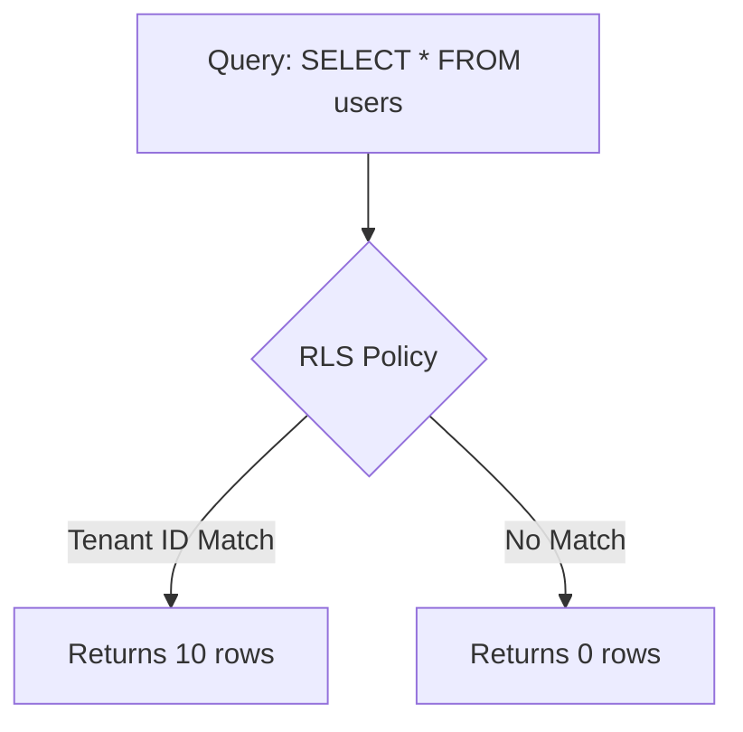

# Data Layer Security (RLS)

Row-Level Security (RLS) transfers the app's tenant filtering logic directly to the database.

## Advantages of RLS in Postgres
Any malicious query that does `SELECT * FROM invoices` without a tenant ID will return 0 rows.

## Governance and Policy
RLS policies are enabled using `ALTER TABLE invoices ENABLE ROW LEVEL SECURITY;`.

> [!NOTE]
> The rest of the white paper is kept in its original language to preserve the syntax of code and diagrams.

