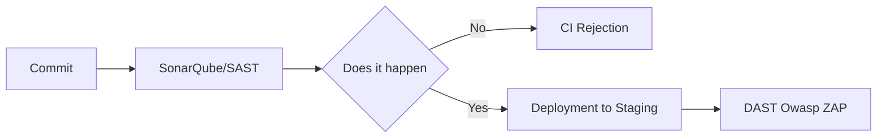

# Secure Secret Management and DevSecOps

Hardcoding secrets is a critical vulnerability. Swarm AI prohibits exposing credentials.

## HashiCorp Vault
Dynamic storage. Vault can generate ephemeral credentials (e.g. a database user that expires in 1 hour).

## SAST/DAST integration
- **SAST:** Static analysis in the CI pipeline.
- **DAST:** Dynamic tests attacking the container in Staging.

> [!NOTE]
> The rest of the white paper is kept in its original language to preserve the syntax of code and diagrams.

