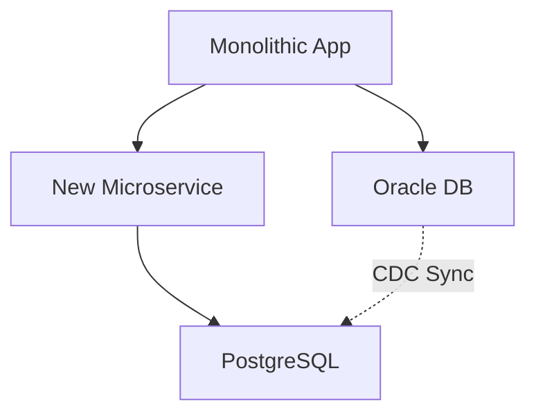

# Migration and Interoperability between DBs

Strategies for exiting legacy or on-premise databases (e.g. Oracle to Postgres).

## Migration Tools
Use of *AWS SCT (Schema Conversion Tool)* and *DMS (Data Migration Service)* for CDC (Change Data Capture) replication.

## Strangler Fig Strategy
Migrate table to table. The application writes dually until integrity is confirmed.

> [!NOTE]
> The rest of the white paper is kept in its original language to preserve the syntax of code and diagrams.

