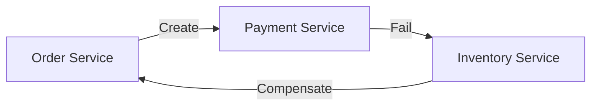

# Data Ingestion and Distributed Consistency

Microservices require choreography and orchestration.

## Saga Pattern
When a distributed transaction fails, the Saga pattern executes *compensation* actions to rollback to other microservices.

## ETL vs ELT
- **ETL:** Transformation on the bus.
- **ELT:** Massive transformation within the Data Warehouse (e.g. Snowflake/BigQuery).

> [!NOTE]
> The rest of the white paper is kept in its original language to preserve the syntax of code and diagrams.

