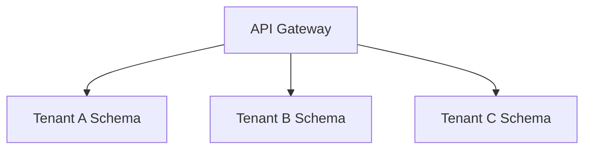

# Multi-Tenant and Multi-Language SaaS Architectures

## Data Isolation
1. **Silo:** One database per client (Expensive, Secure).
2. **Pool:** All rows in the same table with `tenant_id` + RLS (Economic).
3. **Bridge:** One schema per client within the same database.

## Global Location
Using libraries like `i18next` in React to handle asynchronous dynamic dictionaries.

> [!NOTE]
> The rest of the white paper is kept in its original language to preserve the syntax of code and diagrams.

